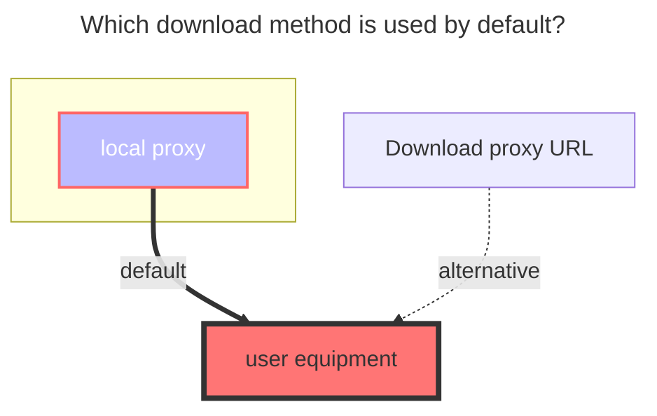
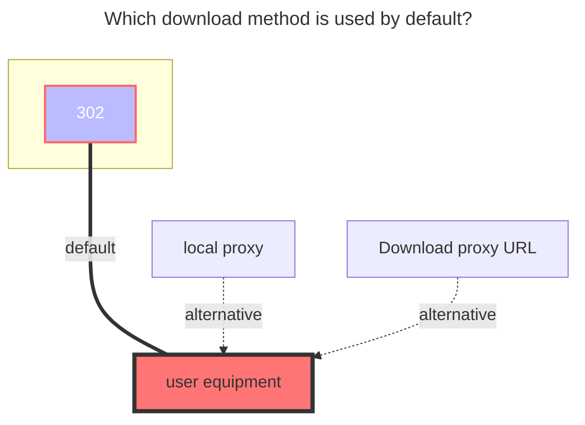

---
# This is the icon of the page
icon: state
# This control sidebar order
order: 17
# A page can have multiple categories
category:
  - Guide
# A page can have multiple tags
tag:
  - Storage
  - Guide
# this page is sticky in article list
sticky: true
# this page will appear in starred articles
star: true
---

# Thunder Cloud Disk

:::tip
Please use Thunder directly instead of ThunderExpert if you are not good at it.

ThunderExpert mainly provides more free settings and realizes more login methods
:::

## Thunder

### username

That is, the mobile phone number, email, and username used for login (there is a probability that you cannot log in, you need to try)

### password

password for login

### CaptchaToken

Need verify: {url} may appear when logging in or uploading, please visit the link in the error to complete the verification and get CaptchaToken (verification code)


Fill in the mount directory ID account password and save it, there will be a big lump in the upper right corner (cannot be copied),

Let's go back to adding an account to copy from Https to the end to a new window to get the verification code parameter (CaptchaToken)

See the image below to add


### The default download method used




## ThunderExpert

:::tip
If Xunlei needs to download, you must specify UserAgent (same as DownUserAgent below)
Or use the proxy function in this program to transfer.
:::

### Login Type

When selecting User, you only need to fill in the username and password

**Recommended**: Just fill in RefreshToken when selecting RefreshToken

### Signature Type

When selecting Algorithms, just fill in the Algorithms (it is difficult to obtain, and needs to be reversed)

**Recommended**: Only fill in CaptchaSign and Timestamp when selecting CaptchaSign

```
//signature algorithm
str = ClientID + ClientVersion + PackageName + DeviceID + Timestamp
for (Algorithm in Algorithms) {
    str = md5(str + Algorithm)
}
CaptchaSign = "1." + str
```

Login type and Sign type recommended options


### DeviceID

The value calculated by md5 is used to determine the logged in device

### ClientID, ClientSecret, ClientVersion, PackageName

It is related to the signature, fill in according to the actual situation

### UserAgent

UserAgent used by API requests, may be inaccessible or speed limited if the setting is incorrect

### DownUserAgent

The User Agent used for downloading, if the setting is wrong, it will not be downloaded (it will be used when the agent is turned on) Fixed parameters:
**Mozilla/5.0 (Windows NT 10.0; Win64; x64) AppleWebKit/537.36 (KHTML, like Gecko) Chrome/67.0.3396.99 Safari/537.36**

## Key data acquisition process

Obtain Xunlei request data through network analysis tools (packet capture tools) --- Please read the following information carefully

Open Xunlei and log in to your account (the picture below uses the PC client to operate, and the web terminal is also available)

Included in the request https://xluser-ssl.xunlei.com/v1/shield/captcha/init
CaptchaSign, Timestamp, DeviceID, ClientID, ClientVersion, PackageName, User-Agent

**Note**: After obtaining the information of the two pictures, slowly select the data from the two data captured and fill in it

After logging in to Thunder and opening the packet capture tool, it is possible that the information of **v1/shield/captcha/init** cannot be immediately obtained at this time.

Do not close the Xunlei PC client and the packet capture tool, just wait, it will refresh automatically after **5 minutes**

You will see the parameters as shown in the figure below, and you can fill in it according to the acquisition (if you can't see it clearly, you can right-click to copy the picture and link it to the browser to open a new window)

See **v1/shield/captcha/init** and grab it, please **immediately don't delay for a second** Right-click Xunlei in the taskbar in the lower right corner to exit, exit completely and then reopen to get * *Figure II**


Restarting Thunder will refresh the token

The request to https://xluser-ssl.xunlei.com/v1/auth/token contains RefreshToken (please use the returned value), ClientSecret (does not exist on the web side)


Figure 1 contains **7** parameters | Figure 1 contains **2** parameters | a fixed parameter (Down UserAgent), ten parameters and 3 options and a mount path, just write and save, before saving Remember to check~

### ThunderExpert complete parameter filling demo:


### The default download method used

