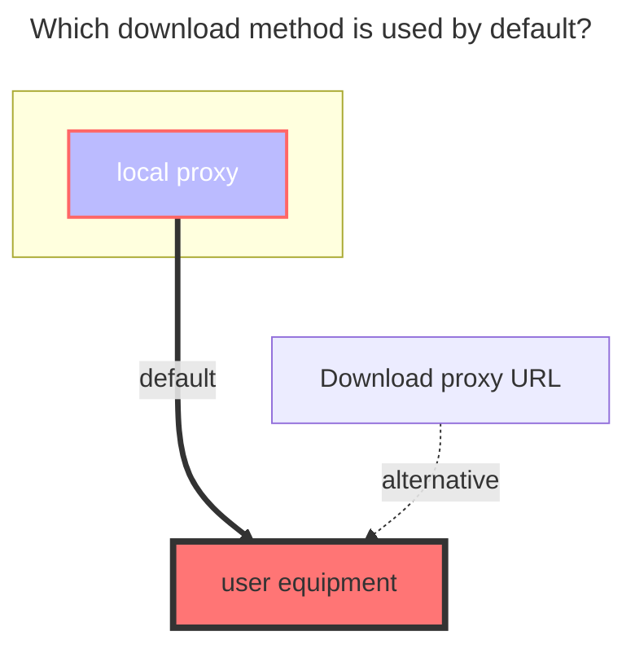
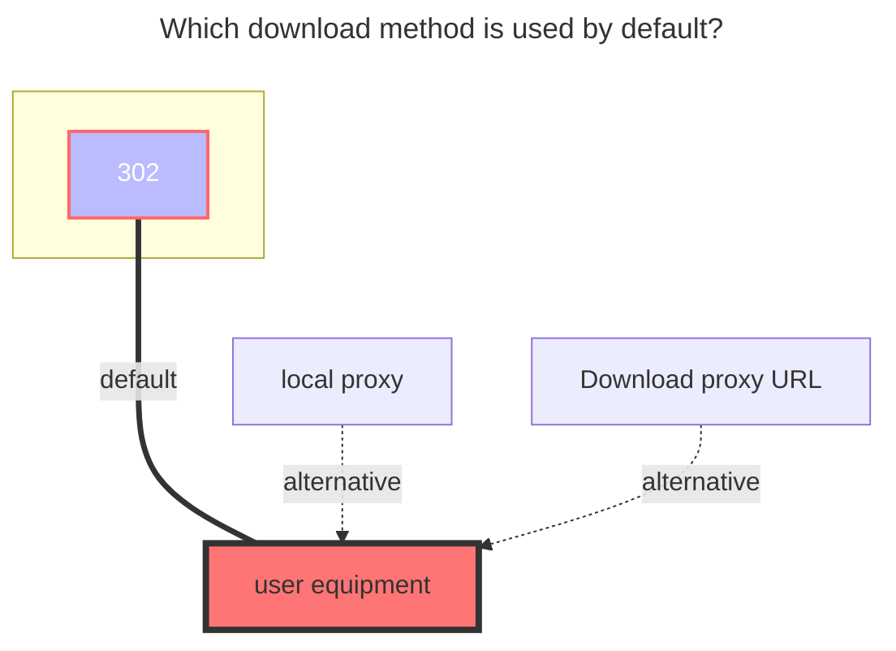

---
# This is the icon of the page
icon: iconfont icon-state
# This control sidebar order
order: 17
# A page can have multiple categories
category:
  - Guide
# A page can have multiple tags
tag:
  - Storage
  - Guide
  - "Native Rroxy"
  - "302"
# this page is sticky in article list
sticky: true
# this page will appear in starred articles
star: true
---

# Thunder Cloud Disk

:::tip
Please use Thunder directly instead of ThunderExpert if you are not good at it.

ThunderExpert mainly provides more free settings and realizes more login methods

-----

Thunder X serves overseas users. As of the time of document release, only the Android version is available. Other versions have not yet been released.

- Thunder X has sufficient speed even without membership. Future changes are unknown.
- Using the APP may require a proxy, but not when mounted on AList.

-----

Thunder Browser：Currently only supports mobile phones (Android, iOS)

- **https://x.xunlei.com/**
- If you log in to AList, the mobile phone will be kicked offline. On the contrary, if you log in to AList first and then log in to the mobile phone, AList will be kicked offline but there will be no prompt

:::


:::: tabs#thunder

@tab Thunder

### **username**

That is, the mobile phone number, email, and username used for login (there is a probability that you cannot log in, you need to try)

- You need to bring the `+86` area code, for example +8613722223333 fill in like this

<br/>


### **password**

password for login

<br/>


### **CaptchaToken**

Need verify: {url} may appear when logging in or uploading, please visit the link in the error to complete the verification and get CaptchaToken (verification code)


Fill in the mount directory ID account password and save it, there will be a big lump in the upper right corner (cannot be copied),

Let's go back to adding an account to copy from Https to the end to a new window to get the verification code parameter (CaptchaToken)

See the image below to add


<br/>


### **The default download method used**




@tab ThunderExpert

:::tip
If Xunlei needs to download, you must specify UserAgent (same as DownUserAgent below)
Or use the proxy function in this program to transfer.
:::

### **Login Type**

1. When selecting User, you only need to fill in the username and password
   - User You need to bring the `+86` area code, for example +8613722223333 fill in like this


2. **RefreshToken**: Just fill in RefreshToken when selecting RefreshToken

<br/>


### **Signature Type**

**Algorithms**：When selecting Algorithms, just fill in the Algorithms (it is difficult to obtain, and needs to be reversed)

**Captcha sign**: Only fill in CaptchaSign and Timestamp when selecting CaptchaSign

```
//signature algorithm
str = ClientID + ClientVersion + PackageName + DeviceID + Timestamp
for (Algorithm in Algorithms) {
    str = md5(str + Algorithm)
}
CaptchaSign = "1." + str
```

Login type and Sign type recommended options


<br/>


### **DeviceID**

The value calculated by md5 is used to determine the logged in device

### **ClientID, ClientSecret, ClientVersion, PackageName**

It is related to the signature, fill in according to the actual situation

### **UserAgent**

UserAgent used by API requests, may be inaccessible or speed limited if the setting is incorrect

### **DownUserAgent**

The User Agent used for downloading, if the setting is wrong, it will not be downloaded (it will be used when the agent is turned on) Fixed parameters:
**Mozilla/5.0 (Windows NT 10.0; Win64; x64) AppleWebKit/537.36 (KHTML, like Gecko) Chrome/67.0.3396.99 Safari/537.36**

<br/>


## **Key data acquisition process**

Obtain Xunlei request data through network analysis tools (packet capture tools) --- Please read the following information carefully

Open Xunlei and log in to your account (the picture below uses the PC client to operate, and the web terminal is also available)

Included in the request https://xluser-ssl.xunlei.com/v1/shield/captcha/init
CaptchaSign, Timestamp, DeviceID, ClientID, ClientVersion, PackageName, User-Agent

**Note**: After obtaining the information of the two pictures, slowly select the data from the two data captured and fill in it

After logging in to Thunder and opening the packet capture tool, it is possible that the information of **v1/shield/captcha/init** cannot be immediately obtained at this time.

Do not close the Xunlei PC client and the packet capture tool, just wait, it will refresh automatically after **5 minutes**

You will see the parameters as shown in the figure below, and you can fill in it according to the acquisition (if you can't see it clearly, you can right-click to copy the picture and link it to the browser to open a new window)

See **v1/shield/captcha/init** and grab it, please **immediately don't delay for a second** Right-click Xunlei in the taskbar in the lower right corner to exit, exit completely and then reopen to get * *Figure II**


Restarting Thunder will refresh the token

The request to https://xluser-ssl.xunlei.com/v1/auth/token contains RefreshToken (please use the returned value), ClientSecret (does not exist on the web side)


Figure 1 contains **7** parameters | Figure 1 contains **2** parameters | a fixed parameter (Down UserAgent), ten parameters and 3 options and a mount path, just write and save, before saving Remember to check~

<br/>


### **ThunderExpert complete parameter filling demo:**

 

<br/>


### **The default download method used**




@tab Thunder  X

### **username、password**

The mailbox and password used for login

<br/>


### **CaptchaToken**

It will be filled automatically without filling in manually

<br/>


### **Root folder id**

The default is the full directory of the empty display, If you want to use a subfolder to make the root directory, grab the request to get it

- In the request in the package`https://api-pan.xunleix.com/drive/v1/files?parent_id=&page_token=&filters=`，you can get the following parameters
  - `文件夹ID（id）`
  - `文件夹名称（name）`
  - `父文件夹ID（parent_id）`
- The `folder ID` obtained in the root directory (for example : `我接收的文件`、`我的云盘`、`高速云下载`), **This will change with different account numbers, there is no the same value, In the request in the package**


<br/>

### **Use video url**

- **https://github.com/alist-org/alist/pull/6464#issuecomment-2124306443**

<br/>


### **The default download method used**


@tab Thunder  X Expert

### **username、password**

The mailbox and password used for login

<br/>


### **CaptchaToken**

It will be filled automatically without filling in manually

<br/>


### **Root folder id**

The default is the full directory of the empty display, If you want to use a subfolder to make the root directory, grab the request to get it

- In the request in the package`https://api-pan.xunleix.com/drive/v1/files?parent_id=&page_token=&filters=`，you can get the following parameters
  - `文件夹ID（id）`
  - `文件夹名称（name）`
  - `父文件夹ID（parent_id）`
- The `folder ID` obtained in the root directory (for example : `我接收的文件`、`我的云盘`、`高速云下载`), **This will change with different account numbers, there is no the same value, In the request in the package**


<br/>


### **Login Type**

- ` User `: Only fill in the username and password

- ` Refresh token `: Just fill in`RefreshToken`

<br/>


### **Sign Type**

- `Algorithms`：Choose `Algorithms` Just fill in `Algorithms` (It has been automatically filled. You do n’t have to fill in it yourself. You only need to fill in the username and password.When the algorithm is not invalidated)
- `Captcha sign`: Choose `Captcha sign` Just fill in `Captcha sign` and `Timestamp`

<br/>


### **Part of parameter Packet Capture description**

- `Captcha token` ：No need to fill in
- `Device id`：The value calculated by MD5 is used to judge the login device
- `Client id`, `Client secret`, `Client version`, `Package name`：It related to the signature, fill in according to the actual situation

-----

- `User agent`：API requests `User agent`, setting errors may not access or speed limit
- `Download user agent`：When downloading, use the `user agent `,If the setting error cannot be downloaded (the agent will use it)
  - `User agent` and `Download user agent`：You can fill it out by yourself. If you don’t know how to fill it out, you can leave it blank and it will be automatically filled in.


-----

In the request in the package `https://xluser-ssl.xunleix.com/v1/shield/captcha/init`，you can get the following parameters^6^

- `Client id`、`Device id`、`Captcha sign`
- `Package name`、`Client version`、`Timestamp`


In the request in the package `https://xluser-ssl.xunleix.com/v1/auth/signin`, you can get the following parameters^2^

  - `Client id`、`Client secret`


<br/>


### **Use video url**

- **https://github.com/alist-org/alist/pull/6464#issuecomment-2124306443**

<br/>


### **The default download method used**


@tab Thunder  Browser

### **username、password**

Mobile phone number, email, username, and password used to log in

- When filling in the mobile phone number, please bring the `+86` area code, for example `+8613822334455`

<br/>


### **CaptchaToken**

It will be filled automatically without filling in manually

<br/>


### **Root folder id**

The default is the full directory of the empty display, If you want to use a subfolder to make the root directory, grab the request to get it

- In the request in the package`https://x-api-pan.xunlei.com/drive/v1/files?parent_id&page_token&space=`，you can get the following parameters
  - `文件夹ID（id）`
  - `文件夹名称（name）`
  - `父文件夹ID（parent_id）`
- The `folder ID` obtained in the root directory (for example : `来自分享`、`超级保险箱`), **This will change with different account numbers, there is no the same value, In the request in the package**


<br/>


### **Safe password**

Thunder  Browser Safe password

- Files in Safe password can only be deleted directly and cannot be deleted to the recycle bin, so the [**Deletion method**](#remove-way) below has nothing to do with this configuration.

<br/>


### **Remove way**

**Trash**：Use AList to delete files and then move them to the Recycle Bin. If you delete them accidentally, you can restore them through Thunder Cloud Disk.

**Delete**：Deleting it directly cannot restore it.

<br/>


### **Use video url**

- When `Use video url` is turned on, some types of files may not be accessible properly.
- **https://github.com/alist-org/alist/pull/6464#issuecomment-2124306443**

<br/>


### **The default download method used**


@tab Thunder Browser Expert

### **username、password**

Mobile phone number, email, username, and password used to log in

- When filling in the mobile phone number, please bring the `+86` area code, for example `+8613822334455`

<br/>


### **CaptchaToken**

It will be filled automatically without filling in manually

<br/>


### **Root folder id**

The default is the full directory of the empty display, If you want to use a subfolder to make the root directory, grab the request to get it

- In the request in the package`https://x-api-pan.xunlei.com/drive/v1/files?parent_id&page_token&space=`，you can get the following parameters
  - `文件夹ID（id）`
  - `文件夹名称（name）`
  - `父文件夹ID（parent_id）`
- The `folder ID` obtained in the root directory (for example : `来自分享`、`超级保险箱`), **This will change with different account numbers, there is no the same value, In the request in the package**


<br/>


### **Safe password**

Thunder  Browser Safe password

- Files in Safe password can only be deleted directly and cannot be deleted to the recycle bin, so the [**Deletion method**](#remove-way-1) below has nothing to do with this configuration.

<br/>


### **Remove way**

**Trash**：Use AList to delete files and then move them to the Recycle Bin. If you delete them accidentally, you can restore them through Thunder Cloud

**Delete**：Deleting it directly cannot restore it.

<br/>


### **Login Type**

- ` User `: Only fill in the username and password

- ` Refresh token `: Just fill in`RefreshToken`

<br/>


### **Sign Type**

- `Algorithms`：Choose `Algorithms` Just fill in `Algorithms` (It has been automatically filled. You do n’t have to fill in it yourself. You only need to fill in the username and password.When the algorithm is not invalidated)
- `Captcha sign`: Choose `Captcha sign` Just fill in `Captcha sign` and `Timestamp`

<br/>


### **Part of parameter Packet Capture description**

- `Captcha token` ：No need to fill in
- `Device id`：The value calculated by MD5 is used to judge the login device
- `Client id`, `Client secret`, `Client version`, `Package name`：It related to the signature, fill in according to the actual situation

-----

- `User agent`：API requests `User agent`, setting errors may not access or speed limit
- `Download user agent`：When downloading, use the `user agent `,If the setting error cannot be downloaded (the agent will use it) 
  - `User agent` and `Download user agent`：You can fill it out by yourself. If you don’t know how to fill it out, you can leave it blank and it will be automatically filled in.

-----

In the request in the package `https://xluser-ssl.xunlei.com/v1/shield/captcha/init`，you can get the following parameters^6个^

- `Client id`、`Device id`、`Captcha sign`

- `Package name`、`Client version`、`Timestamp`


In the request in the package `https://xluser-ssl.xunlei.com/v1/auth/signin/token`, you can get the following parameters^3^

  - `Client id`、`Client secret`、`Refresh token`


<br/>


### **Use video url**

- Open `Use video url` 可能会遇到部分类型的文件无法正常访问
- **https://github.com/alist-org/alist/pull/6464#issuecomment-2124306443**

<br/>


### **The default download method used**


::::