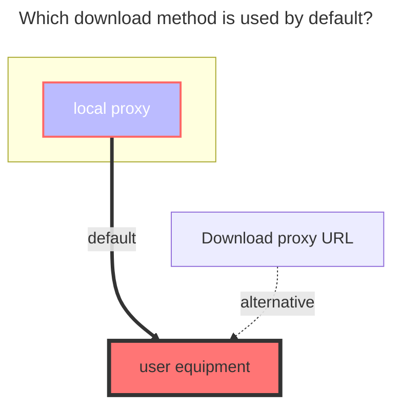
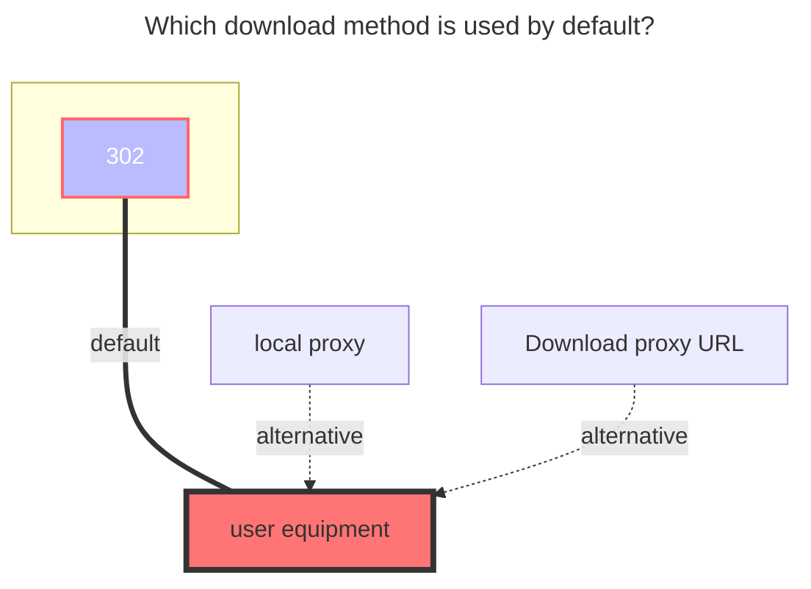

---
# This is the icon of the page
icon: iconfont icon-state
# This control sidebar order
order: 18
# A page can have multiple categories
category:
  - Guide
# A page can have multiple tags
tag:
  - Storage
  - Guide
  - "Native Rroxy"
  - "302"
# this page is sticky in article list
sticky: true
# this page will appear in starred articles
star: true
---

# UC / TV

## **UC Cloud**

**https://drive.uc.cn/**

 

### **Cookie**

Press F12 to open "Debug", select "Network", select any request on the left, and find the one with the `Cookie` parameter.

 

### **Root Folder ID**

Root Folder ID is `0`

- After entering the folder, get the directory ID in the top address bar. If the subdirectory is deeper, the directory ID will be at the back of the address bar. Just write the subdirectory ID you want to mount.

 

### **The default download method used**

## **UC TV**

The TV version supports `302`, but only `List` and `Download` operations are supported. Other operations are not supported (the interface does not support it).

 

### **Add method**

1. Select the `UC TV` driver, fill in the mounting path, and then save

2. Return to the all driver page and use the mobile APP to scan the QR code (If the QR code is not displayed, click on `Table Layout` in the upper right corner of the driver to switch from list mode to table mode)

3. After scanning the QR code to confirm, disable the driver, then enable the `driver` to use it.
   - `Refresh token`、`Device id`、`Query token`,It will be filled in automatically, no manual filling is required
     - Please do not edit manually and modify it

 

### **Root Folder ID**

Root Folder ID is `0`

- After entering the folder, get the directory ID in the top address bar. If the subdirectory is deeper, the directory ID will be at the back of the address bar. Just write the subdirectory ID you want to mount.

 

### **The default download method used**

