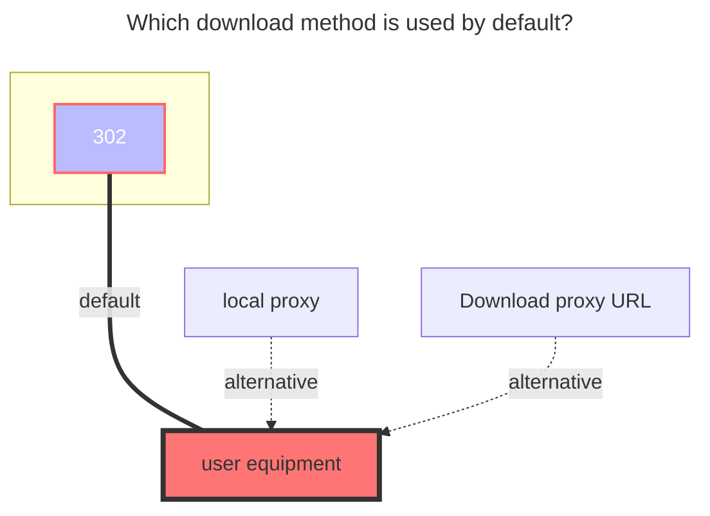

---
# This is the icon of the page
icon: iconfont icon-state
# This control sidebar order
order: 20
# A page can have multiple categories
category:
  - Guide
# A page can have multiple tags
tag:
  - Storage
  - Guide
  - "302"
# this page is sticky in article list
sticky: true
# this page will appear in starred articles
star: true
---

# UPYUN Storage Service

UPYUN Storage Service，refer to as USS，[**Yupyun USS Official Website**](https://console.upyun.com/services/file/)

### **BucKet**

UPYUN Storage Service Name

### **Endpoint**

Accelerated domain name (default TEST domain or bound domain, not CNAME domain)

If you use http protocol, please add `http://` protocol header.

The test domain name provided by upyun is not accessible in some network and does not support https, so it is recommended to use your own bound domain name.

### **Operator name**

Operator name

### **Operator password**

Operator password

### **Root folder path**

Root path, if not filled, it defaults to the root directory.

### **Sign url expire**

The validity period of the signed download address is 4 hours by default.

## **Example of filling in details**

::: tip

If you want to use the official test domain name, you must manually add http For example: http://xxx.test.upcdn.net

If you want to use HTTPS, of course, you can also add your own domain name, for example: https://you.xxx.com

permission is turned on by itself, and the read permission must be turned on！

:::

### **The default download method used**

