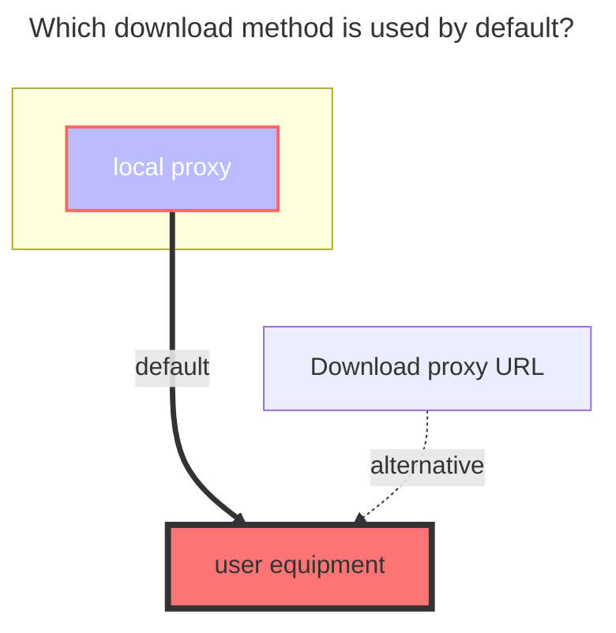

---
# This is the icon of the page
icon: iconfont icon-state
# This control sidebar order
order: 18
# A page can have multiple categories
category:
  - Guide
# A page can have multiple tags
tag:
  - Storage
  - Guide
  - "Native Rroxy"
# this page is sticky in article list
sticky: true
# this page will appear in starred articles
star: true
---

# vtencent 

vtencent Official website link：**https://app.v.tencent.com**

 

### **Cookie**

Just find a parameter carrying Cookie in the F12 request and copy it

- It is recommended to use the Cookie parameter in the request refreshed later, which will carry the Cookie containing the **`tf_x`** parameter.

- `login`、`DescribeTasks`、`DescribeAccount`、`DescribeUserProfile`、`DescribePlatformSettings`、`CreateBindWechatQRCode`

The cookies that can be used are those that need to carry the **`tf_x`** parameter. In the example in the figure, the one on the left can be used, but the one on the right cannot be used.

 

### **Root Folder ID**

The root directory ID is: `9`. If you want to mount other subfolders separately, refer to the method of AliCloud

- If it is still not displayed after filling in, please manually refresh the button on the lower right corner.

 

### **Tf uid**

No need to fill in, store and fill in the correct cookie, `Tf uid` will be filled in automatically after saving

 

### **The default download method used**

