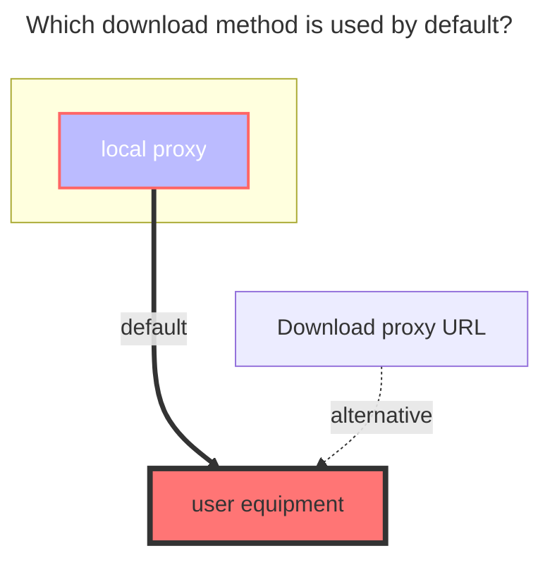

---
# This is the icon of the page
icon: iconfont icon-state
# This control sidebar order
order: 9
# A page can have multiple categories
category:
  - Guide
# A page can have multiple tags
tag:
  - Storage
  - Guide
  - "Native Rroxy"
# this page is sticky in article list
sticky: true
# this page will appear in starred articles
star: true
---

# Tencent weiyun

Tencent Weiyun official website: **https://www.weiyun.com**

::: tip Weiyun login validity period reminder

- QQ: The login can only keep alive for 48 hours at present, and the cookie has to be replaced
- WeChat: no such problem, use token

It is recommended to use WeChat to log in

:::

## **Root folder file_id**

1. Display the root directory, **`leave blank`**, you don’t need to fill in, the program will automatically fill in

2. If only a single folder ID is displayed, select the folder to be displayed, Copy the ID behind the top address bar

## **Cookie**

After logging in to Weiyun, **Open the developer debugging tool (F12)**, find the request that carries the cookie in any request, copy and fill in it.

- The token obtained by WeChat login is longer than the cookie field of QQ login
- QQ WeChat fills in the `Cookie` field value, and you can see it by just looking for a request

## **other notes**

1. The copy function cannot be used
2. **It is recommended not to share Weiyun with the outside world. After all, it is bound to your own QQ number. If you have a major loss to QQ or other things after being blocked/frozen, you will be responsible for the consequences**

### **The default download method used**

