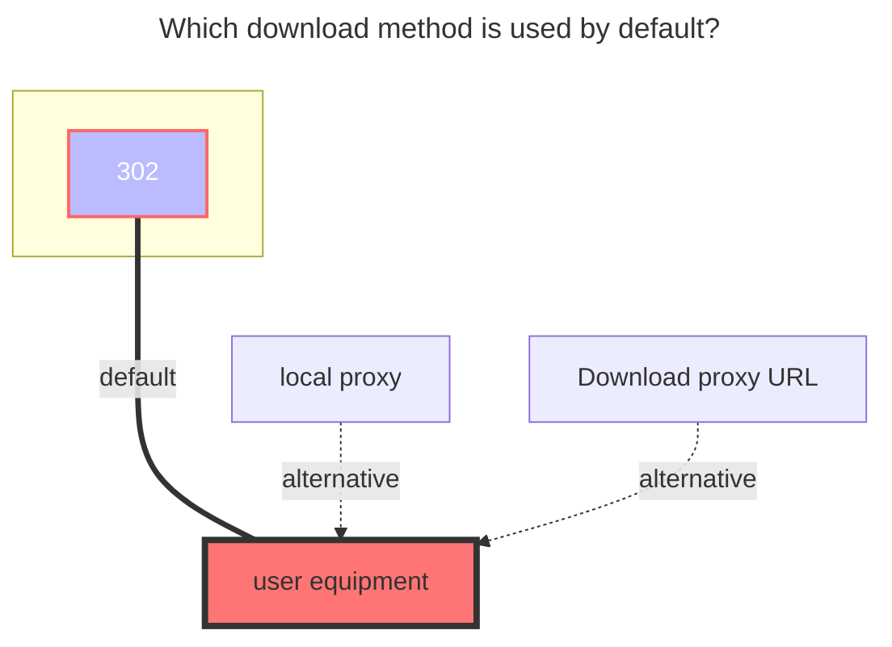

---
# This is the icon of the page
icon: iconfont icon-state
# This control sidebar order
order: 7
# A page can have multiple categories
category:
  - Guide
# A page can have multiple tags
tag:
  - Storage
  - Guide
  - "302"
# this page is sticky in article list
sticky: true
# this page will appear in starred articles
star: true
---
# WoPan

WoPan address：**https://pan.wo.cn/**

- :warning: AList v3.19.0 version and above can use this driver

::: tip

AList WoPan is web-based platform is used to access WoPan storage. 

After mounting WoPan storage using AList, please do not log in to the web version of the WoPan again, as this will log out the AList session and make the invalid.

Logging in on the mobile app does not pose any issue, as it can be done simultaneously without any conflicts.

:::

Get the token tool address：**https://alist.nn.ci/tool/wopan/token.html**

- 

==This tool may have a graphic verification code due to too many users. If a graphic verification code appears, you need to manually capture the packet:==
- Open developer tools
- Open the official website https://pan.wo.cn/ to log in
- Find the request with this content:
   
- Find the token in the response:
   

## **root folder ID**

- **Personal cloud：**：**0**
  - Single folder ID：Unknown (wait for replenishment)

- **Family cloud**：Unknown (wait for replenishment)
  - Family cloud Single folder ID：Unknown (wait for replenishment)

## Type

Personal cloud：Put the `family ID` blank is the personal cloud

Family cloud：add `Family ID` Unknown (wait for replenishment)

### **AList fill in examples：**

Data obtained by using tools `Refresh_token Fill in the refresh token`, `Access_token fills in access_token`

### **The default download method used**

