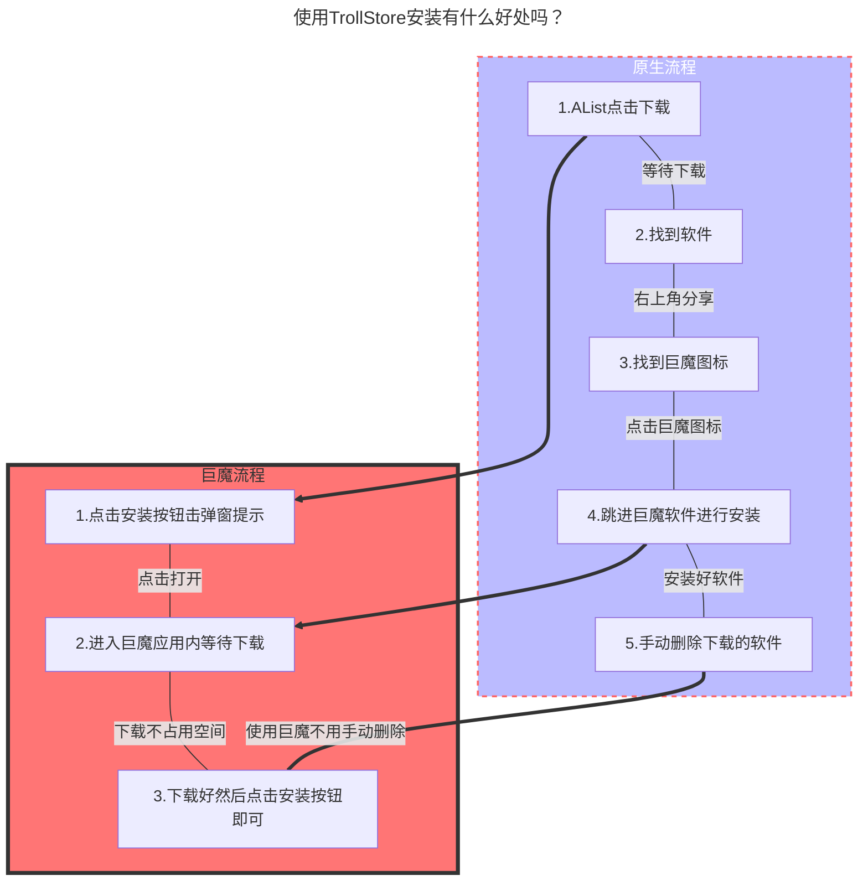

---
# This is the icon of the page
icon: iconfont icon-mini-app
# This control sidebar order
order: 8
# A page can have multiple categories
category:
  - Guide
# A page can have multiple tags
tag:
  - Advanced
  - Guide
# this page is sticky in article list
sticky: true
# this page will appear in starred articles
star: true
---

# IPA 安装

## **1.IPA原生安装**

直接上传 ipa 文件即可。

但是对于 **iOS 16 以上的** 设备，你需要将 ipa 文件命名为：`原文件名@bundle-identifier.ipa`，即需要在原来的基础上加入`@bundle-identifier`，其中的 `bundle-identifier` 即 IPA 包中 `Info.plist` 的 `CFBundleIdentifier`。如：

- aszs@rn.notes.best.ipa

推荐你使用 [ipa-renamer](https://github.com/Xhofe/ipa-renamer) 自动快速地重命名你的 IPA 文件。

- 如果你是手机用户也可以给IPA文件改名，但是你要会上述提到的格式才行，但是不提供手机改名软件请你自己解决...

### **Tips**

- ==.ipa安装 需要 https 和 有效的证书== ，不是随便一个包上传上去没签名就能安装的
- 爱思助手签名的无法使用在线安装，只能使用爱思助手安装（经群友测试）

:::tabs#ipa

@tab 电脑版如何改名

<BiliBili bvid="BV1bT411N7tT" ratio="16:9" low-quality no-danmaku />

**视频若失效可以前往观看：https://b23.tv/oLvHHC8**

@tab IOS 16手机如何改名

<BiliBili bvid="BV1kX4y1X7vo" />

**视频若失效可以前往观看：https://b23.tv/GxGG8Dn**

:::

**安装演示**：部署**HTTPS**和**IPA文件**已签名前提，如果是 ==IOS16自行改名== 若自己无法安装请自行排查问题所在

- **安装演示使用环境**： IOS15.4.1 iPhone12PM，个人证书，HTTPS

<ArtPlayer src="https://r2.izyt.cc/ios/ios_ts.m3u8" />

## **2. TrollStore(巨魔)安装**

 ==需要AList版本 ≥ 3.12.2 及以上==，支持安装TrollStore(巨魔)的设备（不含越狱设备）

已经支持更多设备请查看下方表格，图表内容来自 [**TrollStore**](https://github.com/opa334/TrollStore)

图表信息可能更新不及时可以前往查看  <i class="fa-regular fa-hand-point-right" style="color: #B197FC;"></i> https://ios.cfw.guide/installing-trollstore

|     开始     |     截止     |                       arm64 (A8 - A11)                       |                 arm64e (A12 - A17 / M1 - M2)                 |
| :----------: | :----------: | :----------------------------------------------------------: | :----------------------------------------------------------: |
|  13.7及更早  |  13.7及更早  |                            不支持                            |                            不支持                            |
|     14.0     |    14.8.1    | [Installing TrollStore (TrollHelper)](https://ios.cfw.guide/installing-trollhelper) | [Installing TrollStore (TrollHelperOTA)](https://ios.cfw.guide/installing-trollhelperota) |
|     15.0     | 15.5 beta 4  | [Installing TrollStore (TrollHelperOTA)](https://ios.cfw.guide/installing-trollhelperota) | [Installing TrollStore (TrollHelperOTA)](https://ios.cfw.guide/installing-trollhelperota) |
|     15.5     |     15.5     | [Installing TrollStore (TrollInstallerMDC)](https://ios.cfw.guide/installing-trollhelper-mdc) | [Installing TrollStore (TrollHelperOTA)](https://ios.cfw.guide/installing-trollhelperota) |
| 15.6 beta 1  | 15.6 beta 5  | [Installing TrollStore (TrollHelperOTA)](https://ios.cfw.guide/installing-trollhelperota) | [Installing TrollStore (TrollHelperOTA)](https://ios.cfw.guide/installing-trollhelperota) |
|     15.6     |    15.6.1    | [Installing TrollStore (TrollInstallerMDC)](https://ios.cfw.guide/installing-trollhelper-mdc) | [Installing TrollStore (TrollHelperOTA)](https://ios.cfw.guide/installing-trollhelperota) |
|     15.7     |    15.7.1    | [Installing TrollStore (TrollInstallerMDC)](https://ios.cfw.guide/installing-trollhelper-mdc) | [Installing TrollStore (TrollInstallerMDC)](https://ios.cfw.guide/installing-trollhelper-mdc) |
|    15.7.2    |    15.8.1    | [Installing TrollStore (TrollMisaka)](https://ios.cfw.guide/installing-trollhelper-trollmisaka) | [Installing TrollStore (TrollMisaka)](https://ios.cfw.guide/installing-trollhelper-trollmisaka) |
|     16.0     |    16.1.2    | [Installing TrollStore (TrollInstallerMDC)](https://ios.cfw.guide/installing-trollhelper-mdc) | [Installing TrollStore (TrollInstallerMDC)](https://ios.cfw.guide/installing-trollhelper-mdc) |
|     16.2     |    16.6.1    | [Installing TrollStore (TrollStar)](https://ios.cfw.guide/installing-trollhelper-trollstar) | [Installing TrollStore (TrollStar)](https://ios.cfw.guide/installing-trollhelper-trollstar) |
|   16.7 RC    |   16.7 RC    | [Installing TrollStore (TrollHelper)](https://ios.cfw.guide/installing-trollhelper) |                 没有安装方法（等待后续完善）                 |
|     16.7     |    16.7.5    |                            不支持                            |                            不支持                            |
|     17.0     |     17.0     | [Installing TrollStore (TrollHelper)](https://ios.cfw.guide/installing-trollhelper) |                 没有安装方法（等待后续完善）                 |
| 17.0.1及以后 | 17.0.1及以后 |                            不支持                            |                            不支持                            |

<a href="https://www.alipan.com/s/Z3mrsfdFY5h"><i class="fa-solid fa-party-horn fa-shake" style="color: #74C0FC;"></i> IPA Resources</a> :gift:

 

### **安装示例**

如果你要使用安装很简单，点击 **TrollStore(巨魔)** 按钮即可安装

### **其他说明**

1. 如果你点击 **TrollStore(巨魔)** 按钮后打开的是 Apple的放大镜是因为如下原因
   - 你的 `TrollStore` 版本号小于1.3+版本，建议直接更新到最新版
   - 你的使用 URL 方案没有启用，若启用后记得点击第一个选项立即注销生效 **（Rebuild Now）**
     - 

2. TrollStore URL唤醒格式是什么？

   - > `apple-magnifier://install?url=<URL_to_IPA>`

3. 这样安装有什么好处吗？

   - 解释见下面的流程图

