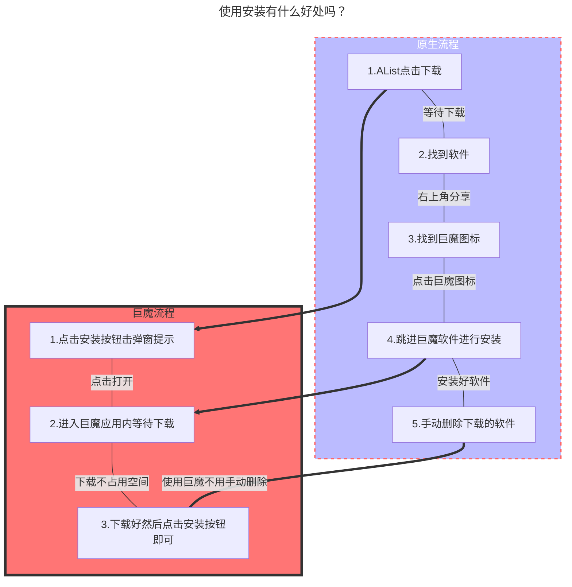

---
# This is the icon of the page
icon: mini-app
# This control sidebar order
order: 8
# A page can have multiple categories
category:
  - Guide
# A page can have multiple tags
tag:
  - Advanced
  - Guide
# this page is sticky in article list
sticky: true
# this page will appear in starred articles
star: true
---

# IPA 安装

## 1.IPA原生安装

直接上传 ipa 文件即可。

但是对于 **iOS 16 以上的** 设备，你需要将 ipa 文件命名为：`原文件名@bundle-identifier.ipa`，即需要在原来的基础上加入`@bundle-identifier`，其中的 `bundle-identifier` 即 IPA 包中 `Info.plist` 的 `CFBundleIdentifier`。如：

- aszs@rn.notes.best.ipa

推荐你使用 [ipa-renamer](https://github.com/Xhofe/ipa-renamer) 自动快速地重命名你的 IPA 文件。

- 如果你是手机用户也可以给IPA文件改名，但是你要会上述提到的格式才行，但是不提供手机改名软件请你自己解决...

### Tips

- ==.ipa安装 需要 https 和 有效的证书== ，不是随便一个包上传上去没签名就能安装的
- 爱思助手签名的无法使用在线安装，只能使用爱思助手安装（经群友测试）

:::tabs#ipa

@tab 电脑版如何改名

<ArtPlayer 
  src="https://hub.onmicrosoft.cn/public/video/wechat?wxv=wxv_2786278463950405640&raw=true" 
  poster="/img/advanced/video.png"
/>

**视频若失效可以前往观看：https://b23.tv/oLvHHC8**

@tab IOS 16手机如何改名

<ArtPlayer 
  src="https://hub.onmicrosoft.cn/public/video/weibo?uid=7821998556&cursor=4871961534007938&raw=true" 
/>

**视频若失效可以前往观看：https://b23.tv/GxGG8Dn**

:::

**安装演示**：部署**HTTPS**和**IPA文件**已签名前提，如果是 ==IOS16自行改名== 若自己无法安装请自行排查问题所在

- **安装演示使用环境**： IOS15.4.1 iPhone12PM，个人证书，HTTPS

<ArtPlayer 
  src="https://hub.onmicrosoft.cn/public/video/weibo?uid=7821998556&cursor=4870951244144255&raw=true" 
/>

## 2. TrollStore(巨魔)安装

支持安装TrollStore(巨魔)的设备（不含越狱设备）

最高到iPhone13系列设备系统版本不大于 `稳定版15.4.1` `测试版15.6 beta 1 - 5 `

如果你是iPhone14直接没戏啦出厂系统版本太高啦，详情查看下方表格

| Version / Device       | arm64 (A8 - A11)                                             | arm64e (A12 - A15, M1)                                       |
| ---------------------- | ------------------------------------------------------------ | ------------------------------------------------------------ |
| 13.7 and below         | Not Supported (CT Bug only got introduced in 14.0)           | Not Supported (CT Bug only got introduced in 14.0)           |
| 14.0 - 14.8.1          | [checkra1n + TrollHelper](https://github.com/opa334/TrollStore/blob/main/install_trollhelper.md) | [TrollHelperOTA (arm64e)](https://github.com/opa334/TrollStore/blob/main/install_trollhelperota_arm64e.md) |
| 15.0 - 15.4.1          | [TrollHelperOTA (iOS 15+)](https://github.com/opa334/TrollStore/blob/main/install_trollhelperota_ios15.md) | [TrollHelperOTA (iOS 15+)](https://github.com/opa334/TrollStore/blob/main/install_trollhelperota_ios15.md) |
| 15.5 beta 1 - 4        | [TrollHelperOTA (iOS 15+)](https://github.com/opa334/TrollStore/blob/main/install_trollhelperota_ios15.md) | [TrollHelperOTA (iOS 15+)](https://github.com/opa334/TrollStore/blob/main/install_trollhelperota_ios15.md) |
| 15.5 (RC)              | Not Supported (CT Bug fixed)                                 | Not Supported (CT Bug fixed)                                 |
| 15.6 beta 1 - 5        | [SSH Ramdisk](https://github.com/opa334/TrollStore/blob/main/install_sshrd.md) | [TrollHelperOTA (arm64e)](https://github.com/opa334/TrollStore/blob/main/install_trollhelperota_arm64e.md) |
| 15.6 (RC1/2) and above | Not Supported (CT Bug fixed)                                 | Not Supported (CT Bug fixed)                                 |

### 安装示例

如果你要使用安装很简单，点击 **TrollStore(巨魔)** 按钮即可安装

### 其他说明

1. 如果你点击 **TrollStore(巨魔)** 按钮后打开的是 Apple的放大镜是因为如下原因
   - 你的 `TrollStore` 版本号小于1.3+版本，建议直接更新到最新版
   - 你的使用 URL 方案没有启用，若启用后记得点击第一个选项立即注销生效 **（Rebuild Now）**
     - 

2. TrollStore URL唤醒格式是什么？

   - > `apple-magnifier://install?url=<URL_to_IPA>`

3. 这样安装有什么好处吗？

   - 解释见下面的流程图

