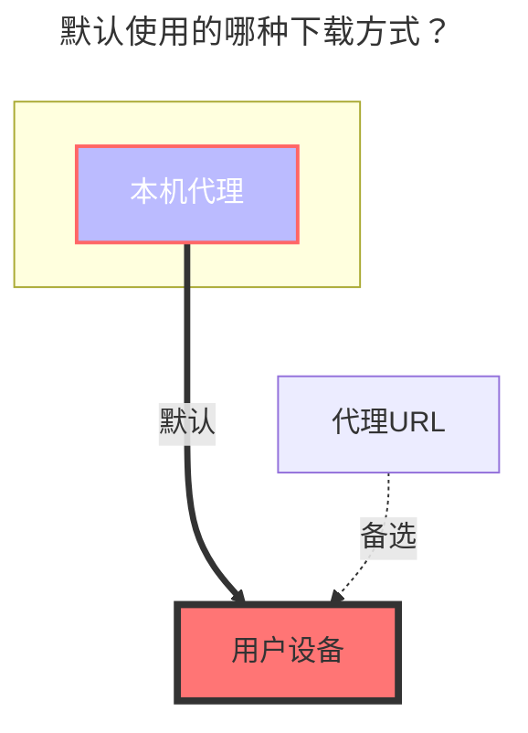

---
# This is the icon of the page
icon: iconfont icon-state
# This control sidebar order
order: 24
# A page can have multiple categories
category:
  - Guide
# A page can have multiple tags
tag:
  - Storage
  - Guide
# this page is sticky in article list
sticky: true
# this page will appear in starred articles
star: true
---

# 115 网盘

:::tip

由于 115 网盘的限制，下载必须携带 Cookies，所以只能使用本程序中的代理功能进行传输。 （可以用其他机器转）
:::

## **根文件夹 ID**

打开 115 网盘官网，点击进入要设置的文件夹时点击 URL 中 `cid`后面的数字

如 <https://115.com/?cid=249163533602609229&offset=0&tab=&mode=wangpan>

这个文件夹的 `根文件夹ID` 即为 `249163533602609229`

 

## **QRCode 扫码方式登录**

<button :disabled="state === 3 || state === 1"
style="outline:none;padding:12px;background:#70c6be;border:none;border-radius:8px;cursor:pointer;font-size:20px;"
@click="onClick">
{{ btnText }}
</button>

 

:::info Token: {{ token }}
:::

 

## **Cookie 方式登录**

`Cookie`可以浏览器登录从浏览器的`api`中获取，也可用抓包 115 应用获取 cookie，115 应用的有效期比较长，注意 cookie 最后不要有`;`。

 

## **秒传**

- **v.3.27.0** 版本 增强秒传：可以直接通过复制方式来和`阿里云盘Open`进行相互秒传文件
  - 前提是要从115秒传到阿里云盘Open的文件，阿里云盘Open已经存在，否则就是正常复制任务。
  - 如果将115的文件秒传到阿里云盘，需要将阿里云盘的秒传选项打开否则为正常模式上传

如果要使用秒传来上传文件建议在自己家用电脑本地搭建一个AList添加一个`本地存储`和`115云盘`进行复制秒传这样节省资源。

 

### **默认使用的下载方式**

