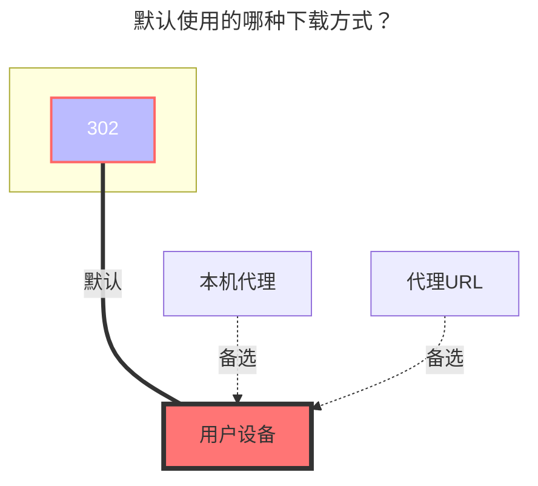

---
# This is the icon of the page
icon: iconfont icon-state
# This control sidebar order
order: 24
# A page can have multiple categories
category:
  - Guide
# A page can have multiple tags
tag:
  - Storage
  - Guide
  - "302"
# this page is sticky in article list
sticky: true
# this page will appear in starred articles
star: true
headerDepth: 5
---

# 115 网盘/分享

## 115 个人网盘

### **根文件夹 ID**

打开 115 网盘官网，点击进入要设置的文件夹时点击 URL 中 `cid`后面的数字

如 <https://115.com/?cid=249163533602609229&offset=0&tab=&mode=wangpan>

这个文件夹的 `根文件夹ID` 即为 `249163533602609229`

<br/>


### **Cookie获取方式**

挂载115云盘提示如下信息，是因为 115已经下架了 `Windows、Mac、Linux` 这三个客户端的应用

```json
{
"state": 0,
"error": "登录失败，系统已下架！如果你有电脑端的使用需求，我们诚挚邀请你下载体验115产品专属客户端“115浏览器”或在线使用“115网页端(115.com)”，畅享智能高效云生活。",
"errno": 0,
"message": "登录失败，系统已下架！如果你有电脑端的使用需求，我们诚挚邀请你下载体验115产品专属客户端“115浏览器”或在线使用“115网页端(115.com)”，畅享智能高效云生活。",
"code": 0
}
```

你获取的是这三个设备的Cookie自然就无法使用，请重新获取其它设备的Cookie进行挂载

<br/>


#### **1. QRCode 扫码方式登录**

<script setup lang="ts">
import { ref } from "vue";
import { api } from "@Api"
const btnText = ref("获取二维码");
// 0 -> Initial
// 1 -> Wait qr
// 2 -> Wait Scan
// 3 -> Getting Token
// 4 -> Success
const state = ref(0);
const src= ref('')
const token = ref('')
const ckData = ref('')
const getQr = async ()=>{
  btnText.value = '等待...';
  state.value = 1;
  const resp = await fetch(`${api()}/proxy/qrcodeapi.115.com/api/1.0/web/1.0/token`);
  const res = await resp.json();
  console.log(res)
  btnText.value='使用115网盘 APP 扫描然后点击'
  state.value = 2;
  ckData.value = {
    uid: res.data.uid,
    time: res.data.time.toString(),
    sign: res.data.sign,
    _ : (new Date().getTime()/ 1000).toString()
  };
  src.value = `${api()}/qr/?size=400&text=${encodeURIComponent(res.data.qrcode)}`
}
const getToken = async ()=>{
  state.value = 3;
  btnText.value = '等待...';
  const resp = await fetch(`${api()}/proxy/qrcodeapi.115.com/get/status/?uid=${ckData.value.uid}&time=${ckData.value.time}&sign=${ckData.value.sign}&_=${ckData.value._}`);
  const res = await resp.json();
  const {data:{version,status,msg}} = res;
  if(status !==  2){
    state.value = 2;
    btnText.value = '使用115网盘 APP 扫描然后点击'
    alert('Status:' + status);
    return
  }
  token.value = ckData.value.uid
  btnText.value = '获取 Token 成功'
  state.value = 4;
  console.log(res)
}
const onClick = async ()=>{
  if(state.value===0){
    getQr()
  }
  if(state.value===2){
    getToken()
  }
}
</script>
<button :disabled="state === 3 || state === 1"
style="outline:none;padding:12px;background:#70c6be;border:none;border-radius:8px;cursor:pointer;font-size:20px;"
@click="onClick">
{{ btnText }}
</button>

<div v-show="src" style="margin:4px">
 
</div>

<div v-show="token" >

:::info Token: {{ token }}
:::

</div>

-----

1. 点击 <i class="fa-solid fa-up fa-bounce" style="color: #70c6be;"></i> <Badge text="获取二维码" type="tip" color="rgb(112,198,190)" vertical="middle" />，然后使用115手机APP端进行扫码
2. APP扫码登录确认后，点击 ` 使用115网盘 APP 扫描然后点击` 按钮，获取 <Badge text="Token" type="info" vertical="middle" />
3. 将获取到的 <Badge text="Token" type="info" vertical="middle" /> 添加到 AList 115驱动的 **`二维码令牌`** 选项內，然后选择`Qrcode源`设备 (Cookie选项留空)
   - 可选设备：`Web`，`android`，`ios`，`tv`，`alipaymini`，`wechatmini`，`qandroid`
     - 不推荐选择 `Web` 和 `Android`(`ios`) ，因为自己常用的设备登录后会将原本登录的挤下线
4. 填写 <Badge text="Token" type="info" vertical="middle" /> 选择设备保存后会自动将 <Badge text="Token" type="info" vertical="middle" /> 获取对应设备的 Cookie 进行自动填写

<br/>


<br/>


#### **2. 手动抓取 Cookie 方式登录**

`Cookie`可以浏览器登录从浏览器的`api`中获取，也可用抓包 115 应用获取 cookie，115 应用的有效期比较长，注意 cookie 最后不要有`;`。

<br/>


#### **3. 使用Python脚本获取 Cookie**

 <i class="fa-solid fa-lightbulb fa-bounce" style="color: #4abf8a;"></i> 展开详细说明进行查看教程和脚本源码

:::: details 详细说明

::: details 查看源码

```python
#!/usr/bin/env python3
# encoding: utf-8

"扫码获取 115 cookie"

__author__ = "ChenyangGao <https://chenyanggao.github.io>"
__version__ = (0, 0, 2)
__all__ = [
    "AppEnum", "get_qrcode_token", "get_qrcode_status", "post_qrcode_result", 
    "get_qrcode", "login_with_qrcode", 
]

if __name__ == "__main__":
    from argparse import ArgumentParser, RawTextHelpFormatter

    parser = ArgumentParser(description="""\
扫码获取 115 cookie

默认在命令行输出，需要安装 qrcode: pip install qrcode
    - https://pypi.org/project/qrcode/
可以指定 -o 或 --open-qrcode 直接打开图片扫码
""", formatter_class=RawTextHelpFormatter)
    parser.add_argument("app", nargs="?", choices=("web", "android", "ios", "linux", "mac", "windows", "tv", "alipaymini", "wechatmini", "qandroid"), default="web", help="选择一个 app 进行登录，注意：这会把已经登录的相同 app 踢下线")
    parser.add_argument("-o", "--open-qrcode", action="store_true", help="打开二维码图片，而不是在命令行输出")
    parser.add_argument("-v", "--version", action="store_true", help="输出版本号")
    args = parser.parse_args()
    if args.version:
        print(".".join(map(str, __version__)))
        raise SystemExit(0)

from enum import Enum
from json import loads
from urllib.parse import urlencode
from urllib.request import urlopen, Request


AppEnum = Enum("AppEnum", "web, android, ios, linux, mac, windows, tv, alipaymini, wechatmini, qandroid")


def get_enum_name(val, cls):
    if isinstance(val, cls):
        return val.name
    try:
        if isinstance(val, str):
            return cls[val].name
    except KeyError:
        pass
    return cls(val).name


def get_qrcode_token():
    """获取登录二维码，扫码可用
    GET https://qrcodeapi.115.com/api/1.0/web/1.0/token/
    :return: dict
    """
    api = "https://qrcodeapi.115.com/api/1.0/web/1.0/token/"
    return loads(urlopen(api).read())


def get_qrcode_status(payload):
    """获取二维码的状态（未扫描、已扫描、已登录、已取消、已过期等）
    GET https://qrcodeapi.115.com/get/status/
    :param payload: 请求的查询参数，取自 `login_qrcode_token` 接口响应，有 3 个
        - uid:  str
        - time: int
        - sign: str
    :return: dict
    """
    api = "https://qrcodeapi.115.com/get/status/?" + urlencode(payload)
    return loads(urlopen(api).read())


def post_qrcode_result(uid, app="web"):
    """获取扫码登录的结果，并且绑定设备，包含 cookie
    POST https://passportapi.115.com/app/1.0/{app}/1.0/login/qrcode/
    :param uid: 二维码的 uid，取自 `login_qrcode_token` 接口响应
    :param app: 扫码绑定的设备，可以是 int、str 或者 AppEnum
        app 目前发现的可用值：
            - 1,  "web",        AppEnum.web
            - 2,  "android",    AppEnum.android
            - 3,  "ios",        AppEnum.ios
            - 4,  "linux",      AppEnum.linux
            - 5,  "mac",        AppEnum.mac
            - 6,  "windows",    AppEnum.windows
            - 7,  "tv",         AppEnum.tv
            - 8,  "alipaymini", AppEnum.alipaymini
            - 9,  "wechatmini", AppEnum.wechatmini
            - 10, "qandroid",   AppEnum.qandroid
    :return: dict，包含 cookie
    """
    app = get_enum_name(app, AppEnum)
    payload = {"app": app, "account": uid}
    api = "https://passportapi.115.com/app/1.0/%s/1.0/login/qrcode/" % app
    return loads(urlopen(Request(api, data=urlencode(payload).encode("utf-8"), method="POST")).read())


def get_qrcode(uid):
    """获取二维码图片（注意不是链接）
    :return: 一个文件对象，可以读取
    """
    url = "https://qrcodeapi.115.com/api/1.0/mac/1.0/qrcode?uid=%s" % uid
    return urlopen(url)


def login_with_qrcode(app="web", scan_in_console=True):
    """用二维码登录
    :param app: 扫码绑定的设备，可以是 int、str 或者 AppEnum
        app 目前发现的可用值：
            - 1,  "web",        AppEnum.web
            - 2,  "android",    AppEnum.android
            - 3,  "ios",        AppEnum.ios
            - 4,  "linux",      AppEnum.linux
            - 5,  "mac",        AppEnum.mac
            - 6,  "windows",    AppEnum.windows
            - 7,  "tv",         AppEnum.tv
            - 8,  "alipaymini", AppEnum.alipaymini
            - 9,  "wechatmini", AppEnum.wechatmini
            - 10, "qandroid",   AppEnum.qandroid
    :return: dict，扫码登录结果
    """
    qrcode_token = get_qrcode_token()["data"]
    qrcode = qrcode_token.pop("qrcode")
    if scan_in_console:
        try:
            from qrcode import QRCode
        except ModuleNotFoundError:
            from sys import executable
            from subprocess import run
            run([executable, "-m", "pip", "install", "qrcode"], check=True)
            from qrcode import QRCode # type: ignore
        qr = QRCode(border=1)
        qr.add_data(qrcode)
        qr.print_ascii(tty=True)
    else:
        from atexit import register
        from os import remove
        from threading import Thread
        from tempfile import NamedTemporaryFile
        qrcode_image = get_qrcode(qrcode_token["uid"])
        with NamedTemporaryFile(suffix=".png", delete=False) as f:
            f.write(qrcode_image.read())
            f.flush()
        register(lambda: remove(f.name))
        def open_qrcode():
            platform = __import__("platform").system()
            if platform == "Windows":
                from os import startfile # type: ignore
                startfile(f.name)
            elif platform == "Darwin":
                from subprocess import run
                run(["open", f.name])
            else:
                from subprocess import run
                run(["xdg-open", f.name])
        Thread(target=open_qrcode).start()
    while True:
        try:
            resp = get_qrcode_status(qrcode_token)
        except TimeoutError:
            continue
        status = resp["data"].get("status")
        if status == 0:
            print("[status=0] qrcode: waiting")
        elif status == 1:
            print("[status=1] qrcode: scanned")
        elif status == 2:
            print("[status=2] qrcode: signed in")
            break
        elif status == -1:
            raise OSError("[status=-1] qrcode: expired")
        elif status == -2:
            raise OSError("[status=-2] qrcode: canceled")
        else:
            raise OSError("qrcode: aborted with %r" % resp)
    return post_qrcode_result(qrcode_token["uid"], app)


if __name__ == "__main__":
    resp = login_with_qrcode(args.app, scan_in_console=not args.open_qrcode)
    print()
    print("; ".join("%s=%s" % t for t in resp['data']['cookie'].items()))

```

源码来自：[**https://gist.github.com/ChenyangGao/d26a592a0aeb13465511c885d5c7ad61**](https://gist.github.com/ChenyangGao/d26a592a0aeb13465511c885d5c7ad61)

:::

<br/>

1. 需要安装 [**Python 3.11.x**](https://www.python.org/downloads/) 以上版本

2. 如果二维码在 `CMD` 和 `powershell` 两个终端无法显示正常，可以使用`-o`参数生成图片的方式来扫码，或者需要额外安装一个终端

   1. 使用 `-o` 参数，生成图片方式然后扫码确认
      - ```python
        python main.py wechatmini -o
        ```

   可以获取的设备有如下，如果不填写设备默认使用的是 `Web` 端的设备

   `Web`，`android`，`ios`，~~`linux`，`mac`，`windows`~~，`tv`，`alipaymini`，`wechatmini`，`qandroid`

   - `alipaymini` 和 `wechatmini` 分别是支付宝小程序和微信小程序
   - **Windows、Mac、Linux 应该不能使用了，最近官方把客户端下架了**
   - 建议使用一些自己不常用的设备，否则登录会将之前的挤掉
   
   -----
   
   2. 另外安装终端
      - Windows Store：**https://apps.microsoft.com/detail/9n0dx20hk701?rtc=1&hl=zh-cn&gl=CN**
      - GitHub 下载：**https://github.com/microsoft/terminal/releases**
   
   3. 其它方式自行解决

-----

执行命令，获取二维码 APP扫码获取 `Cookie` 

:::tabs#qr

@tab 直接执行

```shell
PS C:\Users\233\Desktop\115> python --version
Python 3.12.2
PS C:\Users\233\Desktop\115> python main.py wechatmini
█▀▀▀▀▀▀▀█▀▀▀▀█▀███▀▀▀█▀█▀▀▀██▀█▀▀▀▀▀▀▀█
█ █▀▀▀█ █ █▀▄▀█▄▀▀█▀█  ▄█▀▀ █▀█ █▀▀▀█ █
█ █   █ █▀█  ▄ ▄▀▄ ▀ ▀▄ █▀▄▀█▀█ █   █ █
█ ▀▀▀▀▀ █▀█ ▄▀▄ ▄ ▄ █ ▄▀▄▀█▀█▀█ ▀▀▀▀▀ █
█▀██▀▀▀▀▀▀▀ ▄█ ▀█ █▀▀▀ █▀ ▄▄▄ ▀██▀█▀▀▀█
██▄▀▀▄▀▀▀▀ ▄██▀▄██▀██▄█ █▀▀▀ ▀▀▀▄▄▀ ▄▀█
█   ▀██▀████ ▀ ▀ ▀ █▀ ▀▀▄▄▀▄ █▄▀▄▄ ▀▀▀█
█ ▄▀▀█▄▀█▀▀██ ▀▀▀▀ ▄▀ ▀███▀██▀▄▀▀▄▄   █
██▄█ ▄▀▀█▄   ▀█▄▀▄▄ █ █▀ ▄▀▀  ▄▀█▀█▀█▀█
███▄ █ ▀ ▀█  █▄ ▀▀▀▀█▀█▀█ ▄▀▀ ▄ █  ██▄█
█ █▀▀▀█ █ ▄▄▀▄▄▀ █▄▄▀█▀ █▀▄█  ▀▀▀ ▀█▀ █
█ █   █ █▄ ▄▀ █▀▀ ▀▄▀▀█▀▀  █ █ ▄█▀▄▄ ▀█
█ ▀▀▀▀▀ █▀  █▄▀ ▀ ▄█▄ █▄▀▀█▄ ▀ ▀▄▄ ▄▄ █
▀▀▀▀▀▀▀▀▀▀▀▀▀▀▀▀▀▀▀▀▀▀▀▀▀▀▀▀▀▀▀▀▀▀▀▀▀▀▀
```

直接执行 二维码会出现在终端中进行显示

@tab 使用-o参数

```bash
PS C:\Users\233\Desktop\115> python --version
Python 3.12.2
PS C:\Users\233\Desktop\115> python main.py wechatmini -o
```

使用 `-o` 参数后会自动弹出一张二维码图片

:::

::::

<br/>


### **秒传**

- **v.3.27.0** 版本 增强秒传：可以直接通过复制方式来和`阿里云盘Open`进行相互秒传文件
  - 前提是要从115秒传到阿里云盘Open的文件，阿里云盘Open已经存在，否则就是正常复制任务。
  - 如果将115的文件秒传到阿里云盘，需要将阿里云盘的秒传选项打开否则为正常模式上传

如果要使用秒传来上传文件建议在自己家用电脑本地搭建一个AList添加一个`本地存储`和`115云盘`进行复制秒传这样节省资源。

<br/>

### **离线下载**

<Badge text="v3.37.0" type="info" vertical="middle" /> 及以上版本支持在AList调用115离线下载功能

右下角选择 <span style="color: rgb(24, 144, 255);"><svg fill="none" stroke-width="0" xmlns="http://www.w3.org/2000/svg" viewBox="0 0 24 24" class="toolbar-toggle hope-icon hope-c-XNyZK hope-c-PJLV hope-c-PJLV-ifkxHPo-css" height="1em" width="1em" style="overflow: visible;"><path fill="currentColor" d="M7 14a2 2 0 100-4 2 2 0 000 4zM14 12a2 2 0 11-4 0 2 2 0 014 0zM17 14a2 2 0 100-4 2 2 0 000 4z"></path><path fill="currentColor" fill-rule="evenodd" d="M24 12c0 6.627-5.373 12-12 12S0 18.627 0 12 5.373 0 12 0s12 5.373 12 12zm-2 0c0 5.523-4.477 10-10 10S2 17.523 2 12 6.477 2 12 2s10 4.477 10 10z" clip-rule="evenodd"></path></svg></span><span style="color: rgb(24, 144, 255);"><svg fill="currentColor" stroke-width="0" xmlns="http://www.w3.org/2000/svg" viewBox="0 0 512 512" class="hope-icon hope-c-XNyZK hope-c-PJLV hope-c-PJLV-iipViGO-css" tips="offline_download" height="1em" width="1em" style="overflow: visible;"><path fill="none" stroke="currentColor" stroke-miterlimit="10" stroke-width="32" d="M421.83 293.82A144 144 0 00218.18 90.17M353.94 225.94a48 48 0 00-67.88-67.88"></path><path stroke-linecap="round" stroke-miterlimit="10" stroke-width="32" d="M192 464v-48M90.18 421.82l33.94-33.94M48 320h48"></path><path fill="none" stroke="currentColor" stroke-linejoin="round" stroke-width="32" d="M286.06 158.06L172.92 271.19a32 32 0 01-45.25 0L105 248.57a32 32 0 010-45.26L218.18 90.17M421.83 293.82L308.69 407a32 32 0 01-45.26 0l-22.62-22.63a32 32 0 010-45.26l113.13-113.17M139.6 169.98l67.88 67.89M275.36 305.75l67.89 67.88"></path> </svg></span> 离线下载选项选择`115 Cloud`

- 支持：`magne`、`http`、 `ed2k` 链接

仅支持使用115个人云盘使用离线下载，非115个人云盘会提示如下错误，**虽然添加离线下载提示成功但是在后台会提示错误**

- unsupported storage driver for offline download, only 115 Cloud is supported


- 使用115离线下载的一些提示
  1. 可能会发生不同步的问题（手动右下角刷新 <span style="color: rgb(24, 144, 255);"><svg fill="currentColor" stroke-width="0" xmlns="http://www.w3.org/2000/svg" viewBox="0 0 24 24" class="hope-icon hope-c-XNyZK hope-c-PJLV hope-c-PJLV-ifkxHPo-css" tips="refresh" height="1em" width="1em" style="overflow: visible;"><path fill="none" d="M0 0h24v24H0z"></path><path d="M5.463 4.433A9.961 9.961 0 0112 2c5.523 0 10 4.477 10 10 0 2.136-.67 4.116-1.81 5.74L17 12h3A8 8 0 006.46 6.228l-.997-1.795zm13.074 15.134A9.961 9.961 0 0112 22C6.477 22 2 17.523 2 12c0-2.136.67-4.116 1.81-5.74L7 12H4a8 8 0 0013.54 5.772l.997 1.795z"></path></svg></span>）
  2. 目前当下载成功后，删除离线列表中完成的任务
  3. 115已经在离线列表中的任务url不能再次添加

<br/>

### **默认使用的下载方式**




## **115网盘分享**


`分享链接ID`^1^ 和 `分享链接提取码`^2^ 分别如何获取一目了然

### **根文件夹ID**

默认为空，挂载整个目录文件。

文件夹ID 分根文件夹ID和子文件夹ID，下面分别演示了如何获取`分享根文件夹目录ID`^1^以及`其它子文件夹目录ID`^2^

::: tabs#115

@tab 1分享根文件夹目录ID

打开开发者模式(F12)先将请求全部清空，我们进入文件夹，先将全部请求清空，

我们再点击根文件夹进入，右侧会有一个新的请求，然后选择`载荷`就能看到我们的这个文件夹的ID (cid)


@tab 2其它子文件夹目录ID

打开开发者模式(F12)先将请求全部清空，我们进入文件夹，先将全部请求清空，

右侧会有一个新的请求，然后选择`预览` 然后进行展开查看，就可以看到其它子文件夹的ID (cid)


:::

<br/>

### **错误提示**

例如下图所示的115分享链接分享过期，但是分享链接还能打开


但是在添加保存时候会出现如下错误码：

`Failed init storage but storage is already created: failed init storage: failed to get share snap: json: cannot unmarshal number into Go struct field .data.shareinfo.share_state of type string `


### **默认使用的下载方式**

