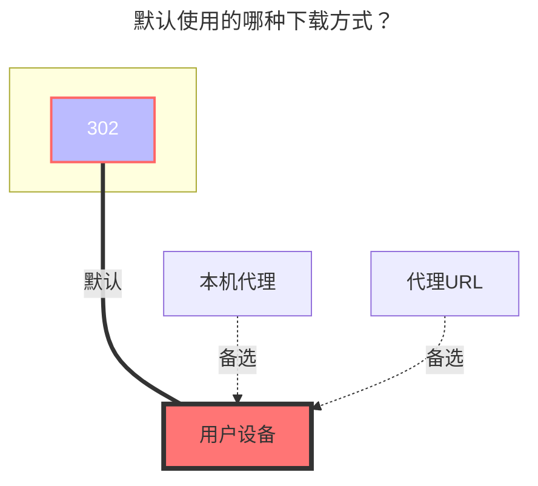

---
# This is the icon of the page
icon: iconfont icon-state
# This control sidebar order
order: 25
# A page can have multiple categories
category:
  - Guide
# A page can have multiple tags
tag:
  - Storage
  - Guide
# this page is sticky in article list
sticky: true
# this page will appear in starred articles
star: true
---

# 115 网盘分享

挂载115网盘分享链接，可供下载，无上传编辑等功能。

:::tip

由于 115 网盘的限制，获取下载直链必须携带 Cookies，所以必须登陆。
:::

## **根文件夹 ID**

默认 "" 则为挂载分享链接的全部内容

## **登录**

同 115 网盘

## **分享码/访问码获取**

115网盘分享链接： [https://115.com/s/sw60op83nux?password=y908#](https://115.com/s/sw60op83nux?password=y908#)

**分享码** 为：**sw60op83nux**
**访问码** 为：**y908**

### **默认使用的下载方式**

