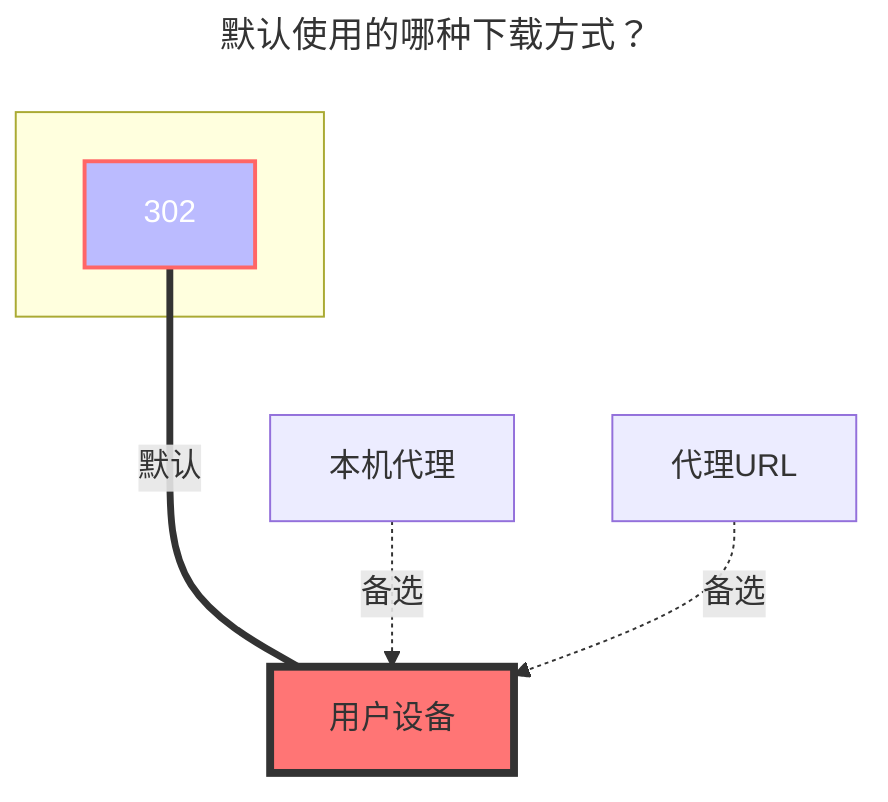

---
# This is the icon of the page
icon: iconfont icon-state
# This control sidebar order
order: 9
# A page can have multiple categories
category:
  - Guide
# A page can have multiple tags
tag:
  - Storage
  - Guide
  - "302"
# this page is sticky in article list
sticky: true
# this page will appear in starred articles
star: true
---

# 123网盘/分享/直链

可以查看下方选项卡内容查看不同方式挂载（包括 **`直链`** ,`个人`,`分享`）

- `直链`：仅适配了鉴权功能，链接也需要自己填写，像[地址树一样](/zh/guide/drivers/UrlTree.md),把在123直链复制的直链填写进去即可

- `个人`：免费用户10G流量下载，上传不限制，禁止多IP共享使用


::::: tabs#123

@tab 个人

## **个人**

:::: tip

免费用户10G流量下载，上传不限制，禁止多IP共享使用

- 需要使用 `v3.33.0`版本

::: warning 

挂载提示：

```json
failed get objs: failed to list objs:当前账号存在安全风险，请使用短信验证码或者微信进行登录。
```

解决方案：

- 这是由于123云盘官方禁止在陌生设备挂载，如果你是在`本地挂载`或者`Windows Server服务器挂载`可以在本地打开123云盘网页登录一下或者修改一次密码
  - 例子：[#6105](https://github.com/alist-org/alist/discussions/6105#discussioncomment-8628361)、 [#6254](https://github.com/alist-org/alist/discussions/6254#discussioncomment-8884882)


:::

::::

https://www.123pan.com/

只需填写账户密码即可。

### **用户名**

用于登录的手机号码

### **密码**

用于登录的密码

### **根文件夹 ID**

输入要挂载的文件夹，官网URL的最后一串，如：


### **使用建议**

- 貌似123的API每次加载的数量有限，故如果你一个文件夹内一次性加载几百个文件，可能会报错
- 建议不用在每个文件夹内放置太多子文件/文件夹


@tab 直链

## **直链**

::: danger 请仔细阅读此提醒

因为123云盘直链是付费购买，有额度的，如果添加123直链存储，请及时设置密码，元信息等措施，防止被人恶意刷流量

设置好后，先自己在无痕模式下自己测试一下，没有设置正确防盗措施被恶意刷流量，自行负责。

:::

首先打开 **`123云盘直链管理`**: **https://www.123pan.com/DirectLink** 右下角自己设置一个鉴权秘钥，然后打开鉴权状态开关


- 打开设置 123云盘设置 : **https://www.123pan.com/Setting** ，找到帐号ID【下图`1`号标签】
- 如何开启直链？（需要开启会员才能用）
  - 找到要开启的文件夹右键点击`启用直链空间`，开启后就会看到文件夹有一个链接图标【下图`2`号标签】
- 如何获取文件直链？【下图`3`号标签】
  - 进入已经`启用直链空间`的文件夹，找到需要获取的文件右键`获取直链链接`，获取到后填写到AList配置內


### **填写示例**

- **来源链接**：填写我们一条一条复制的文件直链

  - 支持像[地址数](/zh/guide/drivers/UrlTree.md)那样新建不同文件夹，支持填写文件大小和修改时间（提供四种方案可以使用，像地址树填写参考下方图片的图二示例）
  - 文件大小单位：为`B`字节,例如1MB的文件要写，1048567，具体字节换算自己在浏览器搜索（可以不写）
  - 文件修改时间：为`Unix timestamp-时间戳`，具体如何换算可以在浏览器搜索（可以不写）

  ```txt
  填写格式:
  [文件字节大小:][文件时间戳:]URL
  127451136:1694101621:https://vip.123pan.cn/1812xxx499/123-link-Test/linuxqq_3.2.0-16736_mips64el.deb
  [文件字节大小:]URL
  134847488:https://vip.123pan.cn/1812xxx499/123-link-Test/linuxqq_3.2.0-16736_loong64.deb
  [文件时间戳:]URL
  1694101621:https://vip.123pan.cn/1812xxx499/123-link-Test/linuxqq_3.2.0-16736_arm64.AppImage
  URL
  https://vip.123pan.cn/1812xxx499/123-link-Test/linuxqq_3.2.0-16736_x86_64.AppImage
  ```

- **鉴权秘钥**：

  - 直链管理页面自己设置，并开启，请必须开启

- **用户Uid**：

  - 帐号设置页面內 帐号ID

- **有效期**：

  - 文件直链有效期，单位为分钟，默认填充为30分钟

<div class="image-preview">  
    
    
</div>


@tab 分享

## **分享**

::: warning 

由于123网盘的限制，此驱动不再积极维护
:::

估计用不了几天就会被修复~

填写驱动的 **`分享key`** 和选填 **`分享密码`** (如果有密码需要填写)，根文件夹ID默认为`0`显示全部文件

### **填写示例**


### **分享密码**

有就填写，没有就不用

### **根文件夹 ID**

分享链接根目录ID是`0`，展示全部文件

如果只想展示某个文件夹，打开开发者模式(F12)清空全部请求（可能123禁止debug调试需要自己关闭这个才能继续）

在想展示的目录上级目录请求內找到图片中右侧的请求，然后点击`响应`，找到下面的格式化按钮`{}`格式化一下，即可看到相关的目录ID，

如果不确定目录ID对不对目录ID下方有目录名称


:::::


## **默认使用的下载方式**

