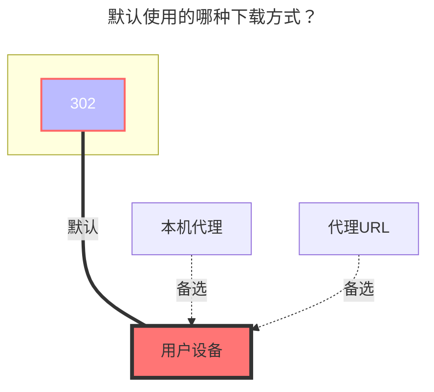

---
# This is the icon of the page
icon: iconfont icon-state
# This control sidebar order
order: 9
# A page can have multiple categories
category:
  - Guide
# A page can have multiple tags
tag:
  - Storage
  - Guide
# this page is sticky in article list
sticky: true
# this page will appear in starred articles
star: true
---

# 123网盘/分享

## **个人**

https://www.123pan.com/

只需填写账户密码即可。

### **用户名**

用于登录的手机号码

### **密码**

用于登录的密码

### **根文件夹 ID**

输入要挂载的文件夹，官网URL的最后一串，如：

### **使用建议**

- 貌似123的API每次加载的数量有限，故如果你一个文件夹内一次性加载几百个文件，可能会报错
- 建议不用在每个文件夹内放置太多子文件/文件夹

## **分享**

估计用不了几天就会被修复~

填写驱动的 **`分享key`** 和选填 **`分享密码`** (如果有密码需要填写)，根文件夹ID默认为`0`显示全部文件

### **填写示例**

### **分享密码**

有就填写，没有就不用

### **根文件夹 ID**

分享链接根目录ID是`0`，展示全部文件

如果只想展示某个文件夹，打开开发者模式(F12)清空全部请求（可能123禁止debug调试需要自己关闭这个才能继续）

在想展示的目录上级目录请求內找到图片中右侧的请求，然后点击`响应`，找到下面的格式化按钮`{}`格式化一下，即可看到相关的目录ID，

如果不确定目录ID对不对目录ID下方有目录名称

## **默认使用的下载方式**

