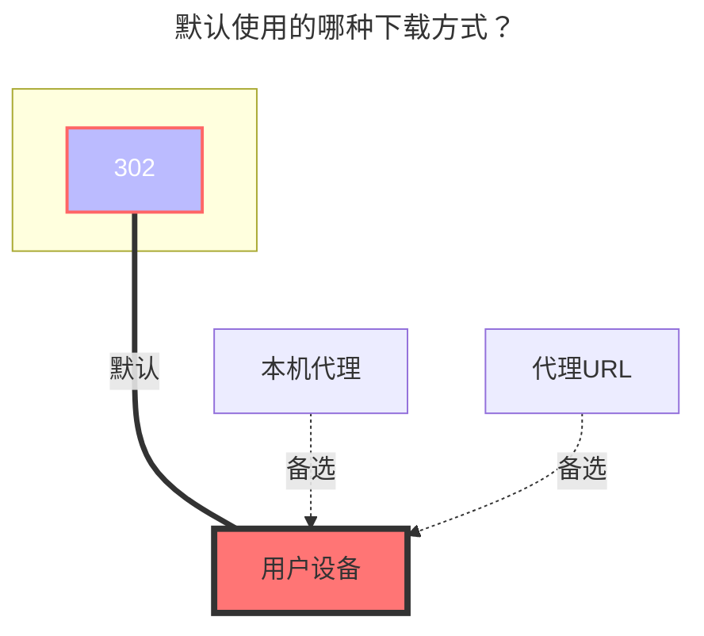

---
# This is the icon of the page
icon: iconfont icon-state
# This control sidebar order
order: 9
# A page can have multiple categories
category:
  - Guide
# A page can have multiple tags
tag:
  - Storage
  - Guide
# this page is sticky in article list
sticky: true
# this page will appear in starred articles
star: true
---

# 123云盘 Open

:::tip 

123云盘Open，使用的是官方授权 API 开发，仅适用于 **`123云盘会员用户`**

:::

:::: warning 注意事项

1. 开放平台发放的 Access Token 也将作为设备计算。同一时刻只允许 client_id 下最多 3 个token 正在使用。多次颁发会存在将 Token 踢下线的情况。颁发后的 Token 有效期为 30 天。
2. OpenAPI 目前仅对会员用户开放。

:::danger 请仔细阅读此注意事项

因API获取的链接都是直链，是需要付费，**添加云盘后请及时配置[加密/元信息]等措施，防止被[爬虫/其他人]恶意[访问/分享]导致帐号被刷流量.**

:::

::::

## **API请求限制**

为确保所有用户的使用体验，123云盘开放平台会对下面 API 进行限流：

| 详细说明             | API                   | 限制QPS |
| :------------------- | :-------------------- | ------- |
| **获取用户信息**     | api/v1/user/info      | 1       |
| **移动文件**         | api/v1/file/move      | 1       |
| **彻底删除文件**     | api/v1/file/delete    | 1       |
| **获取文件列表**     | api/v1/file/list      | 4       |
| **创建目录**         | upload/v1/file/mkdir  | 2       |
| **创建文件**         | upload/v1/file/create | 2       |
| **获取access_token** | api/v1/access_token   | 1       |

获取文件列表每次数量最大100，QPS限制1秒4次，如果列表文件较多建议设置AList分页加载

- 后台 --> 设置 --> 站点 --> **`分页类型`** 自己选择一个 --> **`默认每页数量`** 填写一下

## **默认使用的下载方式**

