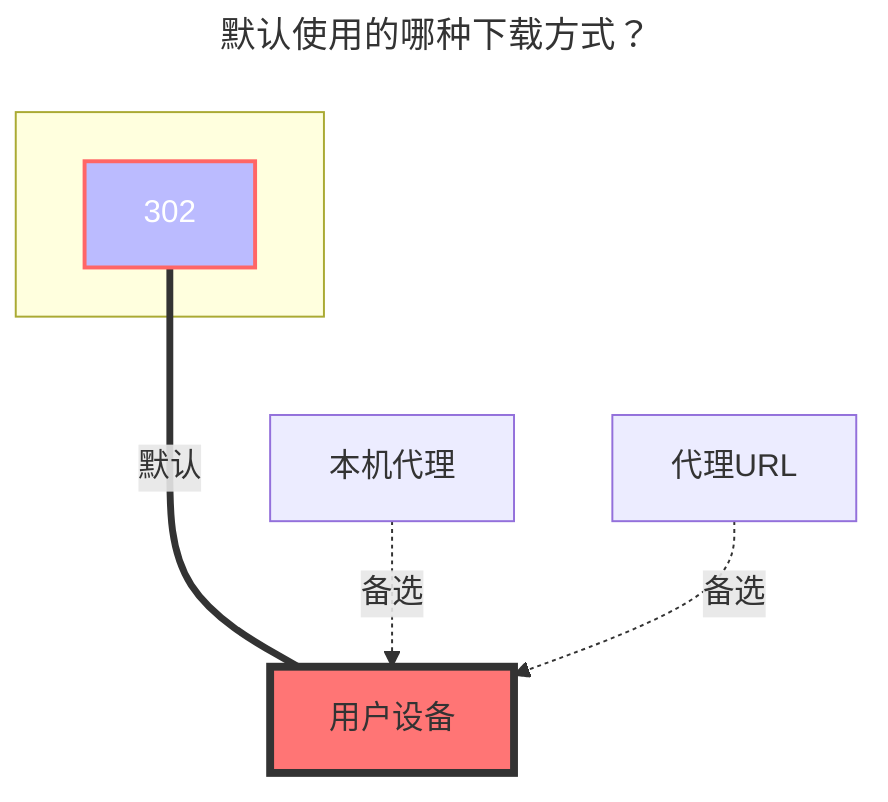

---
# This is the icon of the page
icon: state
# This control sidebar order
order: 7
# A page can have multiple categories
category:
  - Guide
# A page can have multiple tags
tag:
  - Storage
  - Guide
# this page is sticky in article list
sticky: true
# this page will appear in starred articles
star: true
---

# 中国移动云盘

## **帐户**

用于登录的手机号码

云盘地址：**https://yun.139.com/**

- :warning: AList版本必须大于 `v3.18.0` 版本才能使用本教程（不包含v3.18.0）

:::tip

已更换鉴权方式，请获取 `Authorization` 进行填写

:::

## **根文件夹ID**

- 个人云：root，会将所有的都列出来，涵盖18项(自行查看)，正常文件在 **我的文件夹** 这个里面.
  - 如果写文件夹ID列出的是正常的根目录文件夹（推荐使用这个）

- 家庭云：根目录为空就是全部文件
  - 若想挂载单独某个文件夹，在下方图片家庭云中获取目录ID方法

## **类型**

个人云：选择个人云

家庭云：选择家庭云

## **其他**

1. 其他信息取自请求，已经从获取cookie改变成获取`Authorization`

2. 请求信息中底部找不到`载荷`，就去顶部`上面一排`，标记了紫色高亮

### **Cloud ID**

个人云不需要填写，**家庭云专用**。

### **搜索关键词**

注意查看关键词，下方获取 **`Authorization`** 时使用

- 个人云：**getDisk**
- 家庭云：**queryContentList**

### **个人云：**

  
    
    

### **家庭云：**

注意：家庭云不支持重命名、移动、复制和上传。

  
    
    

::: details 手把手教学视频

虽然视频是V2版本，但是获取目录ID 和 Cloud ID的方式一样，

**https://www.bilibili.com/video/BV1US4y1w79a**

现在已经从获取Cookie的方式变成了获取`Authorization`，获取方式可以看下方[填写示例](#填写示例)教程

:::

### **AList挂载填写示例：**

==`Authorization`只需要填写Basic空格后面开始的内容==

  
    
    

### **默认使用的下载方式**

