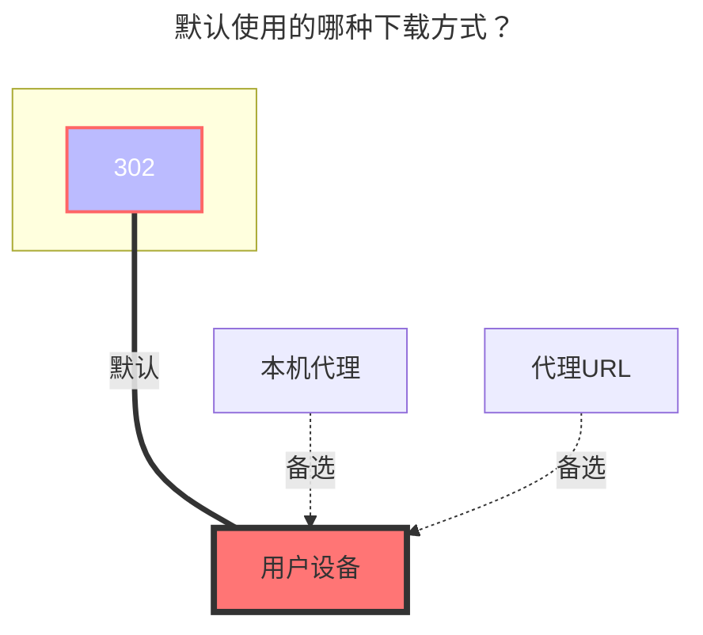

---
# This is the icon of the page
icon: iconfont icon-state
# This control sidebar order
order: 7
# A page can have multiple categories
category:
  - Guide
# A page can have multiple tags
tag:
  - Storage
  - Guide
  - "302"
# this page is sticky in article list
sticky: true
# this page will appear in starred articles
star: true
---

# 中国移动云盘

云盘地址：**https://yun.139.com/**

- :warning: AList版本必须大于 `v3.18.0` 版本才能使用本教程（不包含v3.18.0）

:::tip

已更换鉴权方式，请获取 `Authorization` 进行填写

:::

 

## **根文件夹ID**

- 个人云：`root`，可以为空会自动填写，会将所有的都列出来，涵盖18项(自行查看)，正常文件在 **我的文件夹** 这个里面.
  - 如果写文件夹ID列出的是正常的根目录文件夹（推荐使用这个）
- 家庭云：根目录为空就是全部文件
  - 若想挂载单独某个文件夹，在下方图片[家庭云](#家庭云)中获取目录ID方法
- 新个人云：`/`，可以为空会自动填写，会将所有的都列出来
  - 若想挂载单独某个文件夹，在下方图片[新个人云](#新个人云)中获取目录ID方法

 

## **代理range**

需要先启用 `Web代理` 或者 `Webdav本地代理` 才会生效

- 目前仅适用于：`别名`、`中国移动云盘`、`AList V3`
  - 具体功能说明：**https://github.com/alist-org/alist/pull/6496#issue-2309839607**

 

## **类型**

1. 个人云：选择个人云

2. 家庭云：选择家庭云

3. 新个人云：新版API 
   - 新注册的账号才有，可以通过在请求搜索 `getDisk` 来区分，如果能搜到就是旧版的，不能搜到就是新版的

如果是新API无法使用 `个人云`类型，虽然没有错误信息，但是文件不会被加载

有`getDisk`请求的无法使用`新个人云`类型，否则会提示`用户不存在`

 

## **其他**

1. 其他信息取自请求，已经从获取cookie改变成获取`Authorization`
   1. 新个人云可以通过另外的方式获取详情查看[新个人云](#新个人云)的图片示例

2. 请求信息中底部找不到`载荷`，就去顶部`上面一排`，标记了紫色高亮

 

### **Cloud ID**

个人云不需要填写，**家庭云专用**。

 

### **搜索关键词**

注意查看关键词，下方获取 **`Authorization`** 时使用

- 个人云：**getDisk**
- 家庭云：**queryContentList**

 

### **个人云：**

  
    
    

 

### **家庭云：**

注意：家庭云不支持重命名、移动、复制和上传。

  
    
    

::: details 手把手教学视频

虽然视频是V2版本，但是获取目录ID 和 Cloud ID的方式一样，

**https://www.bilibili.com/video/BV1US4y1w79a**

现在已经从获取Cookie的方式变成了获取`Authorization`，获取方式可以看下方[填写示例](#填写示例)教程

:::

 

### **新个人云：**

  
    

 

### **AList挂载填写示例：**

- ==`Authorization`只需要填写Basic空格后面开始的内容==

- 新个人云文件夹ID，你进入文件夹后会自动变化，你需要哪个文件夹ID就进入哪个文件夹，然后获取`currentCatalogID`^图3^的值就可以

  
    
    
    

 

### **默认使用的下载方式**

