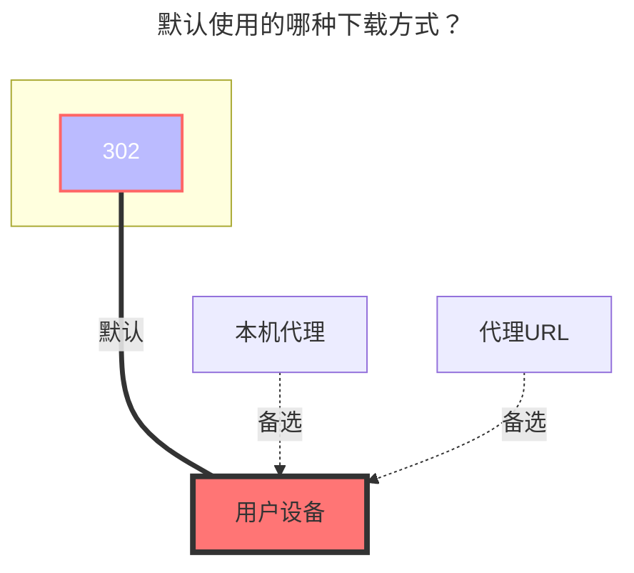

---
# This is the icon of the page
icon: iconfont icon-state
# This control sidebar order
order: 24
# A page can have multiple categories
category:
  - Guide
# A page can have multiple tags
tag:
  - Storage
  - Guide
  - "302"
# this page is sticky in article list
sticky: true
# this page will appear in starred articles
star: true
---

# 网易云音乐云盘

网易云音乐云盘需要在手机端才可以进行上传音乐等操作，网页端无法操作

 

## **Cookie**

进入 **https://music.163.com** 然后打开F12开发者模式

随意打开一个请求只要携带 `Cookie` 找到以下两个参数填写进AList的 `Cookie` 中就可以使用

- **__csrf** 、**MUSIC_U**

 

## **歌曲获取上限**

默认只能获取200首歌曲，如果你超出可以修改此选项

 

### **注意事项**

1. 如果列表文件很多，建议开启分页加载
2. 云空间只可以上传音频格式文件，无法上传其它格式文件

 

### **默认使用的下载方式**

