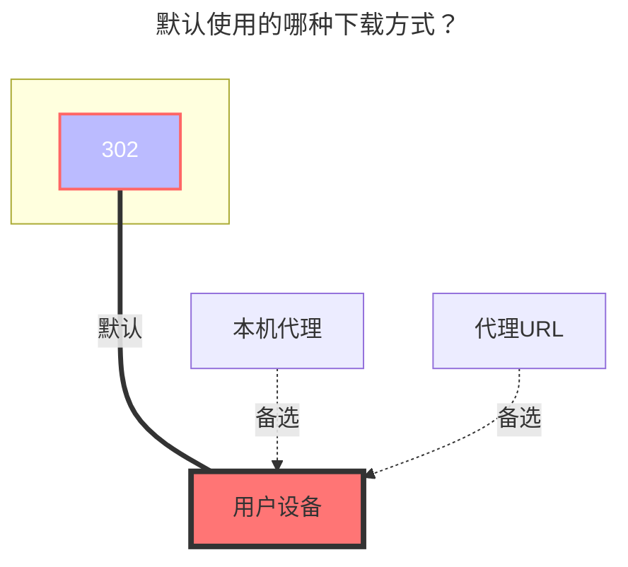

---
# This is the icon of the page
icon: iconfont icon-state
# This control sidebar order
order: 6
# A page can have multiple categories
category:
  - Guide
# A page can have multiple tags
tag:
  - Storage
  - Guide
  - "302"
# this page is sticky in article list
sticky: true
# this page will appear in starred articles
star: true
---

# 天翼云盘

:::tip

Web端登录已更换为滑动验证码，**不再支持ocr与手动输入**，若需要验证码请使用添加`Cookie进行登录`或使用`天翼云盘客户端`驱动

:::

## **个人云**

### **用户名**

用于登录的电话号码

### **密码**

登录密码

 

### **根文件夹ID**

官网 URL 末尾的字符串，如：

- https://cloud.189.cn/web/main/file/folder/-11 -> `-11`
- https://cloud.189.cn/web/main/file/folder/71398114617385472 -> `71398114617385472`

 

### **家庭转移**

为189云盘增加个人云使用`家庭云中转选项`，方便不开会员且家庭云空间小情况下大量上传。

- 注：旧的上传接口家庭云依然会限制上传量，所以`秒传选项`和`旧的上传方式`不生效
- **https://github.com/alist-org/alist/pull/6288**

 

## **家庭云**

（天翼云盘客户端驱动专用）使用电脑浏览器，打开开发者工具（F12），切换仿真设备选择手机设备

打开https://h5.cloud.189.cn/main.html#/family ，进入你想挂载的文件夹，可在网络中看到请求，然后找到所需参数：

 

### **AList挂载填写示例：**

#### **天翼云盘**

填写帐号^1^和密码^2^，然后在请求中随便点击一个请求随意点击一个携带`Cookie`^3^的参数复制填写，Cookie有效期未知。

#### **天翼云盘客户端**

视频参考：**https://www.bilibili.com/video/BV16A4y197De**

 

## **建议**

建议首选使用天翼云盘客户端，[**注意事项点击查看**](../../faq/howto.md#添加-天翼云盘客户端-存储时-提示-need-img-validate-code-验证码)

 

### **默认使用的下载方式**

