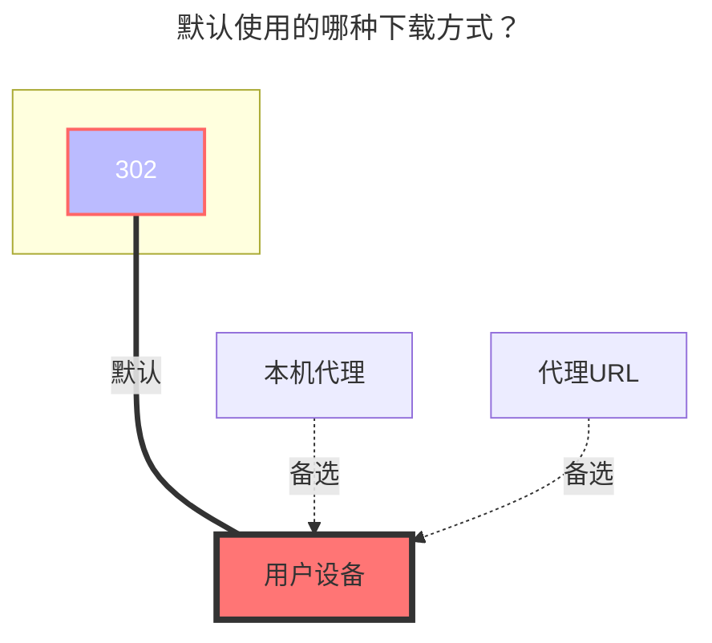

---
# This is the icon of the page
icon: iconfont icon-state
# This control sidebar order
order: 32
# A page can have multiple categories
category:
  - Guide
# A page can have multiple tags
tag:
  - Storage
  - Guide
  - "本地代理"
  - "302"
# this page is sticky in article list
sticky: true
# this page will appear in starred articles
star: true
---
# Alist V2/V3


### **驱动**

首先你要知道对方的到底是V2还是V3


### **根文件夹路径**

- 要添加的目录的pathname，不填默认为根目录，如：
  - [https://alist.nn.ci](https://alist.nn.ci/) -> `/`
  - https://alist.nn.ci/a -> `/a`
  - https://alist.nn.ci/a/b -> `/a/b`


### **链接**

你要挂载的AList链接


::::tabs#AList

@tab V3

:::warning

（**v3.16.3**）若是你挂载的AList"未"开启[**允许挂载**](../../config/site.md#允许挂载)，哪你将无法进行挂载，提示如下错误

```
Failed init storage: the site does not allow mounted
failed get objs: storage not init: the site does not allow mounted
```

(若)或者使用对方提供的`用户名&密码`可以进行挂载，若对方允许挂载肯定是提供`用户名&密码`或者开启了[**允许挂载**](../../config/site.md#允许挂载)，否则也不要强求

- v3.16.3 如何挂载非v3.16.3的低版本，暂时只能使用对方提供`用户名&密码`来挂载了.

-----

`用户名&密码`可以不用写也可以挂载，这样使用的是`guest`游客访问，如果对方未开启游客账户访问权限挂载时会提示错误(如下)

```bash
failed get objs: failed to list objs: request failed,code: 400, message: Key: 'LoginReq.Username' Error:Field validation for 'Username' failed on the 'required' tag
```

- 若是你开始使用的是`用户名&密码`方式挂载的，后面你切换成了使用`元信息密码`方式挂载
  - 你需要手动将之前自动填充的`令牌`清除，否则还是会使用`用户名&密码`方式挂载

:::

### **元信息密码**

（元信息密码选项**不是必填**，给有需要的人说明）

你要挂载的AList路径有设置元信息密码

- 例1：
  - 你挂载的路径是 `/a`
  - 那么你要知道对方这个 `/a` 路径密码设置的是什么才能看到文件，不然进去后是空白
- 例2：
  - 你挂载的路径是 `/`
  - 但是对方根目录 `/`，没设置密码，但是其他的个别文件夹 比如 阿里,百度,123 这几个设置了密码，那么你可以填写这些的不过只能写一个密码.
    - 如果上面提到的三个文件夹密码设置的不一样那么你填写的一个只能进其中是这个密码的文件夹，不是这个密码的就进不去了，应该都明白了.

<br/>


## **用户名**

你要挂载的`AList`用户名（账号）

## **密码**

你要挂载的`AList`用户名对应的密码

:::tip 温馨提示

看起来很麻烦，实际操作一下就了解了，写的详细是给小白看的（前提是在对方开启了[**允许挂载**](../../config/site.md#允许挂载)）

1. 访问路径优先使用 [**根文件夹路径**](#根文件夹路径) ,如果你挂载方式是使用的 `用户名&密码`方式，[**根文件夹路径**](#根文件夹路径) 建议写`/`，否则你此用户名的访问权限和[**根文件夹路径**](#根文件夹路径) 不符会错误提示

   - 例^1^：[**根文件夹路径**](#根文件夹路径)：`file`，用户名的访问权限文件夹是：`video`，这样访问会提示错误

   - 例^2^：[**根文件夹路径**](#根文件夹路径)：`file`，用户名的访问权限文件夹没有`file`，这样访问也会提示错误

2. `AList管理`在给予别人挂载的时,在新建用户时可以选择访问的文件夹，默认的`/`
   - 用户挂载时候，[**根文件夹路径**](#根文件夹路径) 建议写`/`，这样就不会因为管理给了不同访问文件夹权限而提示错误

3. 最极端的情况，首选你知道此次添加的`用户名`能访问的有那文件夹权限，里面有没有，你想单独挂载的路径然后写到[**根文件夹路径**](#根文件夹路径)
   - 如果你不知道[**根文件夹路径**](#根文件夹路径)可以先写`/`，去挂载页面看看你想单独挂载的路径，再后台设置修改即可

:::


### **令牌**

可以不用写，在填写`用户名&密码`保存后会自动填充

<br/>


### **代理range**

需要先启用 `Web代理` 或者 `Webdav本地代理` 才会生效

- 目前仅适用于：`别名`、`中国移动云盘`、`AList V3`
  - 具体功能说明：**https://github.com/alist-org/alist/pull/6496#issue-2309839607**


@tab V2

### **密码**

（密码选项**不是必填**，给有需要的人说明）

密码指的是元信息密码

你要挂载的Alist路径有设置元信息密码

- 例1：
  - 你挂载的路径是 `/a`
  - 那么你要知道对方这个 `/a` 路径密码设置的是什么才能看到文件，不然进去后是空白
- 例2：
  - 你挂载的路径是 `/`
  - 但是对方根目录 `/`，没设置密码，但是其他的个别文件夹 比如 阿里,百度,123 这几个设置了密码，那么你可以填写这些的不过只能写一个密码.
    - 如果上面提到的三个文件夹密码设置的不一样那么你填写的一个只能进其中是这个密码的文件夹，不是这个密码的就进不去了，应该都明白了.


### **访问令牌**

（访问令牌选项**不是必填**，给有需要的人说明）

（这是让对方给你的，一般没有人会交出自己的token给外人）

- V2获取方式：前往V2文档进行查看 --> **https://alist-doc.nn.ci/docs/driver/alist#token**
- V3获取方式：后台 --> 设置 --> 其他 --> **`令牌`**

::::

### **默认使用的下载方式**



