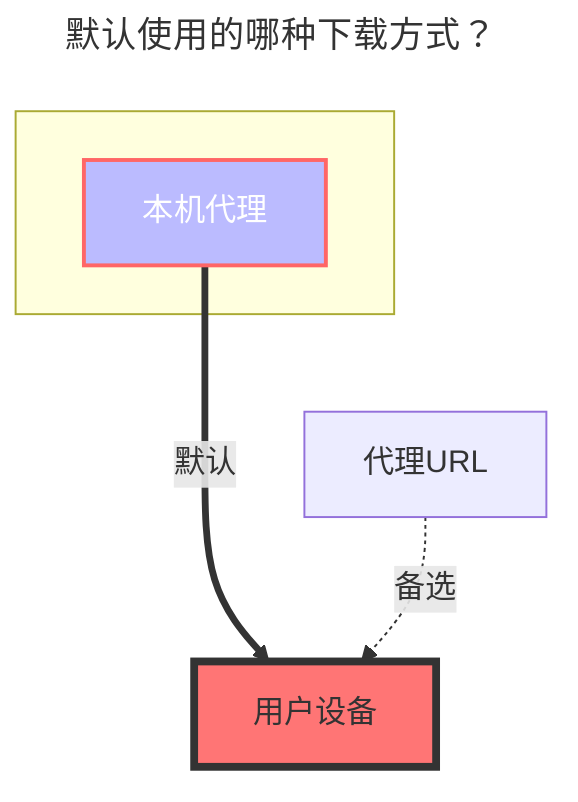

---
# This is the icon of the page
icon: iconfont icon-state
# This control sidebar order
order: 12
# A page can have multiple categories
category:
  - Guide
# A page can have multiple tags
tag:
  - Storage
  - Guide
  - "本地代理"
# this page is sticky in article list
sticky: true
# this page will appear in starred articles
star: true
---

# Crypt(加密)

## **介绍**

`Crypt`是什么？

相当于一个两层密码的保险箱加密了，除了你自己有钥匙能打开别人谁也打不开，配置中的密码和盐值相当于钥匙

当然还有密码和盐值你自己也要保管好，如果丢失了你自己也打不开，除非你自己穷举或者猜出正确密码。

::: tip 使用提醒

1. 如果你不了解想要使用本 加/解密 驱动请仔细查看一下每个文字
2. 请先在本地使用了解一下再搬到生产环境中部署使用，否则数据丢失自行承担！
3. 数据丢失100%的因为修改了配置文件导致的，如果已经上传了文件请勿再修改配置文件，否则数据丢失自行承担！

==再次提醒请仔细阅读文档使用，否则数据丢失自行承担！==

:::

## **使用说明**

我们只需要在现在已经挂载的驱动(网盘)中新建一个**空白文件夹**，名称随意，准备给加密(Crypt)驱动使用

然后把我们新建的空白文件夹名称填写到我们新建的`Crypt`驱动配置中的`加密后文件存储路径`选项

例如：

- 我们原本的驱动路径是`/123`，我们在123这个目录下新建了一个`air空白文件夹`
- 我们就要在`Crypt`驱动的`加密后文件存储路径`选项填写`/123/air`
- 我们上传文件需要在 新建的`Crypt`驱动目录进行上传文件才会进行加密
  - 加密文件我们去 **`加密后文件存储路径`** 查看会看到加密后的文件，无法正常打开查看
  - 如果要打开查看，我们需要在挂载的`Crypt`驱动文件夹查看

## **填写示例**

如果你不懂如何配置，可以使用如下最简单默认的配置，具体每个配置的作用会在下方详细说明

:::danger  请仔细阅读注意事项 --- 非常重要

再次重申一下请勿嫌啰嗦

在配置中一经填写保存后，请勿修改，请勿修改，请勿修改！！！重要的事情说三遍

[**密码**](#密码) 和 [**盐值**](#盐值) 请必须记住，点击保存后这两个选项就会进行加密无法明文显示（上图明文显示是因为还未保存）

- **如果在没有上传文件之前密码忘记了可以重新填写密码配置**

-----

如果你还没有在Crypt驱动內上传文件，可以修改配置，否则请勿修改！！

如果在已有数据的情况下更改配置，`Crypt`尽力过滤非法文件/目录，但非法数据不会被删除

- **非法文件/目录指的是另一种配置生成的加密数据**

:::

::: warning

关于加密组合一共有5种方式，（实际上是6种）因为只开启**文件夹加密，文件名不加密**这样的配置不生效（下面举例的第一种）

1. <Badge text="无效" color="red" vertical="middle" /> 文件名 `Off`，文件夹 `true`
2. <Badge text="有效" type="tip" vertical="middle" /> 文件名 `Off`，文件夹 `false`
3. <Badge text="有效" type="tip" vertical="middle" /> 文件名 `标准`，文件夹 `false`
4. <Badge text="有效" type="tip" vertical="middle" /> 文件名 `标准`，文件夹 `true`
5. <Badge text="有效" type="tip" vertical="middle" /> 文件名 `混淆`，文件夹 `false`
6. <Badge text="有效" type="tip" vertical="middle" /> 文件名 `混淆`，文件夹 `true`

:::

 

### <i class="fa-solid fa-files" style="color: #409eff;"></i> **文件名加密**

如果看不懂可以使用默认配置

- 1.**默认为 `Off关闭`状态**
  - 文件名是否加密，作用于上传后文件名进行加密
  
- 2.**标准加密**
  - 标准加密安全等级高^(荐)^
  
- 3.**简单混淆**
  - 安全等级很低 ，对长文件名友好，但是对于中文文件名会生成特殊字符，某些网盘存储不支持特殊字符。

- 下图中左侧的加密了的 [**加密后文件存储路径**](#加密后文件存储路径)，右侧是解密后的`Crypt`驱动可以查看文件
  - 如果不开启<Badge text="文件名" type="tip" vertical="middle" />加密，就会显示<Badge text="左上角" color="rgb(216,100,69)" vertical="middle" />那样的是源文件后面新增一个加密的后缀（xxxxx\.xxx **.bin** ）(后缀名可以自定义不一定是.bin)
  - 如果开启<Badge text="文件名" type="tip" vertical="middle" />加密，就会显示<Badge text="左下角" color="rgb(78,130,184)" vertical="middle" />那样将文件名也进行了加密混淆没有了后缀和原文件名，别人就无法知道是什么了，但是可以在`Crypt`驱动（<Badge text="右侧展示的文件夹" color="rgb(0.0.0.0)" vertical="middle" />）中看到真实文件名

 

### <i class="fa-solid fa-folder-open" style="color: #409eff;"></i> **文件夹名加密**

使用启用文件夹加密，默认为 `false` 未启用，看不懂可以不启用，

开启文件夹加密的同时必须选择一项**文件名加密**否则单独只开文件夹加密不生效

- 下图中左侧的加密了的 [**加密后文件存储路径**](#加密后文件存储路径)，右侧是解密后的`crypt`驱动可以查看文件
  - 如果不开启<Badge text="文件夹" type="tip" vertical="middle" />加密，就会显示<Badge text="左上角" color="rgb(216,100,69)" vertical="middle" />那样的没有任何变化的文件夹
  - 如果开启<Badge text="文件夹" type="tip" vertical="middle" />加密，就会显示<Badge text="左下角" color="rgb(78,130,184)" vertical="middle" />那样将文件夹名字也进行了加密混淆

 

### <i class="fa-solid fa-cloud-binary" style="color: #409eff;"></i> **加密后文件存储路径**

也就是存储加密后的文件，可以是AList能挂载的驱动里面任意一款驱动

 

### <i class="fa-solid fa-lock-keyhole" style="color: #409eff;"></i> **密码**

就是字面意思密码

### <i class="fa-solid fa-lock-keyhole" style="color: #409eff;"></i> **盐值**

也可以理解为第二个密码

 

### **加密后缀**

高级选项，默认为`.bin`，可自定义必须要以`.`开头，例如 .abc .aaa .psd 这样的后缀

如果开启了文件名加密`加密后缀`就不会显示

 

### **文件名编码**

高级选项，非专业人士请勿修改，默认为 **`Base64`**，但是除了 **`Base64`** 之外的选项并没有测试，遇到问题需要自己解决。

- 参考[#5109](https://github.com/alist-org/alist/issues/5109)，[#5080](https://github.com/alist-org/alist/issues/5080)

 

## **高级用法**

高级用法仅适用于对 **`Rclone`** 了解的人

如果你对 **`Rclone`** 很了解可以看 :point_right: [**Rclone Crypt 文档**](https://rclone.org/crypt) 目前完全兼容

注意，`Alist Crypt`驱动默认使用了 `filename_encoding = base64` ,如果使用Rclone请在高级设置中配置此条。（理由：对长文件名更友好一些）

因为alist内部并没有对大小写**不敏感**提供支持，所以如果使用了大小写不敏感的文件系统可能会出问题，例如：windows上使用本地存储驱动，再使用Crypt

 

## **注意事项**

启动AList时发现Crypt提示错误，是因为Crypt靠前启动时候找不到相关路径，可以通过给Crypt驱动填写[序号](common.md#序号)让Crypt启动靠后

 

## **默认使用的下载方式**

