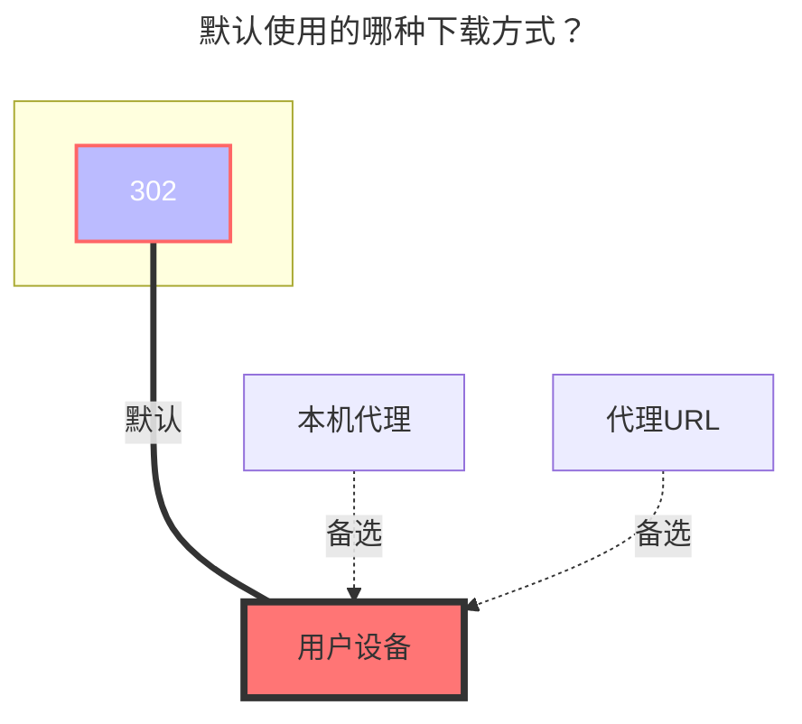

---
# This is the icon of the page
icon: iconfont icon-state
# This control sidebar order
order: 40
# A page can have multiple categories
category:
  - Guide
# A page can have multiple tags
tag:
  - Storage
  - Guide
  - "302"
# this page is sticky in article list
sticky: true
# this page will appear in starred articles
star: true
---

# 网易云音乐云盘

### **Cookie**

[**点击此处登录**](https://music.163.com/) 随便找个请求复制 Cookie, 确保带有 `__csrf` 和 `MUSIC_U` 字段即可

### **Song Limit**
默认只获取 200 首歌曲, 如果你云盘里歌曲超出这个数, 修改这个值

### **默认使用的下载方式**

