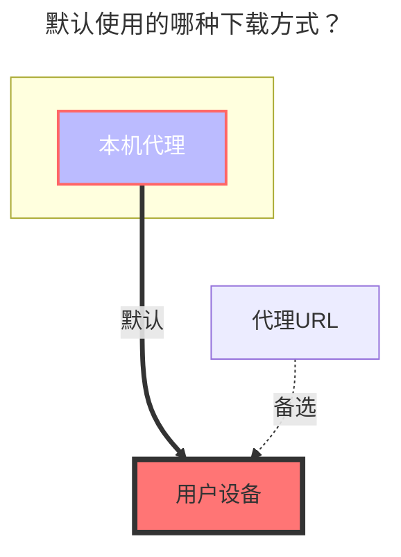

---
# This is the icon of the page
icon: iconfont icon-state
# This control sidebar order
order: 28
# A page can have multiple categories
category:
  - Guide
# A page can have multiple tags
tag:
  - Storage
  - Guide
  - "本地代理"
# this page is sticky in article list
sticky: true
# this page will appear in starred articles
star: true
---
# SMB

是把smb挂载到Alist，而不是Alist通过smb共享出来，而不是smb能像webdav共享出来。

因无相关设备和服务，无法测试，可以根据 **GitHub Discussions** 讨论中提供的办法自行测试一下

**https://github.com/alist-org/alist/discussions/2215#discussioncomment-4104018**

等待有了相关设备或服务后更详情的教程再进行补充，或者等待测试没问题的大佬pr。

### **默认使用的下载方式**

