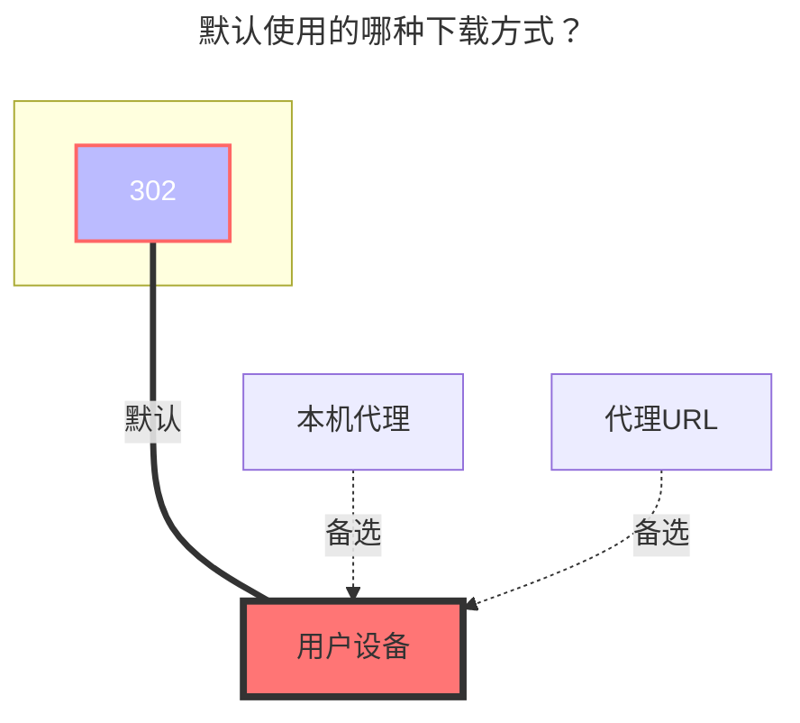

---
# This is the icon of the page
icon: iconfont icon-state
# This control sidebar order
order: 38
# A page can have multiple categories
category:
  - Guide
# A page can have multiple tags
tag:
  - Storage
  - Guide
  - "302"
# this page is sticky in article list
sticky: true
# this page will appear in starred articles
star: true
---
# Seafile

Seafile 是以资料库为单位进行版本控制和同步的开源云盘。

使用本驱动可以挂载 Seafile 的资料库到 Alist，已支持访问加密资料库。

## **根文件夹路径**

1、如果未设置资料库ID（RepoId），则该配置可指定要访问的资料库的名称与子路径，默认为根路径：`/`，表示展示所有资料库。假设你有一个资料库名为 `example`，如果你只想挂载该资料库的内容，可以将本项设为 `/example`；如果你只想展示该资料库内一个名为 `abc` 的目录，则可以将本项设置为 `/example/abc` ，以此类推。

2、如果设置了资料库ID（RepoId），则该配置用来设置指定资料库内的目录，默认为根目录：`/`。

## **地址**

你的 Seafile 服务器地址，形如：
- `https://seacloud.cc`
- `http://192.168.1.24:8000`

## **用户名**

用于登录你的 Seafile 服务器的邮箱或用户名。

## **密码**

邮箱或用户名对应的密码。

## **RepoId（资料库ID）**

Seafile 资料库ID，形如：`86fc6316-3f2a-4c64-b6f5-d4d2b341bc9a`

> 在浏览器中打开Seafile资料库，即可在地址栏中看到资料库ID。

可留空不填，不填则展示指定账号所有可见的资料库。

## **RepoPwd（资料库密码）**

设置用来访问加密资料库的密码，如果没有加密资料库请留空。

配置该项后 Alist 将会用此密码访问指定账号所有已加密的资料库，不会影响未加密资料库的访问。如果你有多个加密资料库使用了相同的密码则均可以正常访问。

暂不支持在一个存储内对不同的资料库配置不同的密码进行访问，如果你有这种需求，可以添加多个 Seafile 存储来实现，这样就可以对不同的加密资料库指定不同的密码进行访问。

> 如果设置了资料库密码后仍无法访问加密资料库内的文件，请检查密码及上面的其他配置是否有误，建议修改此密码配置后重新启动 Alist，避免缓存的影响。

### **默认使用的下载方式**

