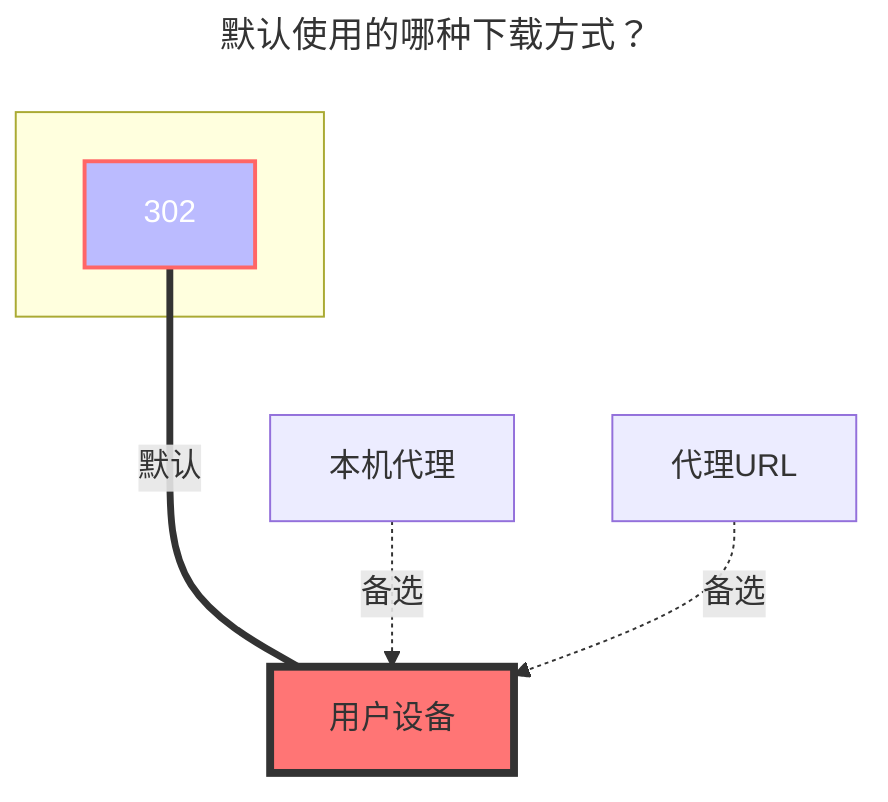

---
# This is the icon of the page
icon: iconfont icon-state
# This control sidebar order
order: 37
# A page can have multiple categories
category:
  - Guide
# A page can have multiple tags
tag:
  - Storage
  - Guide
  - "302"
# this page is sticky in article list
sticky: true
# this page will appear in starred articles
star: true
---

# Terabox(海外百度)

## **刷新令牌**

[**点此登录**](https://www.terabox.com/)进行获取刷新令牌，随意找一个请求即可找到 **`Cookie`**

## **jsToken**

查看 [**主页**](https://www.terabox.com/main?category=all) 的网页源代码，按 `Ctrl` + `F` 键搜索 `jsToken`

找到字符串类似 `%20%3D%20a%7D%3Bfn%28%22xxxxxxxxxxxxxxx%22%29`

中间的 `xxxxxxxxxxxxxxx` 就是要获取的 **jsToken**

 

## **下载接口**

**下载接口需要选择 ==`非官方`==** ，才可以使用 ^(v3.29)^

 

#### **注意事项：根文件路径默认是 /**

- 如果你不想写根目录 **/** 要写其他目录

- 挂载其他单个子目录，放一张图参考一下吧
  - 

    

### **默认使用的下载方式**

