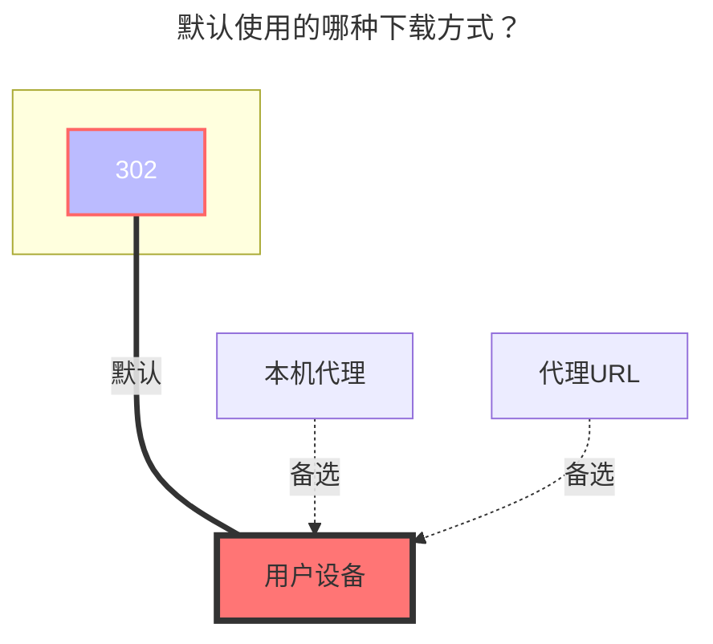

---
# This is the icon of the page
icon: iconfont icon-state
# This control sidebar order
order: 39
# A page can have multiple categories
category:
  - Guide
# A page can have multiple tags
tag:
  - Storage
  - Guide
  - "302"
# this page is sticky in article list
sticky: true
# this page will appear in starred articles
star: true
---
# Trainbit

**Trainbit** 官网：https://trainbit.com/

## **AUSHELLPORTAL ，Apikey**

进入 Trainbit网页后，按F12打开开发者模式   在网络选项中随便打开一个刷新出来的数据，然后找到带有Cookie选项的都可以

填写参数对应的值即可

**AUSHELLPORTAL**：`.AUSHELLPORTAL` ` .AUSHELLPORTALws` 这两个参数的值都一样

**Apikey**：`retkeyapi`

(具体填写可以查看[详情填写示意图](#详情填写示意图))

## **根文件夹 ID**

- `<目录ID>_<目录uploadurl的q参数>`

我们打开首页按F12，打开开发者模式，选择网络，搜索栏搜索 list，就能看到 "`listoffiles`"，点击，然后选择响应将里面的值，自己去格式化一下（不格式化也能用自己慢慢的寻找）[详情填写示意图](#详情填写示意图)

- 如何格式化：自行浏览器搜索 json在线格式化

## **注意事项**

1. 如果你是从`AList` 上传到 `trainbit` 的文件后缀后面会增加一个 `.delete_suffix`，不用担心
2. 官网说免费用户文件下载15天后会删除文件，但是现在未进行文件删除，以防万一请勿存放重要文件，到时候导致文件丢失

## **详情填写示意图**

### **默认使用的下载方式**

