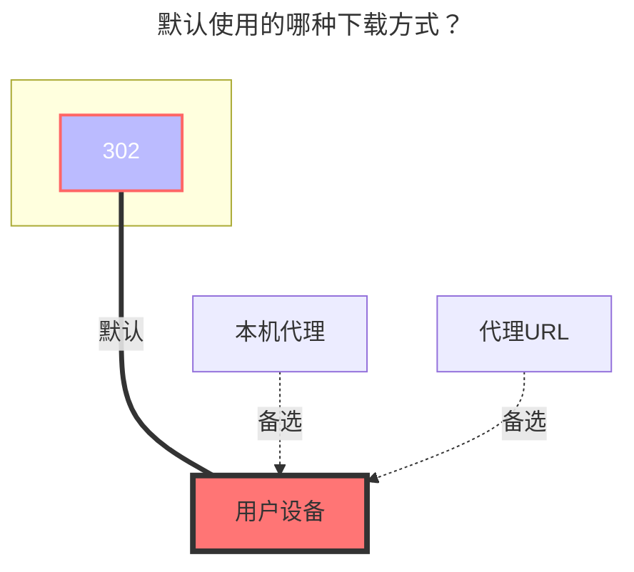

---
# This is the icon of the page
icon: iconfont icon-state
# This control sidebar order
order: 33
# A page can have multiple categories
category:
  - Guide
# A page can have multiple tags
tag:
  - Storage
  - Guide
  - "302"
# this page is sticky in article list
sticky: true
# this page will appear in starred articles
star: true
---
# 地址树

:::tip
**`地址树-UrlTree`** 是什么?  是用来挂载单个文件链接的，详情可以查看  **→→→[原需求说明](https://github.com/alist-org/alist/issues/3268)←←←**
:::


## **用法**

具体的用法大概讲解一下，建议将下面不同用法都看看越往后越进阶玩法

别看写的看起来很难很啰嗦实际上自己操作一下秒懂。

:::tabs#UrlTree
@tab 1

<Badge text="1" type="info" vertical="middle" />最简单的用法，直接写链接即可

##### 输入

``` 
http://pic.rmb.bdstatic.com/bjh/aff9c9c8817d943d6857a73188958d45.jpeg
https://raw.githubusercontent.com/alist-org/alist/main/README_cn.md
```

##### 输出

```
│ aff9c9c8817d943d6857a73188958d45.jpeg
│ README_cn.md
```


@tab 2

<Badge text="2" type="info" vertical="middle" />有文件的同时，也可以创建文件夹^第一个代码示例^，也可以创建多个文件夹^第二个代码示例^

##### 输入

``` 
http://pic.rmb.bdstatic.com/bjh/aff9c9c8817d943d6857a73188958d45.jpeg
folder:
  http://pic.rmb.bdstatic.com/bjh/aff9c9c8817d943d6857a73188958d45.jpeg
  https://raw.githubusercontent.com/alist-org/alist/main/README_cn.md
```
``` 
http://pic.rmb.bdstatic.com/bjh/aff9c9c8817d943d6857a73188958d45.jpeg
folder:
  http://pic.rmb.bdstatic.com/bjh/aff9c9c8817d943d6857a73188958d45.jpeg
  https://raw.githubusercontent.com/alist-org/alist/main/README_cn.md
http://pic.rmb.bdstatic.com/bjh/a66923e9bfefd03c2998ee998d3b55e7.jpeg
folde2r:
  http://pic.rmb.bdstatic.com/bjh/e919290bf3b8396817d369cedf33b8cd.jpeg
  https://raw.githubusercontent.com/alist-org/alist/main/CONTRIBUTING.md
```

##### 输出

```
│  aff9c9c8817d943d6857a73188958d45.jpeg
└─folder
        aff9c9c8817d943d6857a73188958d45.jpeg
        README_cn.md
```

```
│  	aff9c9c8817d943d6857a73188958d45.jpeg
├─folder
│      aff9c9c8817d943d6857a73188958d45.jpeg
│      README_cn.md
│
├─	a66923e9bfefd03c2998ee998d3b55e7.jpeg
│
└─folder2
        CONTRIBUTING.md
        e919290bf3b8396817d369cedf33b8cd.jpeg
```

开头要空两个空格~


@tab 3

<Badge text="3" type="info" vertical="middle" />可以将文件资源二次命名，实际上下载的还是原来的，并且可以填写文件大小

格式：`新命名的名字.后缀:文件大小:链接.后缀`

```
新名称.jpeg:1024:http://pic.rmb.bdstatic.com/bjh/aff9c9c8817d943d6857a73188958d45.jpeg
新名称2.md:2048:https://raw.githubusercontent.com/alist-org/alist/main/README_cn.md
```

文件大小不用写也是可以重新命名的

```
新名称.jpeg:1024:http://pic.rmb.bdstatic.com/bjh/aff9c9c8817d943d6857a73188958d45.jpeg
新名称2.md:2048:https://raw.githubusercontent.com/alist-org/alist/main/README_cn.md
```


@tab 4

<Badge text="4" type="info" vertical="middle" />多个层级目录套娃玩法

- 第一层目录文件夹不需要空格，但是第一层目录里面的文件需要空两个空格

```
folder:
  http://pic.rmb.bdstatic.com/bjh/aff9c9c8817d943d6857a73188958d45.jpeg
  https://raw.githubusercontent.com/alist-org/alist/main/README_cn.md
```


- 如果你写好第一层了还想在第一个文件夹里面再套一个那就在这个文件夹下面套一层，写法如下，很简单
  - 目录进行空两格，文件加两个空格就是四个，如果继续想往下套一层继续加2个空格即可

```
folder11:
  http://pic.rmb.bdstatic.com/bjh/111.jpeg
  folder111:
    http://pic.rmb.bdstatic.com/bjh/111.jpeg
    folder1111:
      http://pic.rmb.bdstatic.com/bjh/111.jpeg
  folder222:
    http://pic.rmb.bdstatic.com/bjh/222.jpeg
    folder2222:
      http://pic.rmb.bdstatic.com/bjh/222.jpeg
folder22:
  http://pic.rmb.bdstatic.com/bjh/222.jpeg
  folder222:
    http://pic.rmb.bdstatic.com/bjh/222.jpeg
    folder2222:
      http://pic.rmb.bdstatic.com/bjh/2223.jpeg
folder33:
  http://pic.rmb.bdstatic.com/bjh/333.jpeg
  folder333:
    http://pic.rmb.bdstatic.com/bjh/333.jpeg
    folder3333:
      http://pic.rmb.bdstatic.com/bjh/333.jpeg
```


- 不建议的写法，像 **`2.jpeg，5.jpeg`** 这样写法，建议想往那一层文件夹就去那一层文件夹增加链接按照格式，不要这样下面这样写

##### 错误写法

```
folder22:
  http://pic.rmb.bdstatic.com/bjh/222.jpeg
  folder222:
    http://pic.rmb.bdstatic.com/bjh/222.jpeg
    folder2222:
      http://pic.rmb.bdstatic.com/bjh/2222.jpeg
      folder22222:
        http://pic.rmb.bdstatic.com/bjh/2222.jpeg
        folder222222:
          http://pic.rmb.bdstatic.com/bjh/2222.jpeg
    http://pic.rmb.bdstatic.com/bjh/2.jpeg
        http://pic.rmb.bdstatic.com/bjh/5.jpeg
```

##### 正确写法

像 **`2.jpeg，5.jpeg`** 这样文件添加时候，添加到对应的目录里面去，分别对应的是 `folder222 和 folder22222` 两个文件夹

```
folder22:
  http://pic.rmb.bdstatic.com/bjh/222.jpeg
  folder222:
    http://pic.rmb.bdstatic.com/bjh/222.jpeg
    http://pic.rmb.bdstatic.com/bjh/2.jpeg
    folder2222:
      http://pic.rmb.bdstatic.com/bjh/2222.jpeg
      folder22222:
        http://pic.rmb.bdstatic.com/bjh/2222.jpeg
        http://pic.rmb.bdstatic.com/bjh/5.jpeg
        folder222222:
          http://pic.rmb.bdstatic.com/bjh/2222.jpeg
```

@tab 5

<Badge text="5" type="info" vertical="middle" />全部整合起来的举例用法，有常规的，有分类，有重命名，有标注文件大小

```
https://jsd.nn.ci/gh/alist-org/alist/README.md
文档:
  Readme.md:https://pic.rmb.bdstatic.com/bjh/说明.md
  Doc:
    文档.doc:https://pic.rmb.bdstatic.com/bjh/测试文档.doc
  pdf:
    pdf2.pdf:https://pic.rmb.bdstatic.com/bjh/测试.pdf
  Excel:
    表格3.xlsx:https://pic.rmb.bdstatic.com/bjh/测试表格.xlsx 
视频:
  https://pic.rmb.bdstatic.com/bjh/222.jpeg
  电视剧:
    https://pic.rmb.bdstatic.com/bjh/222.pm4
  电影:
    https://pic.rmb.bdstatic.com/bjh/222.flv
音乐:
  https://pic.rmb.bdstatic.com/bjh/222.jpeg
  古典:
    https://pic.rmb.bdstatic.com/bjh/222.mp3
  轻音乐:
    https://pic.rmb.bdstatic.com/bjh/222.flac
    https://pic.rmb.bdstatic.com/bjh/222.wav
软件:
  https://pic.rmb.bdstatic.com/bjh/222.jpeg
  PJ:
    xx软件.exe:252525:https://pic.rmb.bdstatic.com/bjh/222.exe
    xx安装包.zip:259555:https://pic.rmb.bdstatic.com/bjh/222.zip
  IPA:
    GPT.ipa:https://pic.rmb.bdstatic.com/bjh/222.ipa
  APK:
    P图.apk:https://pic.rmb.bdstatic.com/bjh/222.apk
```


:::

## **提示**

1. 如果你点击下载发现没有跳转到下载而是预览，这是因为是根据你原本链接来决定的,例如你原本的链接就是下载他就会跳转到下载
2. 如果你一个文件夹内有相同的文件，会合并只显示一个，默认使用预览查看下载的是你靠上(前)也就是顶部的文件
   - Tips:请勿同时在一个目录内新建两个同名的文件/夹哦~就像你在资源管理器新建两个一样的文件/夹 都会提醒你不能重复
3. 如果你在添加时在同级目录下写了两个相同的文件夹名字，会合并成一个文件夹但是合并后靠后(下)的文件夹的文件不会显示，但是可以通过浏览器地址栏访问（参考上一条的提示）
4. 排序默认是按照你填写从上到下依次排序的和 `alist-别名`的一样


### **默认使用的下载方式**



