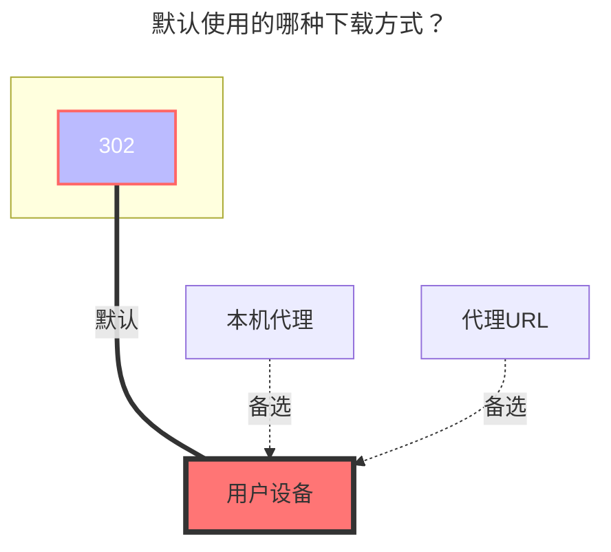

---
# This is the icon of the page
icon: iconfont icon-state
# This control sidebar order
order: 4
# A page can have multiple categories
category:
  - Guide
# A page can have multiple tags
tag:
  - Storage
  - Guide
  - "302"
# this page is sticky in article list
sticky: true
# this page will appear in starred articles
star: true
---

# 阿里云盘/分享

:::warning

不推荐使用该驱动，因为它不稳定，随时可能被屏蔽，我们会在以后的版本中移除。推荐使用官方 API 的驱动 [Aliyundrive Open](./aliyundrive_open.md)。

:::

:::tip

由于阿里云盘 referer 的限制，必须使用移动端 token。 使用桌面 Web 令牌将导致无法下载和预览。
当然，如果你在本地使用或者带宽足够大，你也可以开启代理，让桌面 Web 的 `refresh token` 正常工作。

:::

### **刷新令牌**

按照这个 [issue](https://github.com/Xhofe/alist/issues/88) 在手机上捕获/查找日志（`/data/media/0/Android/data/com.alicloud.databox/files/logs/trace/`）。 或者您可以点击：

<button :disabled="state === 3 || state === 1"
style="outline:none;padding:12px;background:#70c6be;border:none;border-radius:8px;cursor:pointer;font-size:20px;"
@click="onClick">
{{ btnText }}
</button>

 

:::info Token: {{ token }}
:::

_API is hosted on replit.com_

### **根文件夹ID**

打开阿里云盘官网，点击进入要设置的文件夹时点击 URL 后面的字符串

如 https://www.alipan.com/drive/folder/5fe01e1830601baf774e4827a9fb8fb2b5bf7940

这个文件夹的 file_id 即为 `5fe01e1830601baf774e4827a9fb8fb2b5bf7940`：

### **秒传**

上传的时候校验 hash，如果云端有，直接生成文件，不消耗流量

### **内部上传**

如果你部署 Alist 的服务器是阿里云北京地区 ECS，打开此开关可以提升文件上传速度。不符合要求的服务器请不要打开此开关，否则会出现无法上传的问题。

 

## **阿里云盘分享**

已经无法使用，并且后续不再开发和维护分享存储方式，同时[**阿里云盘Open**](./aliyundrive_open.md)获取的Token也不可以在阿里云盘分享挂载存储使用。

 

### **默认使用的下载方式**

