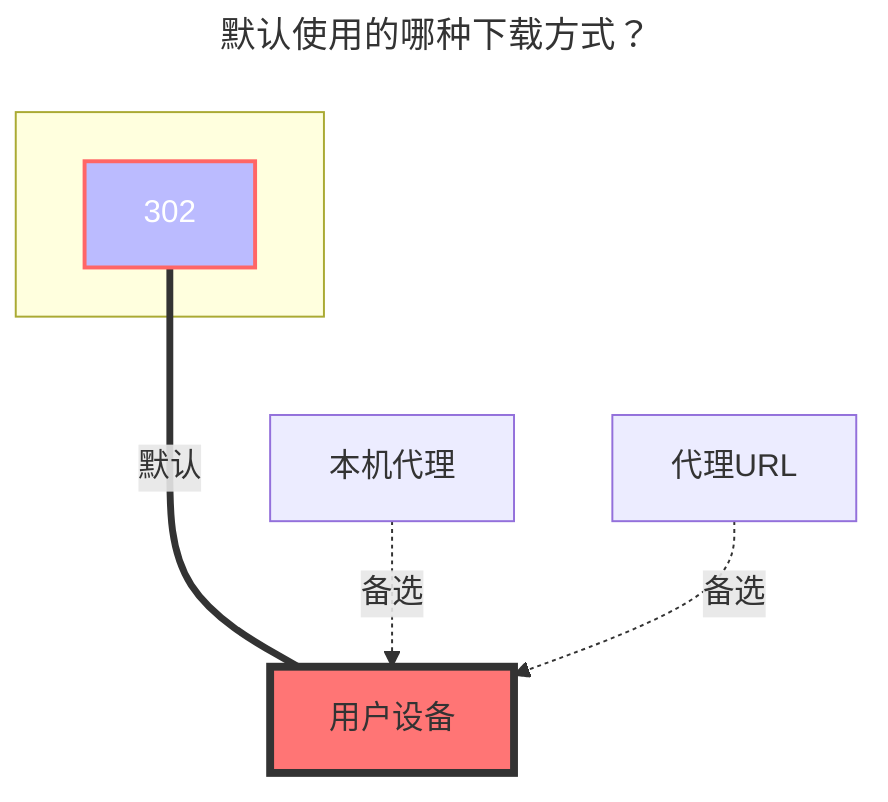

---
# This is the icon of the page
icon: iconfont icon-state
# This control sidebar order
order: 3
# A page can have multiple categories
category:
  - Guide
# A page can have multiple tags
tag:
  - Storage
  - Guide
  - "302"
# this page is sticky in article list
sticky: true
# this page will appear in starred articles
star: true
---

# 阿里云盘 Open

:::tip

阿里云盘 open，使用的是官方授权 API 开发。

:::

::: info 阿里云盘会员

**阿里云盘会员：**[https://www.alipan.com/cpx/member](https://www.alipan.com/cpx/member?userCode=MzAwMDM1&disableNav=YES)

- <i class="fa-solid fa-lightbulb fa-bounce" style="color: orange;"></i> 点击链接领取[**优惠券**](https://www.alipan.com/cpx/member?userCode=MzAwMDM1&disableNav=YES)，[**立即抢购**](https://www.alipan.com/cpx/member?userCode=MzAwMDM1&disableNav=YES) 

:::

:::danger 请仔细阅读注意事项

1. ==此工具获取的刷新令牌仅可以用于 **阿里云盘开放平台** 存储挂载方式== 

   

2. AList 挂载时填写的 token 也应该是这个工具提供的，之前方式获取的不可以

   

3. 暂不适用于其他，同时也仅限用于 Alist 使用

   

4. 同一 IP 在 =={{ minutes }}== 分钟内请求 =={{ max }}== 次，会出现 **Too Many Requests** :no_entry_sign:避免滥用，请勿滥用:no_entry_sign:
   - 查看文件看视频下载不算，上述的分钟和次数是动态的
   - 新增优化：**只会在请求发现令牌过期时去刷新令牌，更新 重启 编辑如果令牌仍然有效则不会去刷新。**

   

5. 在线播放视频提示：**`ExceedCapacityForbidden`** 错误，容量超限限制播放，需要扩容或者删除不必要的文件释放空间,[查看详情](#四、)

   

6. <i class="fa-solid fa-seal-exclamation fa-beat" style="color: #ff0000;"></i> **==请勿将阿里云盘进行公开分享，禁止帐号被多IP访问，若进行分享后帐号被冻结后果自负== <i class="fa-solid fa-seal-exclamation fa-beat" style="color: #ff0000;"></i> 添加存储后请及时设置元信息等措施防止被{其他人/爬虫}恶意[访问/分享]导致帐号被冻结，其他云盘也一样防止被冻结/封号**

   

7. 禁止使用阿里云盘搭建==包括但不限于== **`图床、软件床`** 和 **`视频外链到视频网站播放`** 等分发服务以及一些没有提到的不规范使用的方式，若违反被`冻结/封号`后果自负，并无法解除。

:::

:::danger 关于阿里云open的OAuth验证API无法连接

1.  由于原api `https://api.nn.ci`被sni阻断，导致国内无法连接的情况，故提供两个新的api供使用：
    - `https://api-cf.nn.ci` (套了一层cloudflare)
    - `https://api.xhofe.top` (辽宁多线， 由[亚洲云](https://www.asiayun.com/aff/QQCOOQKZ)赞助)
2.  需要将`aliyundrive_open`后台配置中的`Oauth令牌链接`更换为
    - `https://api-cf.nn.ci/alist/ali_open/token`
    - `https://api.xhofe.top/alist/ali_open/token`
    - 

3.  查看详情：https://github.com/alist-org/alist/discussions/4572

4.  是否可以自己搭建授权OAuth验证API？
    - 需要使用自己申请的开发者帐号搭建

:::

## **刷新令牌**

前往：**https://alist.nn.ci/tool/aliyundrive/request**

#### **获取示意图**

以下两种方式都可以获得 **refresh_token**

  
    
    

## **根文件夹ID**

默认为`root`，展示全部云盘内容，若只想展示某文件夹內内容，可以改为`file_id `

打开阿里云盘官网，点击进入要设置的文件夹时点击 URL 后面的字符串

如 https://www.alipan.com/drive/folder/5fe01e1830601baf774e4827a9fb8fb2b5bf7940

这个文件夹的 file_id 即为 `5fe01e1830601baf774e4827a9fb8fb2b5bf7940`

 

## **客户端 ID，秘钥**

正常用户不需要填写为空即可，如果自己申请了官方授权也可以使用自己的进行填写，为空时默认使用 AList 提供的。

- 如果使用自己的开发者帐号，Oauth令牌链接也要修改，同时也要使用自己开发者帐号ID和秘钥获取刷新令牌

 

## **秒传**

- **v.3.22.1** 版本 新增功能

就是秒传，需要在挂载时，需要启用`秒传`，要秒传的前提是阿里云盘已经有这个文件才可以进行秒传否则就是普通的上传

秒传计算的是文件`sha1`值(应该没错)不需要你计算,你只需要上传即可上传好了会自动帮你计算然后上传完成

- 使用的是阿里云盘官方API提供的接口，查看 :point_right: [**秒传逻辑**](https://www.yuque.com/aliyundrive/zpfszx/ezlzok#y7lyH)

-----

- **v.3.27.0** 版本 增强秒传：可以直接通过复制方式来和`115网盘`进行相互秒传文件
  - 前提是要从阿里云盘秒传到115的文件，115已经存在，否则就是正常复制任务。
  - 如果将115的文件秒传到阿里云盘，需要将阿里云盘的秒传选项打开否则为正常模式上传

如果要使用秒传来上传文件建议在自己家用电脑本地搭建一个AList添加一个`本地存储`和`阿里云盘`进行复制秒传这样节省资源。

 

## **移除方式**

不进行设置默认是删除到回收站內了，如果空间不够需要自己手动清理回收站/若删错文件请前往阿里云盘官网客户端进行找回恢复

- **回收站**：在AList删除后进入网盘回收站，会占用云盘空间，但是后期如果误删可以找回。
- **删除**：直接删除不会停留在回收站，不会占用云盘空间，但是后期如果误删不能找回。
  - 注：请勿泄露自己阿里云盘Open获取的Token， ==若不小心泄露请立刻马上去  [**其他说明 ¹**](#打开-阿里云盘-app-我的-右上角设置齿轮-隐私设置-授权管理-点击-alist-进行查看) 解除授权,再重新扫码授权换新的刷新令牌，同时解除授权后之前获取的都会失效，以保护您账号的安全== 

 

## **云盘类型**

云盘类型可以选择，可以自己的需求选择不同类型，使用 v3.25.1及以上版本的AList添加驱动时进行设置，默认选择的是`默认`类型

- **默认**：有达人等级用户默认展示的是`非备份文件`内容，没有达人等级用户默认展示的是`备份文件`内容

- **资源库**：对应云盘的`非备份文件内容`
- **备份盘**：对应云盘的`备份文件`

202407 --> 阿里云盘更新 `6.0` 版本后，备份盘变更为备份文件和全部文件合并在一起了，但是在OpenAPI方面还是区分 `资源库` 和 `备份盘` 类型

 

## **Livp 下载格式**

即 IOS`实况`照片因为非IOS系统无法解析，然后就无法下载，现根据自己的需求是需要`Jpeg`还是`Mov`

- Jpeg：就是`实况`照片所展示的封面
- Mov：长按`实况`照片的视频画面

 

## **内部上传**

如果你部署 AList 的服务器是阿里云北京地区ECS，打开此开关可以提升文件上传速度。不符合要求的服务器请不要打开此开关，否则会出现无法上传的问题。

- **内部上传**非北京地区的阿里云ECS可以使用吗？不能，因为阿里云盘在使用北京地区的对象存储

 

## **其他说明**

##### 一、

> AList 仅获取了 云盘用户 (**名称 头像 ¹**)，(**访问文件权限 ²**)和(**写入文件权限 ³**)，未获取手机号权限
>
> 详情可以通过以下两种方式查看
>
> 1. 扫码获取刷新令牌时的**提示**
> 2. #### 打开 **阿里云盘 APP --> 我的 -->右上角设置齿轮 --> 隐私设置 --> 授权管理 --> 点击 AList** 进行查看
>    
>    - 若不使用了可以随时手动解除权限

##### 二、

> 默认使用的是阿里云盘自带播放器 - **Aliyun Video Previewer**
>
> 上传到云盘的视频，会经过转码服务转成 H.264 编码的视频流。（好处是 IOS 可以播放了...嗯 应该是这样）
>
> - 新上传到云盘的视频，默认只预转码视频的前 30s。第一次播放时会触发完整的视频转码。转码后的视频会缓存，之后再次触发播放不需要重新转码。
> - 不足 30s 的视频不会触发预转码，只会在第一次播放时开始转码。
> - 实时转码需要一定时间。
> - 画质分别为：LD|SD|HD|FHD|QHD

##### 三、

>Q：阿里云盘Open怎么看不了 Office 全家桶类型的文件
>
>A：~~因为阿里云盘未开放相关API故暂时无法查看~~（敬请期待）

##### 四、

>Q：在线播放阿里云盘视频无法播放，提示：**`ExceedCapacityForbidden`** 错误
>
>A：**用户容量超限**，限制播放，需要扩容或者删除不必要的文件释放空间，在AList和阿里云盘官方APP分别如下图提示
>
>

##### 五、

>Q：如何加载字幕？
>
>A：阿里云盘open 需要使用 **Aliyun Video Previewer**播放器，然后暂时"**只支持转码 mkv 封装的 srt、vtt 文本格式字幕**"
>
>- 目前只支持转码 eng、jpn、chi 三种语言，其他语言会丢失

##### 六、

>Q：在阿里云盘查看视频提示 `转码中，请稍后重试` 和 在AList挂载提示：`failed link: failed get link: UserNotAllowedAccessResource:user not allowed access resource for violation`
>
>A：代表帐号已经被冻结（以前都是直接无法登录），具体情况请查看顶部的红色内容注意事项

## **默认使用的下载方式**

