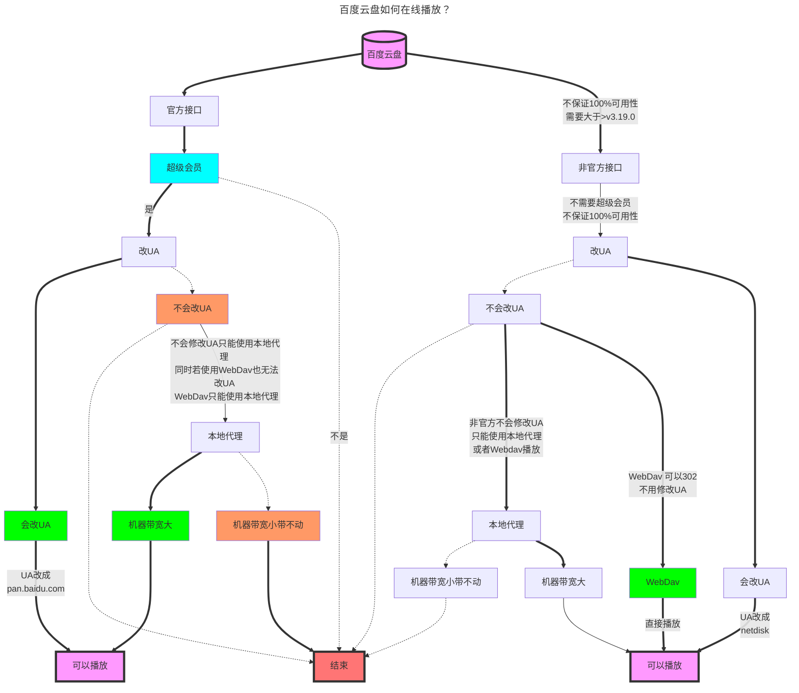
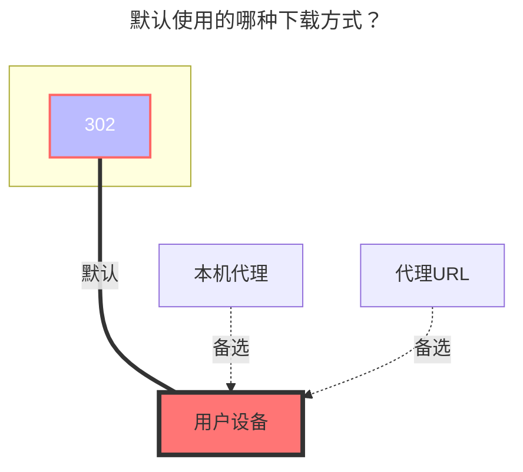

---
# This is the icon of the page
icon: iconfont icon-state
# This control sidebar order
order: 12
# A page can have multiple categories
category:
  - Guide
# A page can have multiple tags
tag:
  - Storage
  - Guide
  - "302"
# this page is sticky in article list
sticky: true
# this page will appear in starred articles
star: true
---

# 百度网盘

:::tip

由于百度网盘 API 的限制，下载大于 20M 左右的文件需要携带 header："User-Agent":"pan.baidu.com"，所以下载大于 20M 的文件时，需要设置请求头，例如使用 curl：

```bash
curl -L -X GET 'YOUR_LINK' -H 'User-Agent:pan.baidu.com'
```

或者使用本程序中的代理功能进行传输。



:::

## **刷新令牌**

[点击这里](https://openapi.baidu.com/oauth/2.0/authorize?response_type=code&client_id=iYCeC9g08h5vuP9UqvPHKKSVrKFXGa1v&redirect_uri=https://alist.nn.ci/tool/baidu/callback&scope=basic,netdisk&qrcode=1) 来获取刷新令牌。


## **根文件夹ID**

要挂载的根文件夹，默认为`/`

- 单独挂载某文件夹，按照下面格式，`/`是根目录，想挂载那个目录就延伸到那个目录就可以
  - /文件夹-A/……/文件夹-x

<br/>


## **自定义破解ua**

[**使用【本地代理 & Crack API】时候使用的UA**](https://github.com/alist-org/alist/issues/5602#issuecomment-1831188682)

<br/>


## **Download API**

- official: 官方接口，很稳定，但是文件比较大，需要修改UA，速度慢 (SVIP速度快)
- crack: 非官方接口，现在也需要修改UA且部分文件可能不限速，但是会不稳定（不保证100%可用性）需要使用大于`3.19.0`的版本
  -  ==需要将UA改成`netdisk`==，修改方法参考下方[添加-user-agent-使用示例](#添加-user-agent-使用示例)
  -  或者开启Web代理（需要大宽带才能带的动）
  -  WebDav播放不需要修改UA，可以直接302播放
  -  仅限于播放/下载 **`视频(只测试了mp4格式其他格式未测试)`**，其他类型文件的会出现下方提示
  -  如果出现下面的提示请勿担心，这不是错误不是Bug，这只是限制，请勿填写`issue`上报.

```json{3}
{
	error_code: 31119,
	error_msg: "hit black userlist , hit illeage dlna",
	request_id: 541111111111111140
}
```

<br/>


## **添加 "User-Agent" 使用示例**

::::danger 如果你不会设置 "User-Agent" 请看这里

 ==以下方法仅限于有百度超级会员用户使用== 

 ==再次提示 以下方法仅限于有百度超级会员用户使用== 

有会员改完 **`"User-Agent"`** 才会有用（选择官方和302）

如果不改 **`"User-Agent"`**，可以开启 ==Web代理==，缺点是需要你搭建Alist的机器中转，也就是说你需要大宽带帮你中转


:::tabs#ua

@tab 网页插件

- 使用浏览器插件修改的好处是 可以直接在线播放，当然了下载也是可以的。

例<Badge text="1" type="info" vertical="middle" />：实在不会的可以看看一个Web网页端的例子： **https://www.bilibili.com/video/BV1UA4y1X7J8**

例<Badge text="2" type="info" vertical="middle" />：另一款插件方法涵盖360，Chrome，Edge： **https://youtu.be/PP6b0WSzYMc**


@tab Aria2

1. 先照着下图设置好 **`"User-Agent"`**，然后在**右下角**的按钮选项，点击**齿轮**(本地设置)，配置好参数

2. 然后在右下角打开第三个按钮选项（**打开复选框**），打开后去列表选择我们要下载的文件，
3. 把我们需要下载的文件**进行勾选**，勾选好后下方会出现**一排按钮**，选择右侧第二个选项下载里面有一个**发送到Aria2**

如果你使用了网页修改 **`"User-Agent"`**，可以不配置 ==**Aria2**== 的`UA`，直接推送到Aria2也能下载


@tab Motrix

1. 先照着下图设置好 **`"User-Agent"`**，然后在**右下角**的按钮选项，点击**齿轮**(本地设置)，配置好参数

2. 然后在右下角打开第三个按钮选项（**打开复选框**），打开后去列表选择我们要下载的文件，
3. 把我们需要下载的文件**进行勾选**，勾选好后下方会出现**一排按钮**，选择右侧第二个选项下载里面有一个**发送到Aria2**

如果你使用了网页修改 **`"User-Agent"`**，可以不配置 ==**Motrix**== 的`UA`，直接推送到Aria2也能下载

- Motrix下载链接：[Motrix官网](https://motrix.app/)，[Motrix-GitHub](https://github.com/agalwood/Motrix)


:::

::::

### **默认使用的下载方式**


