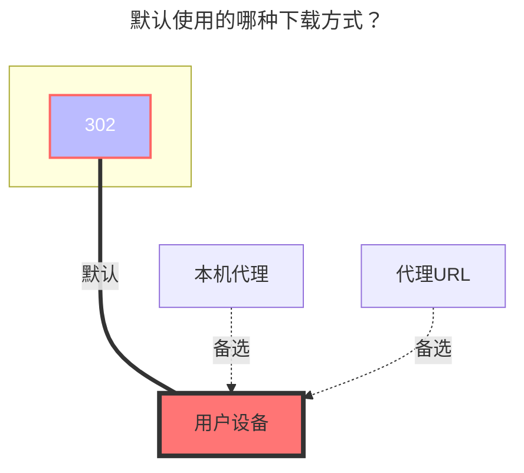

---
# This is the icon of the page
icon: iconfont icon-state
# This control sidebar order
order: 11
# A page can have multiple categories
category:
  - Guide
# A page can have multiple tags
tag:
  - Storage
  - Guide
  - "302"
# this page is sticky in article list
sticky: true
# this page will appear in starred articles
star: true
---

# 百度网盘分享链接

挂载百度网盘分享链接，可供下载，无上传编辑等功能，api非官方。

## **配置**

百度网盘分享链接：surl，百度网盘分享密码：pwd

1. 浏览目录需设置**百度网盘分享链接**和**百度网盘分享密码**，下载还需设置BDUSS。

2. **百度网盘分享链接**即为分享地址`pan.baidu.com/s/`后`?`前部分，**百度网盘分享密码**填4位提取码，无提取码留空。

3. **百度网盘分享链接**和**百度网盘分享密码**可以随意账号填写，但是 **`BDUSS`** 参数的账号 必须使用 ==**百度超级SVIP会员**== 才可以

BDUSS由cookie中提取

- 方法1：[参考教程](http://pandownload.net/faq/cookie.html)(本项目中无需前缀`BDUSS=`)。

- 方法2^荐^：
  - 

## **根文件夹ID**

要挂载的根文件夹，默认为`/`

如果要写文件夹內其他的 请看下方的例子

## **QA**

|出错配置|典型报错|修复说明|
|:-:|:--|:--|
|surl|`{"errno":2,"errtype":0}`|分享链接可能失效, 检查链接状态|
|pwd|`{"errno":-130,"errtype":"mispwd-9"}`|分享密码错误|
|BDUSS|`{"errno":9019,"errmsg":"need verify"}`|BDUSS无效|
|UA|`{"error_code":31326,"error_msg":"user is not authorized, hitcode:119"}`|user-agent违反百度限制, 访问端需设置非浏览器UA(如netdisk)或开启Web代理|
|下载|Failed init storage: 200 OK; {"errno":-130,"|此链接分享内容可能因为涉及侵权、色情、低俗等信息，无法访问！|

## **开发**

接口来自[github.com/yuantuo666/baiduwp-php](https://github.com/yuantuo666/baiduwp-php)项目，非官方api。

当前仅移植目录浏览和普通下载功能，欢迎继续开发。

因缺失官方文档，不排除存在一些兼容问题，可至github反馈，建议提供复现链接以供调试。

不能突破速度限制，请合理使用。

<!-- @include: baidu.md{142-194} -->

### **默认使用的下载方式**

