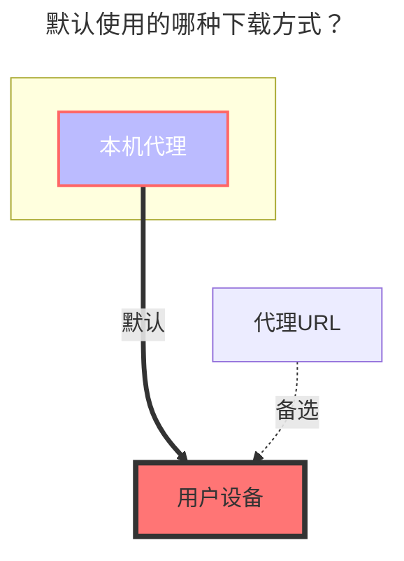

---
# This is the icon of the page
icon: iconfont icon-state
# This control sidebar order
order: 18
# A page can have multiple categories
category:
  - Guide
# A page can have multiple tags
tag:
  - Storage
  - Guide
# this page is sticky in article list
sticky: true
# this page will appear in starred articles
star: true
---

# 超星星小组盘

超星星小组盘也是隶属于超星星，登录超星星后在左侧侧边栏下方能看到一个小组

官网链接：**https://i.chaoxing.com**

 

### **用户名 密码**

超星星的帐号密码

 

### **Bbsid**

按照下面示例流程获取

 

### **根文件夹ID**

默认为`-1`，其它子文件夹ID获取方式看下图示例

- 在请求中搜索关键词`getResourceList`，为了方便我们可以直接搜索 `list`也可以看到，然后我们进入我们需要挂载的文件夹，进文件夹后再去看请求就可以找到`子文件夹ID`

 

### **默认使用的下载方式**

