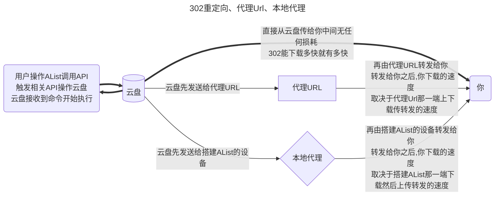

---
# This is the icon of the page
icon: iconfont icon-state
# This control sidebar order
order: 1
# A page can have multiple categories
category:
  - Guide
# A page can have multiple tags
tag:
  - Storage
  - Guide
# this page is sticky in article list
sticky: true
# this page will appear in starred articles
star: true
---

# 通用项

## **挂载路径**

唯一标识，即要挂载到的位置，如果要挂载到根目录，就是 `/`

## **序号**

当有多个账户时，用于排序，越小越靠前，可以填写负数

## **备注**

随便你想填什么，只是提醒你这个存储是什么

## **启用签名**

对文件进行签名加密(不会需要密码)，仅对本驱动生效，如果别的没启用签名也没设置`签名全部`和`元信息加密`其他的不会进行签名

使用场景：不想开启全部签名，也不想设置元信息加密，只想对某驱动进行签名加密防止被扫

影响范围：`设置-->全局-->签名所有` >  `元信息目录加密` > `单驱动签名`

## **缓存过期**

目录结构的缓存时间。

## **Web 代理**

网页预览、下载和直接链接是否通过中转。如果你打开此项，建议你设置[site_url](../../config/configuration.md#site_url)，以帮助alist更好的工作。

-----

- Web代理：是使用网页时候的策略，默认为本地代理，如果填写了代理URL并且启用了Web代理使用的是代理URL
- WebDAV策略：是在使用WebDAV功能时候的选项，
  - 如果有302选项默认为302，如果没有302选项默认为本地代理，如果要使用代理URL请填写并且手动切换到代理URL策略

两者是不同的配置

## **WebDAV 策略**

- 302 重定向：重定向到真实链接
- 使用代理 URL：重定向到代理 URL
- 本机代理：直接通过本地中转返回数据（最佳兼容性）

-----

- 302重定向：虽然不会消耗流量，但是不建议共享使用，有封禁账户的风险
- 代理URL：会消耗搭建代理URL的流量
- 本地代理：会消耗搭建AList设备的流量

### **三种模式说明**



## **下载代理 URL**

开启代理时不填写此字段，默认使用本机进行传输。提供了下面两种代理方式：

::::tabs
@tab cloudflare workers
可以使用 Cloudflare Workers 做代理，这里填写 Workers 地址即可。

Workers 代码可以在 https://github.com/alist-org/alist-proxy/blob/main/alist-proxy.js 找到，实际使用时需要替换其中的这两个变量：

- ADDRESS: 你的 AList 地址，必须加上协议头，后面不能跟 `/`。如 `https://pan.nn.ci`；
- TOKEN: 在 AList 管理页面中进入“其他设置”得到。

:warning: Cloudflare Workers 免费CDN支持兼容(不论国内还是国外)的只有 **http80端口** 和 **https443端口**，来自群友测试

- 在Alist后台挂载配置时 填写 **下载代理URL** 时候的 链接结尾 不可以带 `/`

若看不懂[**有拆解详细**](https://anwen-anyi.github.io/index/11-durl.html)的教程


@tab 通用二进制
也可以使用另一台机器进行代理，在 https://github.com/alist-org/alist-proxy/releases 下载程序并通过 `./alist-proxy -help` 查看使用方法。

如果不懂有详细[**视频教程**](https://www.bilibili.com/video/BV17N411S7fg/)

::::

你甚至可以开发自己的代理程序，一般步骤是：

- 下载时会请求 `PROXY_URL/path?sign=sign_value`
- 在代理程序中验证 sign，sign 的计算方法为：

```js
const to_sign = `${path}:${expireTimeStamp}`
const _sign = safeBase64(hmac_sha256(to_sign, TOKEN));
const sign = `${_sign}:${expireTimeStamp}`
```

`TOKEN`即管理员账户的[token](../../config/other.md#token).

- 验证签名正确后，请求 `HOST/api/fs/link`，可以得到文件的 URL 和要携带的请求头
- 使用信息请求和返回

## **排序相关**

- 排序方式：按什么排序
- 排序方向：排序方向是升序还是降序

:::info
有些驱动器使用自己的排序方法，可能会有所不同。
:::

## **提取文件夹**

- 提取到前面：排序时将所有文件夹放在前面
- 提取到后面：排序时将所有文件夹放在后面
