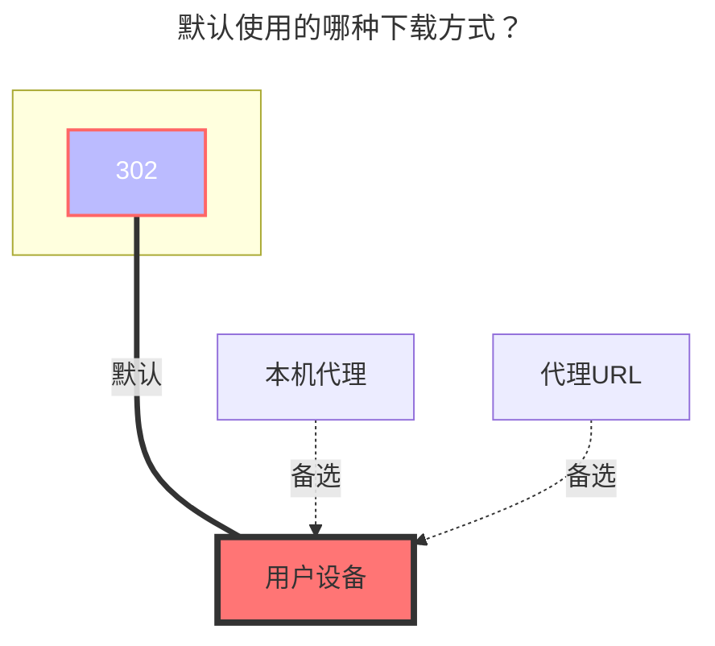

---
# This is the icon of the page
icon: iconfont icon-state
# This control sidebar order
order: 34
# A page can have multiple categories
category:
  - Guide
# A page can have multiple tags
tag:
  - Storage
  - Guide
  - "302"
# this page is sticky in article list
sticky: true
# this page will appear in starred articles
star: true
---

# Dropbox

Dropbox官网：https://www.dropbox.com/

## **获取刷新令牌**

前往：**https://alist.nn.ci/tool/dropbox/request.html**

- 有两种方式，一种是直接使用AList提供的，一种是自己新建应用
  - 获取方式如下（推荐使用第二种^{右侧的}^因为AList提供的已经无法新建用户了）
  - 使用右侧自建`客户端ID`和`秘钥`时，记得授权^{第三张图}^

  
    
    
    

- 如果使用自己新建的应用需要填写`客户端ID`和`客户端秘钥`

- 获取方式如上图右图（创建应用链接：**https://www.dropbox.com/developers/apps** ）

- 回调参数链接：**https://alist.nn.ci/tool/dropbox/callback**

参考链接：[**点击查看**](https://github.com/alist-org/alist/commit/cfee536b96f38e5ba3f3575fab4e89f6c0e1bc5b#commitcomment-119688700)

## **根文件夹ID**

空为根目录：挂载全部文件

单文件夹ID：进入你需要挂载的文件夹复制顶部链接将`/home`后面的填写进去即可

### **默认使用的下载方式**

