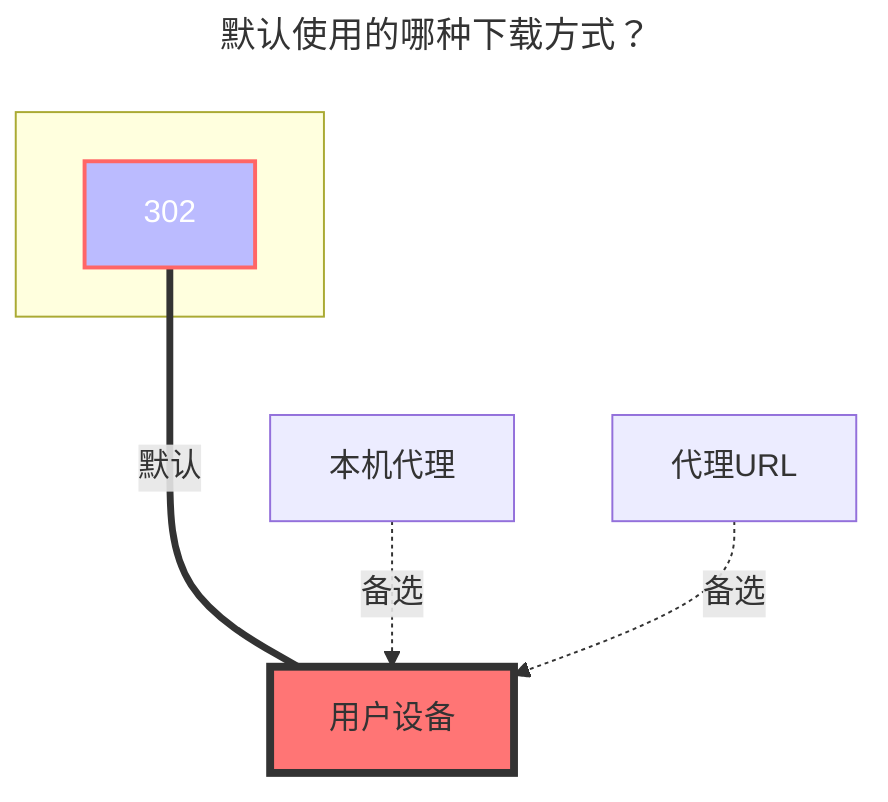

---
# This is the icon of the page
icon: iconfont icon-state
# This control sidebar order
order: 10
# A page can have multiple categories
category:
  - Guide
# A page can have multiple tags
tag:
  - Storage
  - Guide
  - "302"
# this page is sticky in article list
sticky: true
# this page will appear in starred articles
star: true
---

# FebBox

FebBox：https://www.febbox.com

- 需要代理，直连似乎无法访问？

 

## **根文件夹ID**

根目录ID，默认为`0`

其它目录ID查看进入文件夹后看顶部链接地址栏

- **https://www.febbox.com/console#/files?parent_id=66889900**

那这个目录ID就是 `66889900`

 

## **客户端ID 和 秘钥**

生成地址：**https://www.febbox.com/open/clients**

- 生成的客户端ID和秘钥和AList填写的顺序是相反的，注意别填错

 

### **用户IP**

**可选** ，用户下载时的IP，引用官方说明

- IP address, Optional parameter. Supports IPv6 format.After filling in, the best download server suitable for the IP location will be selected. If not filled in, the requested IP will be used.
- IP地址，可选参数。支持 IPv6 格式。填写后，将选择适合 IP 位置的最佳下载服务器。如果未填写，将使用请求的 IP

 

### **注意事项**

- 目前上传功能不可用 [**alist-org/alist/issues/7293**](https://github.com/alist-org/alist/issues/7293#issuecomment-2395776474)

 

### **默认使用的下载方式**

