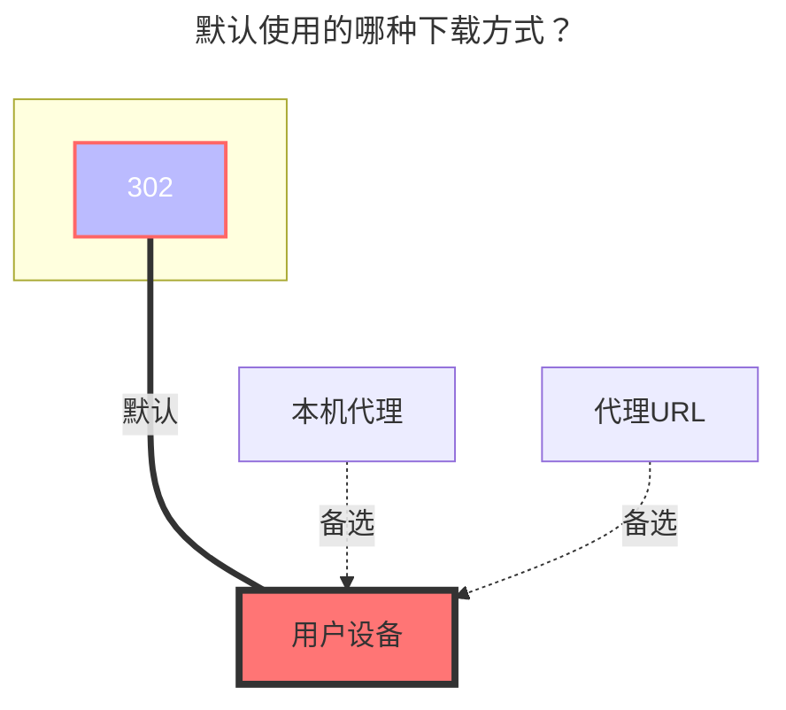

---
# This is the icon of the page
icon: iconfont icon-state
# This control sidebar order
order: 10
# A page can have multiple categories
category:
  - Guide
# A page can have multiple tags
tag:
  - Storage
  - Guide
  - "302"
# this page is sticky in article list
sticky: true
# this page will appear in starred articles
star: true
---

# 小飞机网盘

小飞机网盘：https://feijipan.com/ ( v3.31.0)

## **根文件夹ID**

根目录ID，默认为`0`，其它目录ID查看下图获取方式

 

## **账户、密码**

填写自己的小飞机网盘帐号密码

 

### **默认使用的下载方式**

