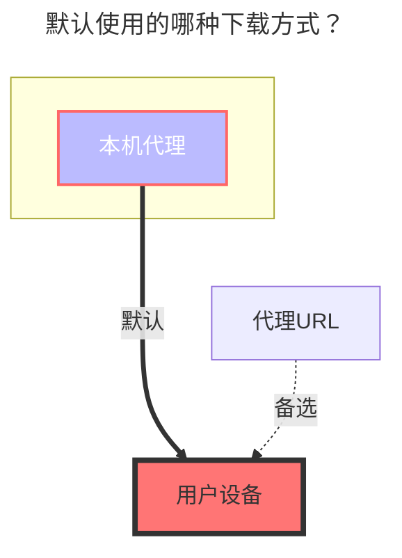

---
# This is the icon of the page
icon: iconfont icon-state
# This control sidebar order
order: 29
# A page can have multiple categories
category:
  - Guide
# A page can have multiple tags
tag:
  - Storage
  - Guide
  - "本地代理"
# this page is sticky in article list
sticky: true
# this page will appear in starred articles
star: true
---

# FTP

## **地址**

FTP 地址，需要包含端口。

## **用户名**

FTP 用户名

## **密码**

FTP 密码

## **根文件夹ID**

根文件夹，默认 `/`，同本地存储。

### **默认使用的下载方式**

