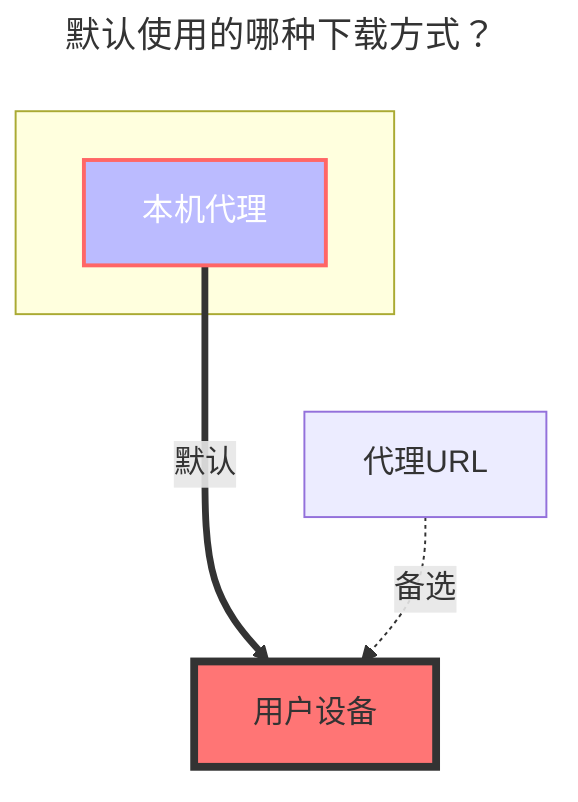

---
# This is the icon of the page
icon: iconfont icon-state
# This control sidebar order
order: 14
# A page can have multiple categories
category:
  - Guide
# A page can have multiple tags
tag:
  - Storage
  - Guide
  - "本地代理"
# this page is sticky in article list
sticky: true
# this page will appear in starred articles
star: true
---

# 谷歌云盘

支持团队盘（根目录ID填写团队盘的目录ID）

### **获取 client_id, client_secret, refresh_token**

参考 https://alist.nn.ci/tool/google/request

### **根文件夹 ID**

与阿里云盘类似，官网 URL 的最后一个字符串，如：

## **详细文本教程**

::: warning 注意事项

1. 搭建Alist服务的机器首先要能连接到Google网盘(科学连接到不行,得程序能连接到)，或者直接用国外服务器才可以喔~
2. 测试版的应用token似乎过阵子（7天左右）就会失效，如果需要长期稳定的token要发布应用才可以似乎？
3. 一个客户端ID和秘钥只能获取一次token，再次获取只能重新创建 **OAuth 客户端ID**，用新的客户端ID和秘钥

:::

**先打开 https://alist.nn.ci/tool/google/request   `1. 先点击Use own client然后再创建客户端(Create client)`**

**如果没有登录谷歌账号,先登录谷歌账号，点击 `已启用的API和服务` 或者 `库` 二选一 都可以**

**点击 `已启用的API和服务` 或者 `库` 进去后下拉找到 `Google Driver API`**

点击 **`Google Driver API`** 进去后，看下图示意图，将API服务启用

 **`Google Driver API`** 启用后我们进行一个 应用创建 - 仔细看~~~

如果是第一次创建 那么应该会出现 **` ❗如需创建 OAuth 客户端ID,您必须先配置统一屏幕`**，我们就去配置即可,点击页面的  **`配置同意屏幕`** 即可跳转到配置界面，

 ==配置教程看下一张图== ，配置好后再回来看这张图~

回调参数URL：**https://alist.nn.ci/tool/google/callback**

**`OAuth 同意屏幕`** 配置教程，如已配置好 忽略本图即可(如果看不清楚可以放大)

我们创建好 **`OAuth 客户端ID`** 后点击我们刚刚创建的 **`OAuth 客户端ID`** 随便写~ 进去后有  `客户端ID`  和  `客户端秘钥 `

获取到 `客户端ID`  和  `客户端秘钥 ` 后

我们回到最开始 **https://alist.nn.ci/tool/google/request** 把 `客户端ID`  和  `客户端秘钥 ` 填进去

 ==获取授权时记得勾选 **云盘** 和 **相册** 后面 选项==

然后开始登录账号，若提示**未经Google验证**点击左侧继续就行，授权后就会看到我们的token刷新出来了

上述操作后我们也拿到了 `刷新令牌`我们去 **`Alist后台`** 添加账号里面进行添加吧~

后台添加账号保存后我们就挂载成功啦~我们来看下吧

左侧是Alist挂载的 右侧是谷歌网盘里面的内容~ **o(*^＠^*)o**

::: details 查看视频教程

**https://www.bilibili.com/video/BV18v4y1W7vo/**

:::

### **默认使用的下载方式**

