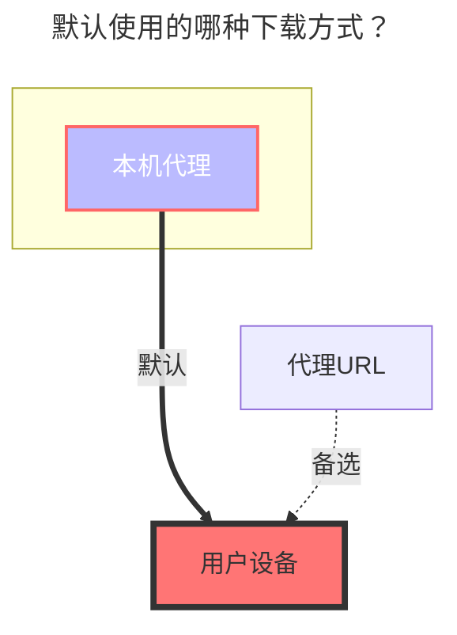

---
# This is the icon of the page
icon: iconfont icon-state
# This control sidebar order
order: 15
# A page can have multiple categories
category:
  - Guide
# A page can have multiple tags
tag:
  - Storage
  - Guide
  - "本地代理"
# this page is sticky in article list
sticky: true
# this page will appear in starred articles
star: true
---

# 谷歌相册

## **根文件夹 ID**

根目录root，其他目录ID未知( ~~貌似不能挂载单独的相册~~ 已解决下面有介绍)

## **获取 client_id, client_secret**

获取工具 https://alist.nn.ci/tool/google/request

如何获取自己的  `client_id(客户端ID)  client_secret(客户端秘钥)` 去看[**谷歌网盘**](./googledrive.md)哪一篇

::: tip 

提示 此应用未经 Google 验证

您获得了授权，可以使用一款目前处于测试阶段的应用。除非您了解向您发出邀请的开发者，否则请勿继续。

我们点击左侧的**继续**就行

此选项记得勾选不然会报错，下面的注意事项当中有说明

:::

现在更加方便了，其实获取谷歌云盘的时候勾选了相册到时候获取到的token也可以拿来挂载相册~一举两得

记得打开 **`Photos Library API`** 哦~

- **https://console.cloud.google.com/apis/library/photoslibrary.googleapis.com?project=instant-shard-350513**

## **挂载单个相册目录**

根据[上面](https://alist.nn.ci/tool/google/request)获取到的**客户端ID**和**秘钥**和**刷新令牌**

我们填写到 **https://alist.nn.ci/tool/google/album** 即可获取我们每个相册的单个目录ID

- 根文件ID（就是相册ID）：默认root，展示全部，若只想展示单个相册，可以填写你想展示的相册ID
- 在我们填写后下方也会出现一个 **`access_token`** 这个也可以填写到刷新令牌里面前使用和之前获取到的，这两个都可以用 - [解释](https://github.com/alist-org/alist/discussions/3264#discussioncomment-5051171) 

#### **填写示意图**

## **两个注意事项：**

1. failed get objs: failed to list objs: Request had insufficient authentication scopes.: []
   - 是因为在获取授权的时候没有勾选 相册权限（查看上面提到的图片） `查看和整理您的Google相册媒体库中的内容,向媒体库上传内容。`
   - 获取 `access_token`、`refresh_token` 时未声明`https://www.googleapis.com/auth/photoslibrary`的范围。
   
2. failed get objs: failed to list objs: Photos Library API has not been used in project ... before or it is disabled. Enable it by visiting <https://console.developers.google.com/apis/api/photoslibrary.googleapis.com/overview> then retry. If you enabled this API recently, wait a few minutes for the action to propagate to our systems and retry.: []
   - 是因为对应的项目没有开启 **`Photos Library API`**  谷歌相册API

### **挂载展示**

### **默认使用的下载方式**

