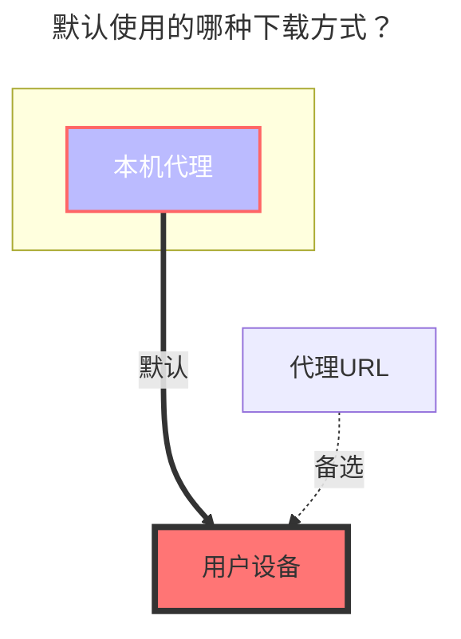

---
# This is the icon of the page
icon: iconfont icon-state
# This control sidebar order
order: 18
# A page can have multiple categories
category:
  - Guide
# A page can have multiple tags
tag:
  - Storage
  - Guide
  - "本地代理"
# this page is sticky in article list
sticky: true
# this page will appear in starred articles
star: true
---

# 6盘

- `6盘（halalcloud）` 官方网站：[https://2dland.cn](https://2dland.cn/)

  - 网盘登录：https://drive.2dland.cn

  

- 官方公告、文档地址：https://2dland.yuque.com/r/organizations/homepage

::: tip

由于`6盘（halalcloud）`采用的 `IPFS`协议存储，因此块大小被限制在`1MB`，于是**只能使用`本机代理`进行下载**，且单线程速度较慢，**使用时请尽量使用多线程下载，提升速度**

:::

 

## **根文件夹ID**

顶部地址栏路径，根文件夹是：`/`

子文件夹：`/A文件夹/C文件夹/C文件夹`

 

## **添写示例**

初次添加6盘 (halalcloud) 驱动，`Refresh token`可以留空，此时右上角会弹出红色错误通知

返回存储页面，点击刷新按钮，之前添加的驱动 <code style="font-weight: bold;color:red">Click Here</code>区域会变成可点击模式，点击后进行点击跳转到 6盘 (halalcloud) 官网进行登录

登录成功，**离开后会自动关闭网页**，请及时复制顶部地址栏中的`RefreshToken`字段参数链接

- 或者复制到其它位置再进行获取链接中`RefreshToken`字段

- 复制到其它位置后会自动进行UrlEncode编码，具体以`RefreshToken`字段是 `"rt__`开头的，以`"`^（"编码后是%22）^结尾的字符串
  - 可以参考下面提取示例或者借用工具

 

链接中蓝色字段是我们需要的`RefreshToken`

	<ul>
		<li>地址栏复制链接获取<code>RefreshToken</code>：</li> 
		<ul> 
			<li style="font-weight: bold;">解码前：</li>
			<ul>
                <li>https%3A%2F%2Fstatic.2dland.cn%2Fuser%2Flanding%2F%3Ftype%3Doauth2-response%26payload%3D%7B%22scope%22%3A%22openid%20profile%20email%20phone%22%2C%22refreshToken%22%3A%22rt__2xxxx5_2xxxxxa-4xx7-4xxa-9xx3-exxxxxxxxxx4%22%2C%22state%22%3A%2210xxxx4d3-4cxa-4xx8-axxb-1xxxf3%22%2C%22callback%22%3A%22at_callback_d4dxxxxxxxxxxxxxxxxxxxxxxxxxef_ly8og7b8%22%7D</li>
			</ul> 
			<li style="font-weight: bold;">解码后：</li>
			<ul>
				<li>https://static.2dland.cn/user/landing/?type=oauth2-response&payload={"scope":"openid profile email phone","refreshToken":"rt__2xxxx5_2xxxxxa-4xx7-4xxa-9xx3-exxxxxxxxxx4","state":"10xxxx4d3-4cxa-4xx8-axxb-1xxxf3","callback":"at_callback_d4dxxxxxxxxxxxxxxxxxxxxxxxxxef_ly8og7b8"}</li>
			</ul> 
            <li style="font-weight: bold;">如果实在看不出来可以借助工具进行解码：<a href="https://tool.chinaz.com/tools/urlencode.aspx">https://tool.chinaz.com/tools/urlencode.aspx</a>
			</li>
		</ul>
	</ul>
    

 

## **其它参数**

- `Upload thread`：上传线程（默认为 3 ， 范围1-32）

- `App id`：`应用ID` （默认已给出，无需填写）

- `App version`：`应用版本`（默认已给出，无需填写）

- `App secret`：`应用密钥`（默认已给出，无需填写）

 

### **默认使用的下载方式**

