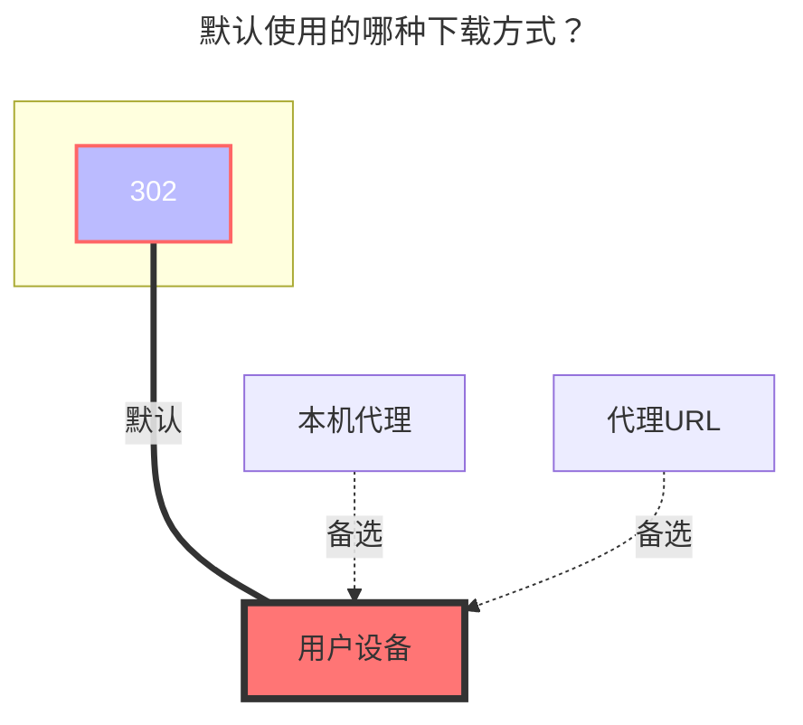

---
# This is the icon of the page
icon: iconfont icon-state
# This control sidebar order
order: 38
# A page can have multiple categories
category:
  - Guide
# A page can have multiple tags
tag:
  - Storage
  - Guide
  - "302"
# this page is sticky in article list
sticky: true
# this page will appear in starred articles
star: true
---
# KodBox

KodBox可道云(原KodExplorer)是业内领先的企业私有云和在线文档管理系统,为个人网站、企业私有云部署、网络存储、在线文档管理、在线办公等提供安全可控,简便易用、可高度定制的私有云产品。采用windows风格界面、操作习惯,无需适应即可快速上手,支持几百种常用文件格式的在线预览、播放和编辑,环境友好,功能强大,是一款一经试用,就再也离不开的私有云产品。同时你也可以将此程序二次开发整合到你现有的系统。

使用本驱动可以挂载kodbox的网盘空间到Alist。

## **根文件夹ID**

假设你有一个网盘空间名为 `个人空间`，如果你只想挂载该网盘空间的内容，就要获取`个人空间`对应的path；如果你只想展示该网盘空间内一个名为 `abc` 的目录，就要获取`个人空间/abc`对应的path ，以此类推。

示例：如何获取KodBox网盘空间`个人空间`的path，得出path为`{source:5}`
> 在浏览器中打开KodBox网盘空间，在控制台模式下即可看到网盘空间对应的path，不可留空不填。

## **地址**

你的kodbox服务器地址，形如：
- `https://kodcloud.cc`
- `http://192.168.1.24:8000`

## **用户名**

用于登录你的kodbox服务器的邮箱或用户名。

## **密码**

邮箱或用户名对应的密码。

### **默认使用的下载方式**

