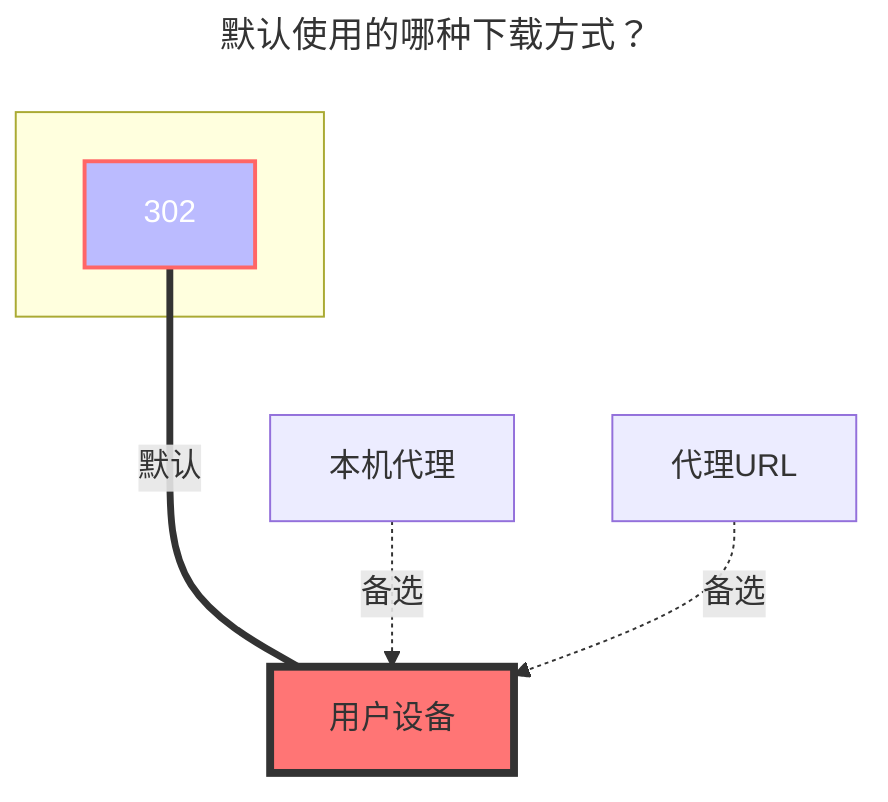

---
# This is the icon of the page
icon: iconfont icon-state
# This control sidebar order
order: 9
# A page can have multiple categories
category:
  - Guide
# A page can have multiple tags
tag:
  - Storage
  - Guide
  - "302"
# this page is sticky in article list
sticky: true
# this page will appear in starred articles
star: true
---

# 蓝奏云盘

::: tip

蓝奏网盘挂载有三种**模式（类型）**，分别是 **账户，cookie** 和 **链接** 

- **账户**：可以显示自己网盘所有文件，只需要填写帐号密码，会自动帮你刷新cookie
- **cookie**：可以显示自己网盘所有文件，但是需要提供网盘的cookie
- **链接**：只能显示链接里面的内容（不需要提供cookie就可以挂载）

:warning: 推荐使用**账户**的方式挂载：

- cookie模式需要手动更换cookie
- 用链接模式总是会抽风不知道怎么回事

:::

## **根文件夹ID**

蓝奏云盘根目录ID，默认为`-1`，如果使用`链接`类型挂载根文件夹ID请看[填写说明](#填写说明)的第三条

- **其他文件夹ID**
  - 两种获取方式（看下图即可）
  - 

## **账户**

只需要填写自己的蓝奏云帐号密码

## **Cookie**

登录自己的 [**蓝奏云盘**](https://pc.woozooo.com/) 账号，然后F12打开开发者模式，就能找到 `Cookie`，没有具体的，例如图片中左侧的随便点一个然后有右图蓝色部分的 `Cookie` 即可.

## **分享链接和分享密码**

- **分享链接**：在蓝奏云盘内随便生成一个分享链接
  - 小提示 ：链接里面的 **lanzouX**，最后这个默认的 **X**内容有时候有些地区打不开，可以自己更换一下试试看比如换成 i,x,u,t 等等等反正好多自己试试看就行.
- **分享密码** ：链接的密码

## **修复文件信息**

需要 **WebDav** 服务的，需要打开它

## **错误信息**

使用Cookie类型或者账户类型添加提示`not find file page param`错误是因为蓝奏云更换了域名

- 解决方案：建议使用账户类型添加
  - 把分享链接改成 `https://wwop.lanzoul.com`保存即可，如果还是不可以，右下角刷新一下。
  - 后续蓝奏可能还会更改。

## **填写说明**

1. **账户模式**：类型选择`账户`，填写`账户`和`密码`选项，以及`根文件夹ID`(选填,默认为根目录全部文件)

2. **Cookie模式**：类型选择`Cookie`，填写`Cookie`，以及`根文件夹ID`(选填,默认为根目录全部文件)

3. **链接模式**：类型选择`链接`，填写`分享链接`和`根文件夹ID`以及 `分享密码(如果有密码)`两个选项就可以

   - 分享链接是 :point_right: https://xxx.lanzou.com/aaabbbccc :point_left: 这种格式的

   - 在`分享链接`填写：https://xxx.lanzou.com

   - 在`根文件夹ID`填写：aaabbbccc

   - 在`分享密码`填写：有密码就写没有就不用写

### **默认使用的下载方式**

