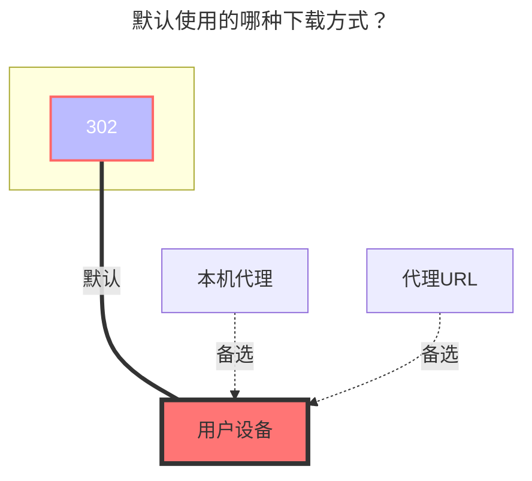

---
# This is the icon of the page
icon: iconfont icon-state
# This control sidebar order
order: 9
# A page can have multiple categories
category:
  - Guide
# A page can have multiple tags
tag:
  - Storage
  - Guide
  - "302"
# this page is sticky in article list
sticky: true
# this page will appear in starred articles
star: true
---

# 联想家庭储存链接分享

**https://pc.lenovo.com.cn**

- 需要购买联想设备

 

## **根文件夹ID**

根文件夹ID：空着

子文件夹ID：进入需要获取子文件夹ID的文件夹，找到该请求，获取子文件夹ID

 

## **分享ID和分享密码**

分享链接链接示例： https://siot-share.lenovo.com.cn/s/#/Ss.JjMaJJwcgrDT46qhVA 提取码：`fr0w`

- **分享ID**：分享链接中末尾的字符串 `Ss.JjMaJJwcgrDT46qhVA`
- **分享密码** ：提取码

 

### **主机地址**

默认使用公网的：**https://siot-share.lenovo.com.cn**

如果你使用局域网的可以改成联想设备内网地址：**http://192.168.XX.XX**

 

### **默认使用的下载方式**

