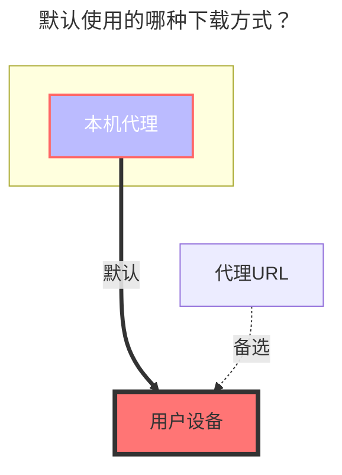

---
# This is the icon of the page
icon: iconfont icon-state
# This control sidebar order
order: 2
# A page can have multiple categories
category:
  - Guide
# A page can have multiple tags
tag:
  - Storage
  - Guide
  - "本地代理"
# this page is sticky in article list
sticky: true
# this page will appear in starred articles
star: true
---
# 本地存储

## **根文件夹ID**

您要挂载的文件夹的路径。 例如：

- Linux: `/root`
- Windows: `C:`

## **本地存储视频封面**

需要使用`ffmpeg` 工具来添加，暂时还不会（后续补充）

- 需要使用AList版本 ≥ [**v3.12.0**](https://github.com/alist-org/alist/releases/tag/v3.12.0)
  - Add thumbnail for video with ffmpeg  -  by [**@GodFinal**](https://github.com/GodFinal) and [**@Xhofe**](https://github.com/Xhofe) in [**#3556**](https://github.com/alist-org/alist/pull/3556) [**(309d6)**](https://github.com/alist-org/alist/commit/309d655)

## **回收站路径**

回收站的路径，如果为空则永久删除或保持“永久删除”

如果填写此路径在删除本地存储文件时会将文件移动到此文件夹內，让你有一次后悔的机会。

填写方式参考上述挂载路径的方式不同系统填写方式不同。

==如果不知道是否填写正确，可以先自己在测试环境进行测试一下再进行生产环境使用==

- Linux: `/root`
- Windows: `C:`

### **默认使用的下载方式**

