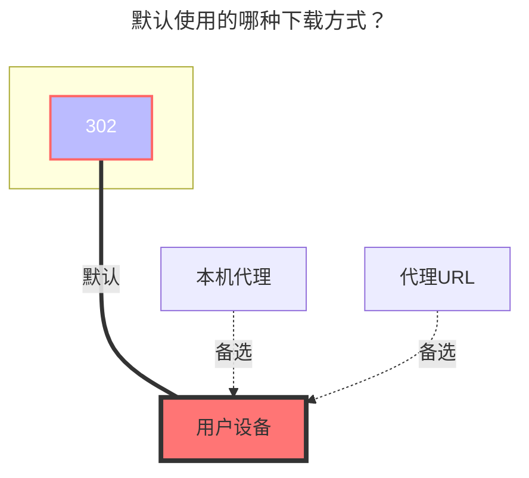

---
# This is the icon of the page
icon: iconfont icon-state
# This control sidebar order
order: 10
# A page can have multiple categories
category:
  - Guide
# A page can have multiple tags
tag:
  - Storage
  - Guide
  - "302"
# this page is sticky in article list
sticky: true
# this page will appear in starred articles
star: true
---

# 分秒帧

## **访问令牌**

登录后可以在请求头中获取

## **项目编号**

从官网网址获取：

## **根文件夹 ID**

登录后从请求中获取

### **默认使用的下载方式**

