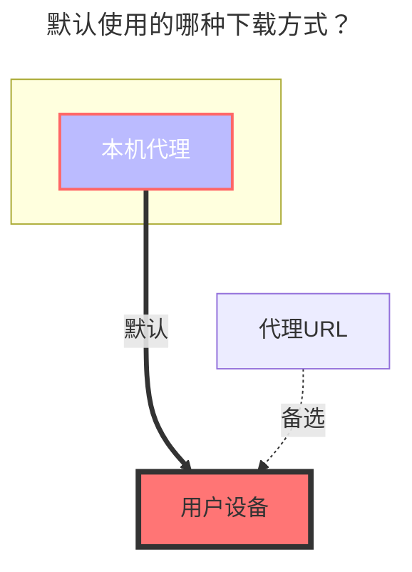

---
# This is the icon of the page
icon: iconfont icon-state
# This control sidebar order
order: 26
# A page can have multiple categories
category:
  - Guide
# A page can have multiple tags
tag:
  - Storage
  - Guide
  - "本地代理"
# this page is sticky in article list
sticky: true
# this page will appear in starred articles
star: true
---

# MEGA 网盘

MEGA官网：**https://mega.nz/login**

### **邮箱**

MEGA登录账号

### **密码**

登录密码

 

## **两步验证**

非必填选项，如果开启了需要填写，没开启的不需要填写

### **两步验证秘钥**

**https://mega.nz/fm/account/security/two-factor-authentication**

点击启用 `启用双重验证（2FA）`然后会看到一个二维码，二维码下方有一串字母，这个就是`2FA验证秘钥`，请在扫码绑定前记录一下切勿丢失，`2FA验证秘钥`如果丢失可以解绑重新获取一个新的

### **两步验证代码**

要启用双因素身份验证，需要在手机上安装支持 TOTP 的验证器，例如 [Google Authenticator](https://play.google.com/store/apps/details?id=com.google.android.apps.authenticator2)，[Microsoft Authenticator](https://support.microsoft.com/zh-cn/account-billing/%E4%B8%8B%E8%BD%BD%E5%B9%B6%E5%AE%89%E8%A3%85microsoft-authenticator%E5%BA%94%E7%94%A8-351498fc-850a-45da-b7b6-27e523b8702a)

扫描屏幕出现的二维码就可以，同时这个二维码也是[两步验证秘钥](#两步验证秘钥)

 

## **填写示例**

 

### **默认使用的下载方式**

