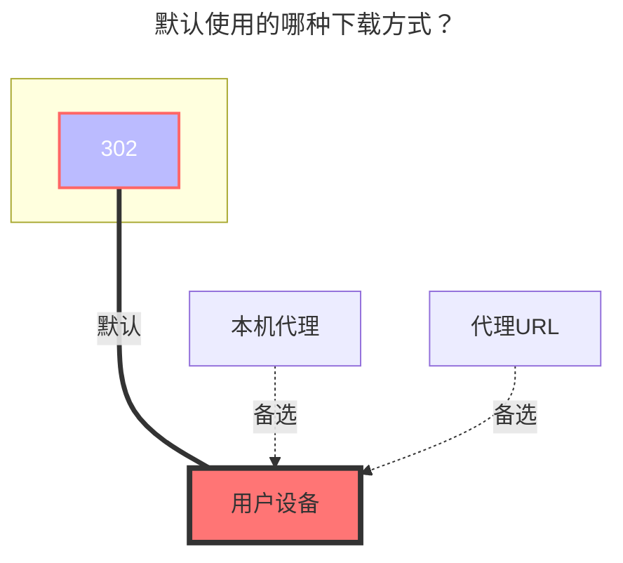

---
# This is the icon of the page
icon: iconfont icon-state
# This control sidebar order
order: 8
# A page can have multiple categories
category:
  - Guide
# A page can have multiple tags
tag:
  - Storage
  - Guide
  - "302"
# this page is sticky in article list
sticky: true
# this page will appear in starred articles
star: true
---

# 四川电信魔盘

云盘官网链接：**https://mopan.sc.189.cn/mopan/#/downloadPc**

- 没有网页端，只有`Android`,`IOS`,`PC-Win64位`,`iPad`,`TV`

- :warning: AList版本 > ==3.30.0== 以上版本才能使用本驱动

 

## **Sms code**

第一次添加时先输入 手机号和密码的选项，然后在`Sms Code`输入 ==send==，再点击保存会给你进行发短信，然后将验证码重新输入就可以添加

 

## **根文件夹ID**

留空会自动填充为根目录

- 由于请求加密，暂时未想到合适的获取文件夹ID的方法

 

## **提示**

1. `根文件夹ID`、`设备信息`不用填写,会自动帮你填充

2. 如果在[Sms Code](#sms-code)输入验证码后已经保存了，请进入编辑输入收到的验证码

 

### **默认使用的下载方式**

