---
# This is the icon of the page
icon: iconfont icon-state
# This control sidebar order
order: 8
# A page can have multiple categories
category:
  - Guide
# A page can have multiple tags
tag:
  - Storage
  - Guide
# this page is sticky in article list
sticky: true
# this page will appear in starred articles
star: true
---

# 四川电信魔盘

云盘官网链接：**https://mopan.sc.189.cn/mopan/#/downloadPc**

- 没有网页端，只有`Android`,`IOS`,`PC-Win64位`,`iPad`,`TV`

- :warning: AList 3.19.0版本及以上版本才能使用本驱动

::: danger

==四川电信魔盘的安全问题有点多，不建议存隐私文件。密码也不要使用常用的密码，服务器会明文存储==

1. 由于请求加密，暂时未想到合适的获取文件夹ID的方法，所有目前只能设置为`-11(根目录)`
2. ID为`-11`的目录下的文件夹不能随意删，否则会出现各种bug（如果不打算用官方那些花里胡哨的功能，可以全删了🤔）
3. 目录下的名为`文件`的文件夹为用户空间，`私密空间`对应的就是私密空间，名为一长串数字的为共享空间
   - 名为相册的文件夹对应相册功能，但直接操作可能会有bug，并且暂无适配相册的计划
     - 直接在AList共享空间的相册文件夹內上传文件，APP端会不显示
   - 目前官方对文件夹删除有bug，等待修复

:::

## **根文件夹ID**

`-11`

- 由于请求加密，暂时未想到合适的获取文件夹ID的方法，所有目前只能设置为`-11(根目录)`

### **AList挂载填写示例：**

只需要填写`手机号`和`密码`就可以挂载，`设备信息`不用填写,会自动帮你填充。

### **默认使用的下载方式**

```mermaid
---
title: 默认使用的那种下载方式？
---
flowchart TB
    style a1 fill:#bbf,stroke:#f66,stroke-width:2px,color:#fff
    style a2 fill:#ff7575,stroke:#333,stroke-width:4px
    subgraph ide1 [ ]
    a1
    end
    a1[302]:::someclass====|默认|a2[用户设备]
    classDef someclass fill:#f96
    c1[本机代理]-.备选.->a2[用户设备]
    b1[代理URL]-.备选.->a2[用户设备]
    click a1 "../drivers/common.html#webdav-策略"
    click b1 "../drivers/common.html#webdav-策略"
    click c1 "../drivers/common.html#webdav-策略"
```

