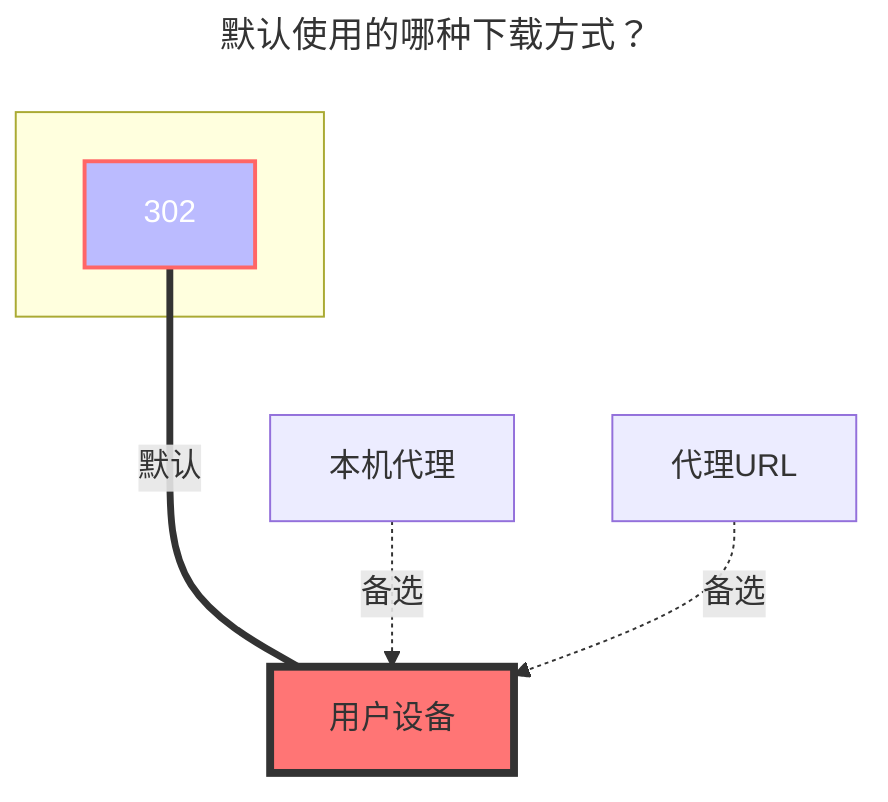

---
# This is the icon of the page
icon: iconfont icon-state
# This control sidebar order
order: 5
# A page can have multiple categories
category:
  - Guide
# A page can have multiple tags
tag:
  - Storage
  - Guide
  - "302"
# this page is sticky in article list
sticky: true
# this page will appear in starred articles
star: true
---

# OneDrive

:::tip
如果你的账号不支持 API，（比如学校账号没有验证管理员，或者管理员禁用了 API），那么你也可以通过 WebDAV 挂载。 有关详细信息，请参阅 [WebDAV 页面](webdav.md)
:::

首先打开 https://alist.nn.ci/tool/onedrive/request

## **创建应用**

> 你也可以选择跳过此步，使用默认提供的client，但是需要组织管理员批准。

- 在打开的页面，选择所在区域，点击创建应用
- 登陆后选择"注册应用程序"，输入"名称"，选择"任何组织目录中的账户和个人"（注意这里不要看位置选择而是看文字，部分人可能是中间那个选项，不要选成单一租户或者其他选项，否则会导致登陆时出现问题），输入重定向 URL 为 <https://alist.nn.ci/tool/onedrive/callback> ，点击注册即可，然后可以得到 `client_id`
  
- 注册好应用程序之后，选择"证书和密码"，点击"新客户端密码"，输入一串密码，选择时间为最长的那个，点击"添加"
  （注：在添加之后输入的密码之后会消失，请记录下来 `client_secret` 的值）
  
- 选择 "API 权限"，点击 "Microsoft Graph"，在"选择权限"中输入 `file`，勾选 `Files.read`（注：Files.read 是只读最小权限，图中权限较大，也同样可以），点击"确定"
  

## **获取刷新令牌**

将上一步骤中获得的 `client_id` 和 `client_secret` 填入 https://alist.nn.ci/tool/onedrive/request ，点击"获取刷新令牌"即可

## **获取 SharePoint site_id**

如果需要挂载 SharePoint，完成上一步后，在显示刷新令牌的界面会出现一个输入站点地址，输入站点地址后点击获取 `site_id` 即可。

## **添加账号**

将上述过程中获取得到的值依次填入即可。

## **根文件夹ID**

默认为 `/`，如果需要自定义，就填路径就行，从根路径开始，和本地路径一样，比如 `/test`

### **默认使用的下载方式**

