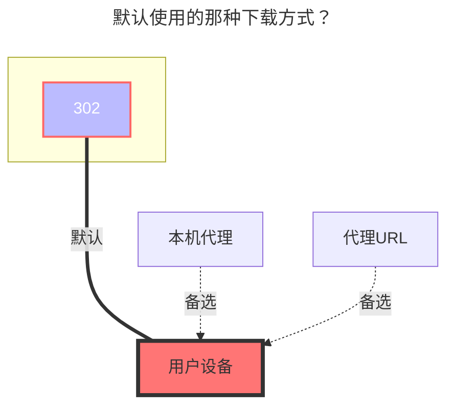

---
# This is the icon of the page
icon: state
# This control sidebar order
order: 5
# A page can have multiple categories
category:
  - Guide
# A page can have multiple tags
tag:
  - Storage
  - Guide
# this page is sticky in article list
sticky: true
# this page will appear in starred articles
star: true
---

# OneDrive APP

首先使用个人或者组织账号登录

**https://entra.microsoft.com/#view/Microsoft_AAD_IAM/TenantOverview.ReactView?Microsoft_AAD_IAM_legacyAADRedirect=true**

登录后获取我们的<Badge text="租户ID" type="info" vertical="middle" />


## 中间过程

:::tip
请仔细阅读添加，如有错误可及时反馈 
:::

:::tabs#onedrive_app
@tab 1

1. 注册一个应用，类型自己选，建议选第三吧

2. 重定向URL(回调参数)，类型选择Web，参数填写：**https://entra.microsoft.com/TokenAuthorize**，否则后面授权时无法授权
3. 填好后点击下方的注册 跳转后就可以看到<Badge text="客户端ID" type="info" vertical="middle" />


@tab 2

我们去获取一个客户端秘钥，按照下图获取即可，记得<Badge text="秘钥ID" type="info" vertical="middle" />要及时保存，只会出现一次


@tab 3

客户端秘钥拿到了，去授权一下使用的 **`API`**，依旧跟着下图获取即可


@tab 4

API授权后，我们去授权组织应用

- 左侧侧边栏 ---> 企业应用程序 ---> 所有应用程序 ---> **{选择我们开始新建的哪个应用名称}** ---> 权限 ---> 点击 代表`xxxx`授予管理员同意


注意事项

- 如果你在开始注册应用时，回调参数不是一样的可能点击授权时会报错，记得写一样的
- 如何查看是否授权成功，未授权时页面是提示`未发现该应用程序具有管理员许可的授权`，授权成功后刷新一下页面会看到三条API权限如下图所示
  - 上面是未授权时的样子，下面是授权后的样子（授权后刷新页面即可）


@tab 5

通过开始到现在 我们分别拿到了如下参数：租户ID^1^，注册应用^2^，拿到客户端ID/秘钥^3^，授权API/管理员API^4^

然后通过下面的格式最终授权一下即可，分别是<Badge text="租户ID" type="info" vertical="middle" /><Badge text="秘钥ID" type="info" vertical="middle" /><Badge text="回调参数URL" type="info" vertical="middle" />改成自己的最终登录收取即可

```html
https://login.microsoftonline.com/{租户ID或者common}/adminConsent?client_id={客户端ID}&redirect_uri={注册应用时的回调URL}
```


:::

## 填写示例

将上述过程中获取得到的值依次填入即可，如果哪个邮箱你不知道是什么了 可以通过[**查看组织所有用户**](#查看组织所有用户)来查找


## 查看组织所有用户

如果不知道自己的OneDrive组织有多少用户可以前往下面的链接登录 `admin`账号查看

**https://admin.microsoft.com/Adminportal/Home?source=applauncher#/users**


## 好处以及注意事项

1. 好处就是这样只授权一次管理员登录后，添加参数时用一样的即可，在添加时除了邮箱哪里不同别的都一样
   - 例如E5 25个5T的账号，你提前登录初始化完毕后，直接CV之前的参数即可，不用像以前一样每次都得去获取刷新令牌时间一长还失效
   - A1 A1P等可以分发的账号更多(500 - **∞**)


2. 这样的方式管理员授权后，可以随意查看组织中每个成员的账号，泄露了自己的文件
   - 建议自己申请 OneDrive E5 去好一些


### 默认使用的下载方式


